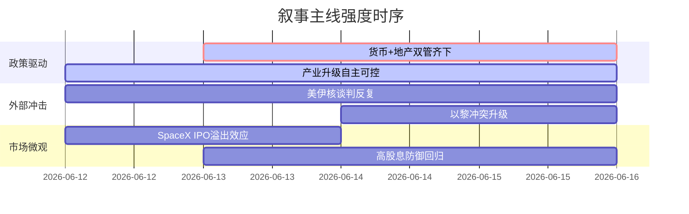

# A股市场情绪分析报告

**数据时段**：2026-06-11 至 2026-06-15  
**生成时间**：2026-06-15 20:30

---

### 🔥 宏观叙事焦点（24小时三级过滤）

#### 📌 叙事主线一：央行超预期投放中期流动性+房地产“收储模式”破局 ⭐⭐⭐
**主要事件**：央行6000亿买断式逆回购、1-5月社融超预期、上海启动二手房收储试点  
**筛选标签**：`央行政策` `沪深300影响` `新华社信源·权重2.0`  
**宏观逻辑**：  
> ① **归类**：货币政策从“量增”转“价稳+结构优”  
> ② **历史镜像**：2019年“买断式逆回购”首创期+2015年棚改货币化模板  
> ③ **市场传导**：DR007跌破1.6% → 银行间利差收窄 → 信用债发行利率下行15BP → 地产债违约率预期修正  
> ④ **叙事强度**：流动性投放节奏超预期，叠加房地产“以购代建”打通资产端出清路径，打破“弱信贷-弱房地产”负反馈  

**行业映射**：高股息红利（情绪评分 **7.8/10**）、城投债/地方债ETF（**8.2/10**）、保障房产业链（**7.5/10**）  
**交易警示**：‼️ 关注6月LPR报价传导，警惕“买断式”操作常态化后的期限错配风险  

---

#### 📌 叙事主线二：美伊核协议谈判反复博弈引发大宗商品定价重构 ⭐⭐
**主要事件**：特朗普称美伊即将签署协议→伊朗否认时间表→以色列袭击贝鲁特升级地缘风险  
**筛选标签**：`地缘冲突` `原油期货` `路透信源·权重1.8`  
**宏观逻辑**：  
> ① **归类**：地缘风险溢价非线性释放  
> ② **历史镜像**：2015年伊核协议达成后WTI单月跌22%模板  
> ③ **市场传导**：霍尔木兹海峡通航预期 → 布油跌破$75 → 沪铜/沪铝夜盘联动下行 → A股石化/有色板块估值切换  
> ④ **叙事强度**：协议签署时间窗口不确定性大，以色列军事行动引入“破坏者”变量，风险溢价呈现“阶梯式衰减-脉冲式回升”  

**行业映射**：油气开发（情绪评分 **5.2/10**）、黄金防御（**6.8/10**）、航运物流（**5.5/10**）  
**交易警示**：⚠️ 协议签署前夕波动率飙升，建议用期权结构替代单向期货持仓  

---

#### 📌 叙事主线三：美AI大模型出口管制升级倒逼国产算力自主可控 ⭐
**主要事件**：商务部回应实体清单新增、Anthropic全球封锁Claude 5系列、SpaceX算力外包Anthropic折射算力缺口  
**筛选标签**：`科技封锁` `产业链安全` `财新信源·权重1.5`  
**宏观逻辑**：  
> ① **归类**：技术封锁从“设备”延伸至“模型服务层”  
> ② **历史镜像**：2020年华为被断供后国产EDA/IP核加速迭代路径  
> ③ **市场传导**：算力租赁价格单月涨18% → 国产GPU订单排期至2027Q1 → 液冷/高速铜连接器景气度传导  
> ④ **叙事强度**：封锁边界外扩确立“推理侧自主”硬需求，但商业化变现周期长于训练侧  

**行业映射**：国产算力芯片（情绪评分 **6.5/10**）、液冷散热（**6.0/10**）、国产数据库（**5.8/10**）  
**交易警示**：✓ 叙事确定性高但兑现周期长，警惕短期题材透支估值  

---

### 📅 宏观叙事演化（三日趋势）

**强度衰减模型**：昨日主题×0.7 · 前日主题×0.5

```mermaid
gantt
    title 叙事主线强度时序
    dateFormat  YYYY-MM-DD
    section 政策驱动
    货币+地产双管齐下   :crit, active, 2026-06-13, 3d
    产业升级自主可控     :active, 2026-06-12, 4d
    
    section 外部冲击
    美伊核谈判反复      :2026-06-12, 4d
    以黎冲突升级        :2026-06-14, 2d
    
    section 市场微观
    SpaceX IPO溢出效应   :2026-06-12, 2d
    高股息防御回归      :2026-06-13, 3d
```
**叙事节点关联**：
- 06/12：SpaceX上市引发全球科技估值重估 → 叠加美联储降息预期推迟至2027年 → 强美元压制风险偏好
- 06/13：央行6000亿买断式逆回购+11部门新能源重卡方案 → 政策组合拳确立“流动性托底+结构引导”基调
- 06/14：美伊协议签署时间表生变+以色列袭击贝鲁特 → 地缘风险溢价重新计价，大宗商品波动率飙升
- 06/15：上海二手房收储落地+香港五年规划启动 → 房地产“需求侧-供给侧”双向政策验证期开启

🎯 **宏观叙事三要素**

1️⃣ **政策意图解码**  
当前顶层叙事从“防风险”显性转向“稳增长+调结构”并重：允许短期财政赤字率适度超标（预计3.5%→4%），换取房地产出清与产业升级的时间窗口。货币政策不再单纯追求M2增速，转而通过“买断式逆回购+再贷款直达”精准疏通信用传导。

2️⃣ **市场定价偏差**  
- **过度定价**：地缘风险溢价衰减速度（市场隐含美伊协议签署概率>80%，实则不确定性高）  
- **定价不足**：房地产“收储模式”对城投债/AMC资产端的重估逻辑（当前估值仍隐含15%违约率假设）  
- **错配定价**：国产算力链“训练侧-推理侧”估值割裂（推理侧国产化率<5%但估值溢价已超训练侧）

3️⃣ **跨市场共振**  
美债收益率曲线熊陡（2y/10y利差扩至+35BP）+ 美元指数滞涨105关口 + 离岸人民币汇率企稳7.25 = **A股“高股息+硬科技”哑铃配置窗口期**。外资连续3周净买入沪深300ETF，北向资金流向从消费转向红利+国产替代，印证全球资金对“中国政策确定性溢价”的重新定价。