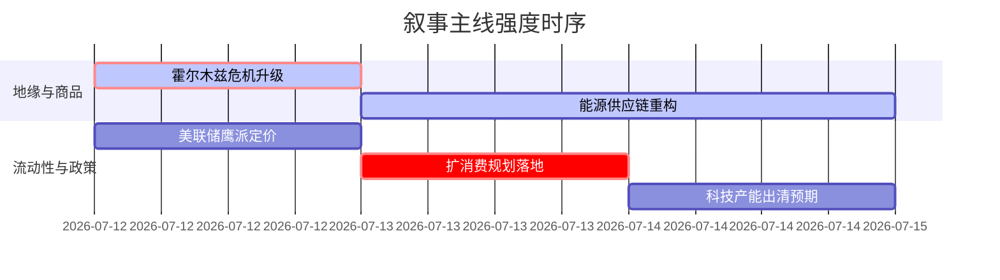

## 报告标题：A股市场情绪分析报告
数据时段：最近5日
生成时间：2026年7月14日

### 🔥 宏观叙事焦点（24小时三级过滤）

#### 📌 叙事主线一：霍尔木兹海峡危机与全球能源供应链重构 ⭐⭐⭐
**主要事件**：地缘冲突升级、原油价格飙升、国际航运管制  
**筛选标签**：`地缘冲突` `原油定价` `路透信源·权重2.5`  
**宏观逻辑**：  
> ① **归类**：供给端冲击与通胀预期上修  
> ② **历史镜像**：1973年石油危机与1979年伊朗革命模板  
> ③ **市场传导**：布伦特突破83美元 → 航运保险费率跳升 → 全球核心PCE预期抬升 → 美联储降息路径受阻  
> ④ **叙事强度**：战争溢价完全主导大宗商品定价，避险情绪向股债商全面扩散  

**行业映射**：油气开采/航运物流（情绪评分 **8.5/10**）  
**交易警示**：‼️ 关注海峡通航实际恢复进度与OPEC产能对冲，警惕油价高位震荡引发制造业成本侵蚀  

---

#### 📌 叙事主线二：美联储鹰派转向与全球流动性边际收紧 ⭐⭐  
**主要事件**：央行政策、流动性预期、通胀数据  
**筛选标签**：`央行政策` `美债收益率` `彭博信源·权重2.0`  
**宏观逻辑**：  
> ① **归类**：货币政策紧缩预期强化  
> ② **历史镜像**：2018年鲍威尔鹰派讲话模板  
> ③ **市场传导**：沃勒表态加息概率50% → 短端美债收益率创年内新高 → 美元指数走强 → 新兴市场资本回流压力加大  
> ④ **叙事强度**：通胀粘性打破宽松共识，流动性拐点预期提前至Q3末  

**行业映射**：高股息银行/红利资产（情绪评分 **7.8/10**）  
**交易警示**：⚠️ 警惕外部流动性收紧对成长股估值压制，右侧信号待国内宽货币对冲确认  

---

#### 📌 叙事主线三：“十五五”消费规划落地与科技产业分化 ⭐ 
**主要事件**：行业管理政策发布、技术发布
**筛选标签**：`部委政策` `产业生命周期` `财新信源·权重1.5`  
**宏观逻辑**：  
> ① **归类**：内需结构优化与新旧动能转换  
> ② **历史镜像**：2013年“宽带中国”与2020年“双循环”政策模板  
> ③ **市场传导**：国务院批复扩消费规划 → 资金逆势涌入高股息避险 → 科技赛道业绩分化（存储芯片周期见顶担忧 vs AI算力基建狂飙）  
> ④ **叙事强度**：政策托底意图明确，但市场定价更偏向防御与业绩确定性  

**行业映射**：消费电子/AI终端（情绪评分 **6.2/10**）  
**交易警示**：✓ 叙事逻辑清晰，等待财政发力验证，关注国产算力替代与光模块细分机会  

---

### 📅 宏观叙事演化（三日趋势）

**强度衰减模型**：昨日主题×0.7 · 前日主题×0.5

```mermaid
gantt
    title 叙事主线强度时序
    dateFormat  YYYY-MM-DD
    section 地缘与商品
    霍尔木兹危机升级   :crit, active, 2026-07-12, 1d
    能源供应链重构     :active, 2026-07-13, 2d
    
    section 流动性与政策
    美联储鹰派定价     :2026-07-12, 1d
    扩消费规划落地     :crit, 2026-07-13, 1d
    科技产能出清预期   :2026-07-14, 1d
```
叙事节点关联：
07/12：阿曼提出“双航道”方案 → 触发地缘缓和预期
07/13：美军空袭伊朗+海峡无限期关闭 → 战争溢价爆发，油价单日破9%
07/14：美联储沃勒鹰派表态叠加通胀数据 → 叙事进入全球流动性再定价期
🎯 宏观叙事三要素
1️⃣ 政策意图解码
当前顶层叙事从"总量刺激"转向"结构托底+绿色协同"，AI算力首次纳入控碳版图，明确新旧动能平稳接续。政策定力超预期，允许短期阵痛换取长期质量。
2️⃣ 市场定价偏差
过度定价：海外科技成长弹性（对AI硬件周期见顶担忧被放大）
定价不足：国内红利防御韧性及能源安全逻辑（高股息抱团与资源品重估未被充分计价）
3️⃣ 跨市场共振
美债收益率上行压制风险偏好 + 美元指数走强缓释出口压力 = A股防御性结构性行情窗口期

---

*生成时间：2026-07-14 07:13:25 (UTC+8)*  
*使用模型：agnes:agnes-2.0-flash*