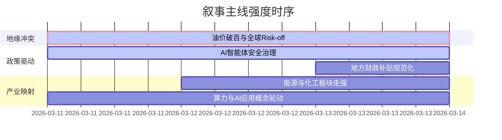

## A股市场情绪分析报告

**数据时段：** 2026年3月9日 - 2026年3月14日
**生成时间：** 2026年3月14日

### 🔥 宏观叙事焦点（24小时三级过滤）

#### 📌 叙事主线一：中东地缘冲突升级引发全球能源与金融市场巨震 ⭐⭐⭐
**主要事件**：伊朗与以色列/美国爆发直接军事冲突，霍尔木兹海峡航运实质中断。
**筛选标签**：`地缘冲突` `能源安全` `全球风险资产` `通胀预期`
**宏观逻辑**：
> ① **归类**：外生供给冲击
> ② **历史镜像**：2022年俄乌冲突初期能源市场冲击与滞胀交易模板
> ③ **市场传导**：油价单周暴涨35% → 全球股指普跌（韩日触发熔断）→ 主要央行降息预期急剧收窄/加息预期升温 → 避险资金涌入美元与短期美债
> ④ **叙事强度**：冲突烈度与持续时间超预期，核心石油通道受阻，重塑全球通胀与货币政策路径。

**行业映射**：能源（油气开采、油服）、化工（成本推升）、航运（运价与风险溢价）（情绪评分 **8.5/10**）
**交易警示**：‼️ 能源价格高位波动加剧，警惕“滞胀”叙事深化对成长股的估值压制。关注地缘进展与IEA/G7联合释放储备的实效性。

---

#### 📌 叙事主线二：国内强化全国统一大市场建设，规范地方补贴 ⭐⭐
**主要事件**：国务院常务会议研究建立地方财政补贴负面清单管理机制。
**筛选标签**：`国务院政策` `财政规范` `公平竞争` `调结构`
**宏观逻辑**：
> ① **归类**：结构性改革政策
> ② **历史镜像**：2023年《中共中央 国务院关于加快建设全国统一大市场的意见》政策深化模板
> ③ **市场传导**：抑制地方无序竞争与市场分割 → 中长期优化资源配置效率 → 短期可能影响部分依赖地方补贴的行业（如部分新能源、电动车）预期
> ④ **叙事强度**：政策意图明确，从“促增长”向“提质量”倾斜，定力超预期。

**行业映射**：全国性布局的龙头企业（情绪评分 **6.0/10**）
**交易警示**：⚠️ 短期可能对部分区域性和补贴依赖型行业情绪造成扰动，中长期利好规范经营的龙头公司。

---

#### 📌 叙事主线三：AI智能体（OpenClaw）生态爆发与安全治理并行 ⭐
**主要事件**：国家网络安全通报中心发布OpenClaw安全风险预警，同时产业端应用加速。
**筛选标签**：`科技产业` `人工智能` `安全监管` `产业生命周期`
**宏观逻辑**：
> ① **归类**：新兴技术产业化与监管跟进
> ② **历史镜像**：移动互联网早期应用爆发与安全问题显现模板
> ③ **市场传导**：技术热点引爆资本市场关注（腾讯、百度等推出服务）→ 安全风险提示引发板块分化（利好网络安全，警示纯概念炒作）→ 催化算力、数据要素等配套需求
> ④ **叙事强度**：产业应用落地速度极快，监管“边发展边规范”意图明显。

**行业映射**：AI应用、算力基础设施、网络安全（情绪评分 **7.5/10**）
**交易警示**：✓ 叙事从主题炒作进入“去伪存真”阶段，关注有真实应用场景和客户落地的公司，警惕无实质业务支撑的概念股回调。

---

### 📅 宏观叙事演化（三日趋势）

**强度衰减模型**：昨日主题×0.7 · 前日主题×0.5

```mermaid
gantt
    title 叙事主线强度时序
    dateFormat  YYYY-MM-DD
    section 地缘冲突
    油价破百与全球Risk-off   :crit, active, 2026-03-11, 3d
    section 政策驱动
    AI智能体安全治理       :active, 2026-03-11, 3d
    地方财政补贴规范化     :2026-03-13, 1d
    section 产业映射
    能源与化工板块走强     :2026-03-12, 2d
    算力与AI应用概念轮动   :2026-03-11, 3d
```
叙事节点关联：
03/11：中东冲突爆发，油价暴涨，全球股市暴跌，滞胀叙事主导。
03/12：市场消化冲击，能源、高股息等防御板块强势，科技股分化。
03/13：国内政策（财政补贴规范）出台，市场关注点部分从外部冲突转向内部政策结构优化。AI智能体安全预警与产业应用并行，板块内部剧烈分化。

🎯 宏观叙事三要素
1️⃣ 政策意图解码
当前顶层叙事呈现“内外有别”特征：对外部冲击（地缘冲突）以风险防范和能源安全应对为主；内部则坚持“调结构”和“高质量发展”主线，规范地方行为，鼓励科技创新但强调安全可控。
2️⃣ 市场定价偏差
过度定价：地缘冲突的短期恐慌情绪（部分风险资产已大幅回调）。
定价不足：国内政策“调结构”的定力与长期影响；AI产业从主题炒作向业绩验证过渡的分化风险。
3️⃣ 跨市场共振
美债收益率飙升（通胀预期） + 美元指数走强（避险） = 全球新兴市场与风险资产承压。A股中与全球经济周期关联度低的内需、高股息及部分科技自主板块展现出相对韧性。