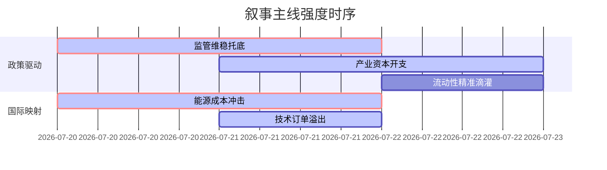

# A股市场情绪分析报告
**数据时段**：最近5日  
**生成时间**：2026-07-22 20:00:58 (UTC+8)  

### 🔥 宏观叙事焦点（24小时三级过滤）

#### 📌 叙事主线一：美伊冲突升级与能源供应链重定价 ⭐⭐⭐
**主要事件**：地缘冲突、国际油价飙升、避险资产定价  
**筛选标签**：`美伊军事行动` `布伦特破95美元` `黄金站4100` `路透信源·权重2.0`  
**宏观逻辑**：  
> ① **归类**：外部风险冲击与通胀预期重估  
> ② **历史镜像**：2022年俄乌冲突初期能源危机模板  
> ③ **市场传导**：霍尔木兹海峡通航量骤降 → 布伦特原油突破95美元/桶 → 全球输入性通胀预期升温 → 现货黄金站上4100美元 → 避险资金与商品周期股形成跷跷板效应  
> ④ **叙事强度**：地缘风险从战术博弈升级为实质性供应中断威胁，打破原有宏观定价锚，重塑大宗商品与汇率联动逻辑  

**行业映射**：石油石化、黄金珠宝、远洋航运（情绪评分 **7.8/10**）  
**交易警示**：‼️ 关注停火斡旋进展与油价高位震荡的博弈，警惕冲突缓和后的快速获利回吐及输入性通胀对中游制造利润的挤压  

---

#### 📌 叙事主线二：监管维稳信号与中长期资金托底 ⭐⭐  
**主要事件**：资本市场制度建设、ETF资金流向、险资入市
**筛选标签**：`证监会政策` `宽基ETF净流入` `险资增持·权重1.5`  
**宏观逻辑**：  
> ① **归类**：流动性预期管理与制度型开放  
> ② **历史镜像**：2015年“国家队”护盘与2024年“新国九条”政策底模板  
> ③ **市场传导**：证监会连开座谈会定调维稳 → 股票型ETF单周净流入超3850亿元 → 头部险企密集发声加大权益配置 → 市场估值修复预期强化，权重板块止跌企稳  
> ④ **叙事强度**：政策意图从“逆周期调节”转向“生态优化”，耐心资本实质性入场打破存量博弈僵局，托底信号明确  

**行业映射**：高股息红利、宽基指数ETF、券商金融（情绪评分 **7.2/10**）  
**交易警示**：⚠️ 注意政策底与市场底的时滞效应，右侧趋势反转需企业盈利数据与成交量能持续配合验证  

---

#### 📌 叙事主线三：AI算力订单爆发与半导体周期反转 ⭐ 
**主要事件**： 科技资本开支、半导体产能博弈、国产替代
**筛选标签**：`产业生命周期` `超微电脑订单` `财新信源·权重1.5`  
**宏观逻辑**：  
> ① **归类**：全球AI军备竞赛与产业链利润分配  
> ② **历史镜像**：2023年英伟达产业链爆发与存储超级周期模板  
> ③ **市场传导**：海外巨头新增超600亿美元服务器订单 → 台积电/三星上调代工价格 → A股科创50暴力反弹10.73% → 光模块/PCB/先进封装等上游供应链业绩预期集体上修  
> ④ **叙事强度**：海外资本开支超预期直接映射国内硬件链，产业逻辑从“概念炒作”全面转向“订单落地与产能爬坡”  

**行业映射**：半导体设备、存储芯片、AI算力基础设施（情绪评分 **6.5/10**）  
**交易警示**：✓ 叙事链条完整且具备持续性，但需警惕外围科技股财报波动带来的脉冲式震荡与短期筹码交换  

---

### 📅 宏观叙事演化（三日趋势）

**强度衰减模型**：昨日主题×0.7 · 前日主题×0.5

```mermaid
gantt
    title 叙事主线强度时序
    dateFormat  YYYY-MM-DD
    section 政策驱动
    监管维稳托底   :crit, active, 2026-07-20, 2d
    产业资本开支   :active, 2026-07-21, 2d
    流动性精准滴灌   :2026-07-22, 1d
    
    section 国际映射
    能源成本冲击   :crit, active, 2026-07-20, 2d
    技术订单溢出   :active, 2026-07-21, 1d
```
叙事节点关联：
07/20：霍尔木兹海峡通航量宣布降至零 → 触发能源危机与避险叙事
07/21：科创50单日暴涨10.73%叠加证监会座谈 → 政策底与产业景气形成内外共振
07/22：超微电脑600亿美元订单落地+ETF资金创纪录流入 → 叙事进入资金面验证与右侧布局期
🎯 宏观叙事三要素
1️⃣ 政策意图解码
当前顶层叙事从“总量强刺激”转向“制度型稳市+耐心资本引导”，允许短期结构阵痛换取中长期生态健康。产业出清与资本开支导向>传统基建托底，政策定力与市场化改革并重。
2️⃣ 市场定价偏差
过度定价：地缘冲突的长期化与海外科技股估值泡沫（预期过于悲观）
定价不足：国内AI硬件产业链的业绩兑现速度与存储周期反转节奏（国产算力基建被低估）
3️⃣ 跨市场共振
美债收益率上行与关税摩擦压制成长股估值 + 人民币汇率双向弹性拓宽内需政策空间 = A股呈现“防御（资源/红利）+进攻（硬科技/出海）”哑铃型配置窗口期

---

*生成时间：2026-07-22 20:00:58 (UTC+8)*  
*使用模型：agnes:agnes-2.0-flash*