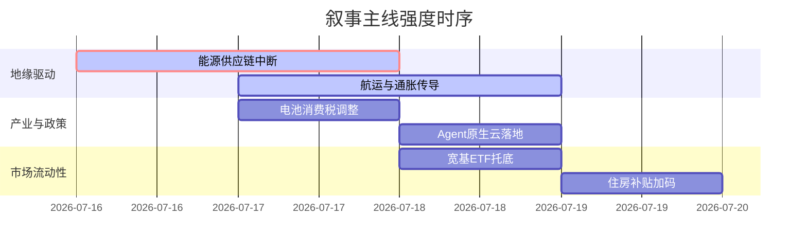

## A股市场情绪分析报告
- **数据时段**：最近5日
- **生成时间**：2026-07-19
- **核心内容**：

### 🔥 宏观叙事焦点（24小时三级过滤）

#### 📌 叙事主线一：美伊冲突跨越民用红线，全球能源供应链重构 ⭐⭐⭐
**主要事件**：地缘冲突升级、原油价格跳涨、航运通道受阻  
**筛选标签**：`中东局势` `霍尔木兹海峡` `路透信源·权重2.0`  
**宏观逻辑**：  
> ① **归类**：地缘风险重估与通胀预期上行  
> ② **历史镜像**：1973年石油危机+2022年俄乌冲突模板  
> ③ **市场传导**：霍尔木兹通行量降至三周低点 → WTI周涨近16%突破83美元 → 全球避险情绪升温 → 资金加速流向黄金、油气及国防军工  
> ④ **叙事强度**：冲突实质性外溢至能源基础设施，供给收缩预期强化，打破原有低通胀假设  

**行业映射**：油气开采与航运链（情绪评分 **8.5/10**）  
**交易警示**：‼️ 关注地缘缓和信号与OPEC+产量博弈，警惕高位原油对制造业成本端的挤压  

---

#### 📌 叙事主线二：财税杠杆调节与AI算力基建范式切换 ⭐⭐  
**主要事件**：行业管理政策发布、技术发布
**筛选标签**：`部委政策` `产业生命周期` `新华社信源·权重1.5`  
**宏观逻辑**：  
> ① **归类**：产业税收调节与技术迭代  
> ② **历史镜像**：2018年光伏“531”政策+2020年云计算补贴模板  
> ③ **市场传导**：锂离子蓄电池等恢复征税 → 中游制造毛利率承压 → 倒逼头部企业技术降本与产能出清；同时WAIC聚焦Agent原生云，算力租赁向端侧智能体迁移  
> ④ **叙事强度**：政策决心大于市场定价，从“规模扩张”转向“质量与合规”，AI商业化进入深水区  

**行业映射**：锂电设备与国产算力（情绪评分 **6.8/10**）  
**交易警示**：⚠️ 警惕政策过渡期内的估值重塑阵痛，右侧信号待业绩验证  

---

#### 📌 叙事主线三：宽基ETF托底与房地产财政化稳预期 ⭐ 
**主要事件**： 国际冲突外溢、地方财政发力
**筛选标签**：`地方政策` `流动性投放` `证券时报信源·权重1.0`  
**宏观逻辑**：  
> ① **归类**：流动性托底与资产再平衡  
> ② **历史镜像**：2015年救市ETF模式+2024年地方化债模板  
> ③ **市场传导**：创业板指单日暴跌超7%触发程序化止损 → 股票型ETF单日吸金超758亿元 → 宽基承接抛压；同时超20城出台住房补贴，财政直接下场稳楼市  
> ④ **叙事强度**：市场情绪冰点与政策底共振，防御性筑底特征明显  

**行业映射**：红利低波与区域地产链（情绪评分 **5.2/10**）  
**交易警示**：✓ 叙事逻辑清晰，等待销售端数据验证，防范短期波动加剧  

---

### 📅 宏观叙事演化（三日趋势）

**强度衰减模型**：昨日主题×0.7 · 前日主题×0.5

```mermaid
gantt
    title 叙事主线强度时序
    dateFormat  YYYY-MM-DD
    section 地缘驱动
    能源供应链中断   :crit, active, 2026-07-16, 2d
    航运与通胀传导   :active, 2026-07-17, 2d
    
    section 产业与政策
    电池消费税调整   :2026-07-17, 1d
    Agent原生云落地  :2026-07-18, 1d
    
    section 市场流动性
    宽基ETF托底      :2026-07-18, 1d
    住房补贴加码     :2026-07-19, 1d
```
叙事节点关联：
07/16：美军连续第五晚空袭伊朗南部设施 → 触发能源供应链断裂叙事
07/17：三部门宣布恢复电池消费税 + 创业板指暴跌超7% → 产业出清与市场恐慌共振
07/18：宽基ETF单日吸金超758亿 + WAIC大会聚焦智能体部署 → 资金防御布局与技术范式切换确认
07/19：超20地加码住房补贴 + 锂电龙头逆势扩产涨价 → 叙事进入政策验证与结构分化期
🎯 宏观叙事三要素
1️⃣ 政策意图解码
当前顶层叙事从“总量刺激”转向“结构优化+底线思维”。财税调节与AI治理并重，允许短期阵痛换取长期质量。产业出清>总量刺激，政策定力超预期。
2️⃣ 市场定价偏差
过度定价：科技成长股线性外推预期（已遭踩踏，估值泡沫破裂）
定价不足：能源安全溢价与宽基托底的韧性（资金正悄然切换至红利与资源品）
3️⃣ 跨市场共振
中东冲突推升大宗商品超级周期 + 国内ETF放量承接抛压 + 美联储鹰派预期压制流动性 = A股结构性行情窗口期（高低切换+防御筑底）

---

*生成时间：2026-07-19 07:08:08 (UTC+8)*  
*使用模型：agnes:agnes-2.0-flash*