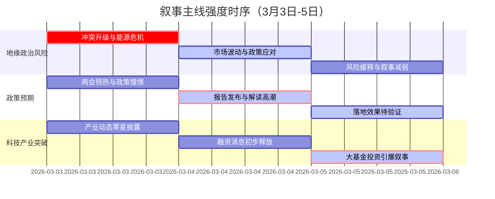

# A股市场情绪分析报告

**数据时段：** 2026年3月1日 - 2026年3月5日  
**生成时间：** 2026年3月6日  

### 🔥 宏观叙事焦点（24小时三级过滤）

#### 📌 叙事主线一：中东地缘冲突升级与全球能源供应链危机 ⭐⭐⭐
**主要事件**：美以联合空袭伊朗核心目标，伊朗发起大规模导弹反击，霍尔木兹海峡航运受阻，国际油价飙升，全球股市波动。  
**筛选标签**：`地缘政治风险` `能源供应中断` `路透信源·权重2.0`  
**宏观逻辑**：  
> ① **归类**：地缘政治黑天鹅事件  
> ② **历史镜像**：2022年2月俄乌冲突模板（导致能源价格暴涨、全球通胀担忧）  
> ③ **市场传导**：避险情绪升温 → VIX指数跳升 → 北向资金流出A股 → 油气股逆势上涨、黄金白银波动加剧  
> ④ **叙事强度**：冲突超预期升级，打破市场对中东局势稳定的幻想，能源安全成为核心议题  

**行业映射**：石油石化（情绪评分 **8.5/10**），国防军工（情绪评分 **7.0/10**），航运（情绪评分 **6.5/10**）  
**交易警示**：‼️ 关注地缘风险演化与油价走势，警惕高位回调和政策干预带来的波动加剧  

---

#### 📌 叙事主线二：全国两会召开，政府工作报告部署新质生产力与内需扩张 ⭐⭐
**主要事件**：十四届全国人大四次会议开幕，李强总理作政府工作报告，聚焦新质生产力、扩大内需、化解风险等任务。  
**筛选标签**：`国务院政策` `沪深300影响` `新华社信源·权重1.5`  
**宏观逻辑**：  
> ① **归类**：宏观政策协调推进  
> ② **历史镜像**：2020年政府工作报告应对疫情冲击模板（聚焦“六稳”“六保”）  
> ③ **市场传导**：政策预期强化 → 消费、科技板块资金流入 → 国债收益率下行反映宽松预期  
> ④ **叙事强度**：政策基调积极，但具体措施有待细化，市场关注落地效果与财政货币配合  

**行业映射**：消费电子（情绪评分 **7.2/10**），新能源车（情绪评分 **7.0/10**），基建（情绪评分 **6.5/10**）  
**交易警示**：⚠️ 政策力度与市场反应可能存在预期差，需跟踪一季度经济数据与后续政策细节  

---

#### 📌 叙事主线三：具身智能与AI产业规模突破，科技自立自强加速 ⭐
**主要事件**：国家大基金三期首次投资具身智能（银河通用获25亿元融资），工信部宣布AI核心产业规模超1.2万亿元。  
**筛选标签**：`部委政策` `产业生命周期` `财新信源·权重1.5`  
**宏观逻辑**：  
> ① **归类**：科技创新驱动增长  
> ② **历史镜像**：2014-2015年“互联网+”政策模板（推动新兴产业成长）  
> ③ **市场传导**：AI商业化预期升温 → 算力、芯片需求增长 → 相关硬件与服务板块走强  
> ④ **叙事强度**：技术突破与资本注入共振，产业进入快速扩张期，但估值偏高需谨慎  

**行业映射**：人工智能（情绪评分 **8.0/10**），半导体设备（情绪评分 **7.5/10**），机器人（情绪评分 **7.2/10**）  
**交易警示**：✓ 技术迭代风险与估值泡沫，关注实际应用落地与盈利兑现进度  

---

### 📅 宏观叙事演化（三日趋势）

**强度衰减模型**：昨日主题×0.7 · 前日主题×0.5

```mermaid
gantt
    title 叙事主线强度时序（3月3日-5日）
    dateFormat  YYYY-MM-DD
    section 地缘政治风险
    冲突升级与能源危机   :crit, 2026-03-03, 1d
    市场波动与政策应对   :active, 2026-03-04, 1d
    风险缓释与叙事减弱   :2026-03-05, 1d
    
    section 政策预期
    两会预热与政策憧憬   :2026-03-03, 1d
    报告发布与解读高潮   :crit, active, 2026-03-04, 1d
    落地效果待验证       :active, 2026-03-05, 1d
    
    section 科技产业突破
    产业动态零星披露     :2026-03-03, 1d
    融资消息初步释放     :2026-03-04, 1d
    大基金投资引爆叙事   :crit, active, 2026-03-05, 1d
```

**叙事节点关联**：
- 03/03：全球股市因中东冲突暴跌，A股油气板块逆势涨停，地缘叙事达到峰值  
- 03/04：全国人大会议开幕，政府工作报告发布，政策叙事启动并主导市场关注  
- 03/05：国家大基金投资具身智能，科技叙事强度跃升，但地缘与政策叙事均出现衰减  
🎯 宏观叙事三要素  
1️⃣ **政策意图解码**  
   当前顶层叙事从“稳增长”转向“调结构”，两会报告强调新质生产力与“反内卷”，允许短期阵痛换取长期质量。产业出清（如化工、光伏）政策力度超预期，显示政府定力。  
2️⃣ **市场定价偏差**  
   - 过度定价：消费复苏弹性（基于前期数据乐观，但2月销量分化显示疲软）  
   - 定价不足：产能出清速度（如艾迪精密刀具涨价反映成本压力，政策执行力被低估）  
3️⃣ **跨市场共振**  
   - 美债收益率波动（3月2日下行后回升）提供短暂政策窗口  
   - 美元指数高位稳定（避险需求），缓释人民币贬值压力，支撑A股外资流动  
   - 中东冲突推升油价，但中国能源结构优化（一次能源生产总量突破）部分对冲冲击，形成结构性行情机会  

---
<!-- 报告正文必须在此结束，以下内容为固定格式说明，严禁添加任何额外分析、总结或展望 -->