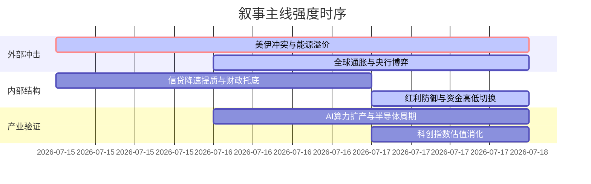

## 报告标题：A股市场情绪分析报告
数据时段：最近5日
生成时间：2026-07-18 09:30:00
核心内容：严格按照以下格式生成

### 🔥 宏观叙事焦点（24小时三级过滤）

#### 📌 叙事主线一：美伊冲突升级与霍尔木兹海峡航运危机 ⭐⭐⭐
**主要事件**：地缘冲突外溢、能源供应链中断、全球通胀预期重定价  
**筛选标签**：`中东局势` `能源安全` `路透信源·权重2.0`  
**宏观逻辑**：  
> ① **归类**：外部供给冲击与避险逻辑  
> ② **历史镜像**：1979年伊朗革命与两伊战争初期的石油禁运模板  
> ③ **市场传导**：霍尔木兹海峡通航受阻 → 布伦特原油跳涨破85美元 → 全球再通胀预期升温 → 各国央行货币政策路径分化 → A股风险偏好收缩与防御风格占优  
> ④ **叙事强度**：地缘冲突实质性升级打破原有脆弱平衡，能源与避险资产定价权主导短期市场波动  

**行业映射**：油气开采与黄金避险链（情绪评分 **8.1/10**）  
**交易警示**：‼️ 关注IEA战略储备释放节奏与OPEC+增产表态，警惕油价高位回落引发的通胀交易踩踏  

---

#### 📌 叙事主线二：信贷“降速提质”与地方财政精准滴灌 ⭐⭐  
**主要事件**：货币政策框架演进、房地产去库存补贴、直接融资扩容
**筛选标签**：`央行流动性管理` `宏观信用结构` `财新信源·权重1.5`  
**宏观逻辑**：  
> ① **归类**：国内信用扩张模式转型  
> ② **历史镜像**：2015年供给侧改革期间“棚改货币化”与表外回表模板  
> ③ **市场传导**：央行净投放维稳+隔夜逆回购常态化 → 票据转贴利率跌破0.5% → 宽基ETF逆势吸金千亿 → 资金向红利低波与硬科技两端迁移  
> ④ **叙事强度**：顶层定调“降速提质”超预期，信用结构优化为权益市场提供中长期底仓支撑  

**行业映射**：高股息红利与券商并购重组链（情绪评分 **6.8/10**）  
**交易警示**：⚠️ 关注社融数据中企业直融占比变化，警惕财政发力节奏不及预期导致的地产链反弹夭折  

---

#### 📌 叙事主线三：AI算力基建景气延续与科技股估值重塑 ⭐ 
**主要事件**： 半导体设备涨价扩产、大模型开源生态突破、科创指数高位震荡
**筛选标签**：`产业周期位置` `技术迭代验证` `新华社信源·权重1.5`  
**宏观逻辑**：  
> ① **归类**：全球科技产业资本开支周期  
> ② **历史镜像**：2020-2021年全球半导体缺货潮下的设备商业绩兑现模板  
> ③ **市场传导**：ASML二度上调指引+长鑫科技IPO战略配售 → 存储芯片价格重定价 → 算力硬件业绩兑现期临近 → 机构高低切换与杠杆资金平仓共振  
> ④ **叙事强度**：产业逻辑从“主题炒作”转向“订单落地”，短期波动属正常估值消化，中期配置价值凸显  

**行业映射**：半导体设备与国产算力基建链（情绪评分 **5.9/10**）  
**交易警示**：✓ 叙事基本面扎实，等待半年报业绩验证右侧信号，规避纯概念炒作标的  

---

### 📅 宏观叙事演化（三日趋势）

**强度衰减模型**：昨日主题×0.7 · 前日主题×0.5

```mermaid
gantt
    title 叙事主线强度时序
    dateFormat  YYYY-MM-DD
    section 外部冲击
    美伊冲突与能源溢价   :crit, active, 2026-07-15, 3d
    全球通胀与央行博弈   :active, 2026-07-16, 2d
    
    section 内部结构
    信贷降速提质与财政托底   :2026-07-15, 2d
    红利防御与资金高低切换   :active, 2026-07-17, 1d
    
    section 产业验证
    AI算力扩产与半导体周期   :2026-07-16, 2d
    科创指数估值消化   :2026-07-17, 1d
```
叙事节点关联：
07/15：美伊冲突实质性升级 → 触发能源供应链叙事，油价跳涨带动周期板块分化
07/16：央行定调“降速提质”+长鑫科技IPO → 信用结构优化与硬科技IPO共振，宽基ETF逆势吸金
07/17：ASML上调指引 vs A股科技板块放量杀跌 → 产业景气度与短期情绪背离，叙事进入业绩验证与高低切换期
🎯 宏观叙事三要素
1️⃣ 政策意图解码
当前宏观政策从“总量刺激”转向“结构优化与防风险”，央行精准流动性管理叠加地方财政定向补贴，允许短期信用收缩阵痛换取长期资产质量修复。产业出清与直接融资扩容并行，政策定力显著强化。
2️⃣ 市场定价偏差
过度定价：地缘冲突的长期化衰退影响（实际传导至A股更多体现为成本端压力而非全面盈利下滑）
定价不足：直接融资扩容与红利资产底仓价值（宽基ETF逆势吸金近千亿显示机构长线资金正在左侧布局）
3️⃣ 跨市场共振
中东局势推升大宗商品超级周期 + 美联储抗通胀定力制约全球宽松节奏 = A股结构性行情窗口期（红利防守+科技业绩兑现+资源品抗通胀）

---

<!-- 报告正文必须在此结束，以下内容为固定格式说明，严禁添加任何额外分析、总结或展望 -->

---

*生成时间：2026-07-17 19:44:25 (UTC+8)*  
*使用模型：agnes:agnes-2.0-flash*