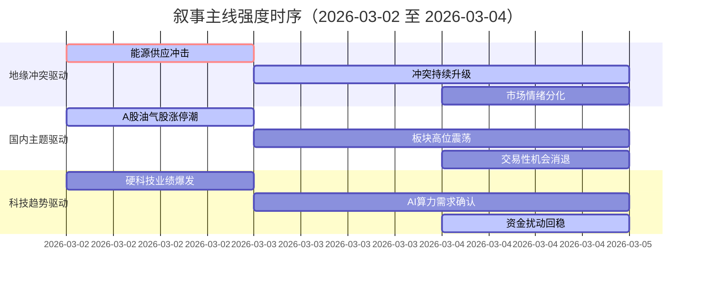

## A股市场情绪分析报告

**数据时段**：2026-02-28 至 2026-03-04  
**生成时间**：2026-03-05 06:50  
**核心内容**：

### 🔥 宏观叙事焦点（24小时三级过滤）

#### 📌 叙事主线一：中东地缘冲突急剧升级与全球能源供应链冲击 ⭐⭐⭐
**主要事件**：美以联合空袭伊朗核心目标，伊朗大规模导弹反击，霍尔木兹海峡航运受阻  
**筛选标签**：`地缘政治黑天鹅` `全球能源危机` `权重2.5`  
**宏观逻辑**：  
> ① **归类**：地缘政治风险事件  
> ② **历史镜像**：1990年伊拉克入侵科威特、2022年俄乌冲突  
> ③ **市场传导**：油价跳升 → 通胀预期回升 → 央行降息预期降温 → 风险资产抛售 + 黄金/美元走强  
> ④ **叙事强度**：冲突持续超预期，供应中断风险真实化，加剧全球滞胀担忧  

**行业映射**：A股石油石化板块（情绪评分 **8.2/10**）  
**交易警示**：⚠️ 地缘风险溢价回撤风险，供需基本面未实质恶化，警惕冲突缓和后的快速回调  

---

#### 📌 叙事主线二：A股油气股历史性暴涨与主题投机过热 ⭐⭐  
**主要事件**：“三桶油”首次集体涨停，油气股批量暴涨，相关ETF触发溢价停牌  
**筛选标签**：`板块轮动` `资金驱动` `权重2.0`  
**宏观逻辑**：  
> ① **归类**：主题投机性行情  
> ② **历史镜像**：2007年资源超级周期、2022年俄乌冲突油气行情  
> ③ **市场传导**：地缘消息 → 期货涨停 → 个股连板 → ETF溢价 → 监管风险警示  
> ④ **叙事强度**：情绪驱动交易，基本面支撑不足，短期涨幅透支  

**行业映射**：周期股（石油/煤炭/航运）（情绪评分 **7.5/10**）  
**交易警示**：‼️ 炒作过热，警惕地缘缓和或监管发声后的快速消退  

---

#### 📌 叙事主线三：硬科技业绩兑现与AI算力需求爆发 ⭐  
**主要事件**：寒武纪等AI芯片公司业绩扭亏为盈，英伟达数据中心收入超预期，全球算力“军备竞赛”  
**筛选标签**：`产业趋势` `业绩驱动` `权重1.5`  
**宏观逻辑**：  
> ① **归类**：产业长期趋势  
> ② **历史镜像**：2013年移动互联网、2019年半导体国产化  
> ③ **市场传导**：业绩超预期 → 机构持仓增加 → 估值重构 → 产业链扩散  
> ④ **叙事强度**：需求刚性，但短期受地缘冲击扰动，估值部分透支远期增长  

**行业映射**：半导体/AI算力（情绪评分 **7.8/10**）  
**交易警示**：⚠️ 短期资金分流至能源板块，长期趋势未改，逢低配置价值显现  

---

### 📅 宏观叙事演化（三日趋势）

**强度衰减模型**：昨日主题×0.7 · 前日主题×0.5

```mermaid
gantt
    title 叙事主线强度时序（2026-03-02 至 2026-03-04）
    dateFormat  YYYY-MM-DD
    section 地缘冲突驱动
    能源供应冲击   :crit, active, 2026-03-02, 1d
    冲突持续升级   :active, 2026-03-03, 2d
    市场情绪分化   :2026-03-04, 1d
    
    section 国内主题驱动
    A股油气股涨停潮 :active, 2026-03-02, 1d
    板块高位震荡   :2026-03-03, 2d
    交易性机会消退 :2026-03-04, 1d
    
    section 科技趋势驱动
    硬科技业绩爆发 :2026-03-02, 1d
    AI算力需求确认 :2026-03-03, 2d
    资金扰动回稳   :active, 2026-03-04, 1d
```
叙事节点关联：
03/02：美伊冲突升级触发油价飙升 → A股油气股批量涨停，寒武纪业绩亮眼但板块承压  
03/03：油气股延续强势，多只ETF溢价触发停牌，监管提示风险；英伟达数据中心收入超预期强化算力逻辑  
03/04：油气股高位震荡分化，资金部分回流科技，市场从纯地缘交易向基本面修复过渡  
🎯 宏观叙事三要素
1️⃣ 政策意图解码
外部冲击下，国内政策重心聚焦“十五五”规划与科技自立自强，对周期性通胀容忍度提升，避免为短期价格波动过度收紧流动性。
2️⃣ 市场定价偏差
过度定价：油气板块短期情绪溢价（地缘驱动，供需未实质恶化）
定价不足：半导体等硬科技的长期国产替代价值（业绩已兑现，但受地缘分流）
3️⃣ 跨市场共振
美债收益率因通胀预期回升 → 美元指数走强 → 新兴市场汇率承压，但中国因能源自给能力相对韧性，A股内部结构分化显著，能源与科技呈现“跷跷板”效应。