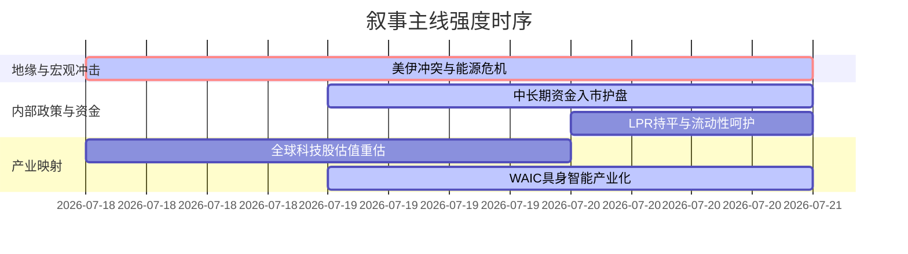

# A股市场情绪分析报告

**数据时段**：2026年7月18日 - 2026年7月20日（最近5日）
**生成时间**：2026-07-20 20:30:20 (UTC+8)

---

## 🔥 宏观叙事焦点（24小时三级过滤）

#### 📌 叙事主线一：美伊冲突急剧升级与霍尔木兹海峡航运危机 ⭐⭐⭐
**主要事件**：地缘军事对抗、能源供应链中断、大宗商品剧烈波动
**筛选标签**：`地缘风险` `国际商品影响` `路透/财新信源·权重2.5`  
**宏观逻辑**：  
> ① **归类**：地缘风险溢价重构  
> ② **历史镜像**：1973年石油危机/2022年俄乌冲突初期模板  
> ③ **市场传导**：霍尔木兹通航量骤降至零 → 布伦特突破90美元+现货黄金破4030美元 → 避险情绪升温→ A股油气煤炭电力板块掀涨停潮  
> ④ **叙事强度**：冲突跨越民用红线，供应中断预期从博弈升级为实质性威胁，全球能源定价逻辑重塑  

**行业映射**：能源安全链（油气开采、煤炭电力、黄金珠宝）（情绪评分 **8.5/10**）  
**交易警示**：‼️ 关注停火斡旋进展与油价高位回落风险，警惕冲突缓和后的快速获利回吐及下游制造业成本挤压效应  

---

#### 📌 叙事主线二：证监会引导中长期资金入市与“国家队”真金白银托底 ⭐⭐
**主要事件**：资本市场制度优化、险资入市、宽基ETF巨额净流入
**筛选标签**：`证监会政策` `A股流动性` `财联社/上证信源·权重2.0`  
**宏观逻辑**：  
> ① **归类**：增量资金引入与交易生态规范  
> ② **历史镜像**：2015年“国家队”护盘+2024年924行情政策组合模板  
> ③ **市场传导**：险企集体发声+央企扫货 → 沪深300/双创ETF上周净流入850亿元 → 宽基指数下行空间受限，市场底信号强化  
> ④ **叙事强度**：监管层“耐心资本”导向明确，回购增持再贷款落地，政策底向市场底传导加速  

**行业映射**：高股息红利/宽基指数（情绪评分 **7.0/10**）  
**交易警示**：⚠️ 关注基本面修复与企业盈利验证节奏，若外部地缘冲击持续加剧，需防范托底资金边际效用递减  

---

#### 📌 叙事主线三：全球科技股估值重估与WAIC具身智能产业化落地 ⭐ 
**主要事件**：AI估值过热担忧、韩国半导体熔断、国内AI项目签约与商业化提速
**筛选标签**：`科技产业政策` `全球科技映射` `彭博/路透信源·权重1.5`  
**宏观逻辑**：  
> ① **归类**：科技资产再定价与国产替代  
> ② **历史镜像**：2000年互联网泡沫破裂后基础设施重建模板  
> ③ **市场传导**：全球科技股3日蒸发3万亿+费半指数回撤近10% → A股光模块/半导体短期承压 → WAIC签约409亿+DeepSeek融资3500亿推动产业转向场景落地  
> ④ **叙事强度**：海外“去拥挤化”倒逼内资切换至业绩确定性方向，具身智能与AI应用成为新主线  

**行业映射**：具身智能/人形机器人/AI算力租赁（情绪评分 **6.2/10**）  
**交易警示**：✓ 右侧信号待确认，关注中报业绩兑现与超跌反弹后的量能配合，避免追高纯概念标的  

---

### 📅 宏观叙事演化（三日趋势）

**强度衰减模型**：昨日主题×0.7 · 前日主题×0.5

```mermaid
gantt
    title 叙事主线强度时序
    dateFormat YYYY-MM-DD
    section 地缘与宏观冲击
    美伊冲突与能源危机   :crit, active, 2026-07-18, 3d
    
    section 内部政策与资金
    中长期资金入市护盘   :active, 2026-07-19, 2d
    LPR持平与流动性呵护   :2026-07-20, 1d
    
    section 产业映射
    全球科技股估值重估   :2026-07-18, 2d
    WAIC具身智能产业化   :active, 2026-07-19, 2d
```

**叙事节点关联：**
- 07/18：美军连续第七晚空袭伊朗，霍尔木兹通行量骤降至三周低点 → 触发能源危机与避险叙事
- 07/19：卡塔尔提出10天停火方案，但海湾国家关键设施仍遭波及 → 冲突外溢风险强化，A股周期板块领涨，科技股阶段性调整
- 07/20：证监会召开座谈会+三大险企发声+国家队ETF上周净流入850亿 → 政策托底对冲外部冲击，市场进入“地缘定价+资金托底”双主线博弈期

**🎯 宏观叙事三要素**
1️⃣ **政策意图解码**
当前顶层叙事从“总量强刺激”转向“结构防御+耐心资本培育”。在外部地缘与全球流动性扰动下，监管层以回购增持再贷款、引导险资入市、规范量化交易组合发力，政策底线思维与稳预期意图明确。
2️⃣ **市场定价偏差**
过度定价：纯概念AI硬件与高杠杆存储芯片（海外去拥挤化传导下的短期错杀压力）
定价不足：能源安全链业绩弹性（油价高位+国内煤炭电力供需偏紧）+ 高股息红利资产的防御配置价值
3️⃣ **跨市场共振**
美伊冲突推升原油/黄金 → 全球通胀预期重估 + 美联储降息路径推迟 = A股外资流向承压；但国内央行净投放1745亿+LPR按兵不动维持宽松 = 内外均衡下结构性行情基础未破，资金正从高位成长向红利与资源品切换。

---

*生成时间：2026-07-20 20:30:20 (UTC+8)*  
*使用模型：agnes:agnes-2.0-flash*