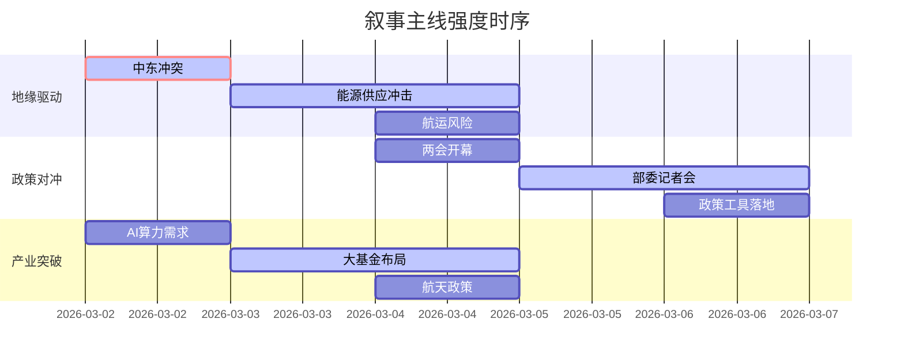

## 报告标题：A股市场情绪分析报告
**数据时段**：最近5日（2026年3月2日 - 2026年3月6日）
**生成时间**：2026年3月7日

### 🔥 宏观叙事焦点（24小时三级过滤）

#### 📌 叙事主线一：中东地缘冲突全面升级 ⭐⭐⭐
**主要事件**：美以联合空袭伊朗核心目标，伊朗大规模导弹反击，霍尔木兹海峡航运安全恶化  
**筛选标签**：`地缘政治风险` `能源供应冲击` `中东冲突·权重3.0`  
**宏观逻辑**：  
> ① **归类**：地缘政治黑天鹅事件  
> ② **历史镜像**：1990年海湾战争 oil price spike template  
> ③ **市场传导**：油价跳升 → 航运中断预期 → 全球股市波动 → 黄金/美元波动  
> ④ **叙事强度**：冲突直接威胁全球能源命脉，打破市场对地缘风险的常规定价，强度远超预期  

**行业映射**：能源（油气开采、油服）、航运、黄金（情绪评分 **9.0/10**）  
**交易警示**：‼️ 关注冲突持续时间与霍尔木兹海峡实际通行情况，警惕预期差收窄导致资产价格剧烈反转  

---

#### 📌 叙事主线二：中国两会政策定调与部委落实 ⭐⭐  
**主要事件**：政府工作报告发布、多部委记者会释放稳增长与科技自立政策  
**筛选标签**：`两会政策` `内需扩张` `新华社信源·权重2.5`  
**宏观逻辑**：  
> ① **归类**：宏观政策转向稳增长  
> ② **历史镜像**：2020年疫情后政策组合模板  
> ③ **市场传导**：政策预期升温 → 消费、基建板块异动 → 融资余额波动  
> ④ **叙事强度**：政策力度超预期，但市场对经济基本面信心仍待验证  

**行业映射**：消费复苏链、基础建设（情绪评分 **7.2/10**）  
**交易警示**：⚠️ 政策与市场反应一致性，警惕预期差收窄  

---

#### 📌 叙事主线三：科技自立自强与AI产业化加速 ⭐ 
**主要事件**： 国家大基金投资具身智能、AI算力需求爆发、商业航天政策升级  
**筛选标签**：`科技自主` `AI产业化` `财新信源·权重2.0`  
**宏观逻辑**：  
> ① **归类**：产业技术突破  
> ② **历史镜像**：2014年半导体国产化模板  
> ③ **市场传导**：技术突破 → 产业链估值重估 → 资金配置变化  
> ④ **叙事强度**：政策支持明确，但商业化进程存在不确定性  

**行业映射**：半导体、AI应用、商业航天（情绪评分 **6.5/10**）  
**交易警示**：✓ 产业政策落地情况，关注技术迭代风险  

---

### 📅 宏观叙事演化（三日趋势）

**强度衰减模型**：昨日主题×0.7 · 前日主题×0.5

```mermaid
gantt
    title 叙事主线强度时序
    dateFormat  YYYY-MM-DD
    section 地缘驱动
    中东冲突   :crit, active, 2026-03-02, 1d
    能源供应冲击   :active, 2026-03-03, 2d
    航运风险   :2026-03-04, 1d
    
    section 政策对冲
    两会开幕   :2026-03-04, 1d
    部委记者会   :active, 2026-03-05, 2d
    政策工具落地   :2026-03-06, 1d
    
    section 产业突破
    AI算力需求   :2026-03-02, 1d
    大基金布局   :active, 2026-03-03, 2d
    航天政策   :2026-03-04, 1d
```
叙事节点关联：
03/02：美以空袭伊朗引爆地缘危机，油价跳涨，全球股市遭遇“黑色星期一”
03/03： A股“三桶油”历史性涨停，资金集中涌入能源避险，市场情绪两极分化
03/04：韩国股市暴跌12%触发熔断，地缘恐慌达峰，但中国两会政策预期开始对冲
03/05：政府工作报告发布，明确新质生产力与扩大内需，部委记者会释放金融协同工具，政策强度上升
03/06：科技产业细节落地，商业航天、低空经济获政策加持，但地缘余波未消，伊朗威胁扩大攻击
🎯 宏观叙事三要素
1️⃣ 政策意图解码
顶层叙事在“调结构”与“稳增长”间再平衡，面临外部冲击时允许阶段性稳内需，但坚持科技自立与产能出清的长周期方向。政策定力超预期，避免“大水漫灌”。
2️⃣ 市场定价偏差
过度定价：地缘冲突的持续时间与油价上涨斜率
定价不足：国内政策对冲的精准性与科技自主的长期回报
3️⃣ 跨市场共振
美债收益率波动中降息周期预期未改 + 中东风险溢价短期主导商品市场 = A股结构性机会在政策受益的能源、消费、科技板块，但整体波动加剧

<!-- 报告正文必须在此结束，以下内容为固定格式说明，严禁添加任何额外分析、总结或展望 -->