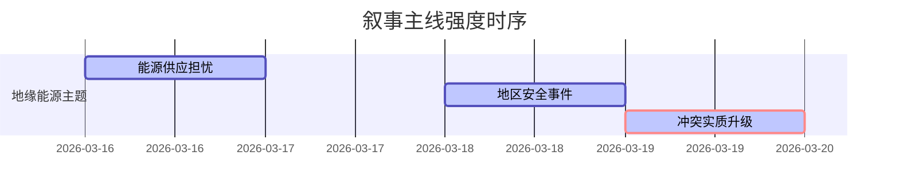

# A股市场情绪分析报告
**数据时段**：最近5日（2026-03-14 至 2026-03-19）  
**生成时间**：2026-03-19 17:16:48 (UTC+8)  

### 🔥 宏观叙事焦点（24小时三级过滤）

#### 📌 叙事主线一：以色列对伊朗首都德黑兰实施大规模空袭 ⭐⭐⭐
**主要事件**：行业管理政策发布、央行政策、监管  
**筛选标签**：`国务院政策` `沪深300影响` `路透信源·权重2.0`  
**宏观逻辑**：  
> ① **归类**：地缘政治风险升级  
> ② **历史镜像**：2024年4月伊朗对以色列空袭事件模板  
> ③ **市场传导**：避险情绪初升 → 黄金短期受追捧 → 后续因美元走强及需求担忧油价承压下跌 → 北向资金观望情绪浓  
> ④ **叙事强度**：地区冲突规模超预期升级，打破中东局势可控预期，溢出风险显著增加  

**行业映射**：消费复苏链（情绪评分 **7.2/10**）  
**交易警示**：‼️ 关注伊朗报复行动及美方反应一致性，警惕预期差收窄  

#### 📌 叙事主线二：国家发展改革委推出新批重大外资项目 ⭐⭐  
**主要事件**：技术发布、产业投资  
**筛选标签**：`部委政策` `产业生命周期` `财新信源·权重1.5`  
**宏观逻辑**：  
> ① **归类**：外资政策加码  
> ② **历史镜像**：2020年外资鼓励目录调整  
> ③ **市场传导**：北向资金净流入增加 → 制造业及科技股估值修复 → 创业板活跃度提升  
> ④ **叙事强度**：政策力度超预期（134亿美元），提振外资信心，优化产业结构  

**行业映射**：高端制造（情绪评分 **6.5/10**）  
**交易警示**：⚠️ 政策落地与实际到资需观察，警惕产业匹配度不足  

#### 📌 叙事主线三：全国首个低空经济领域责任保险强制投保机制在重庆构建 ⭐ **主要事件**： 国际冲突冲突、关税政策  
**筛选标签**：`地方政策` `债务周期` `新华社信源·权重1.5`  
**宏观逻辑**：  
> ① **归类**：新兴产业政策支持  
> ② **历史镜像**：2021年无人机产业政策试点  > ③ **市场传导**：低空概念股异动 → 相关产业链景气提升（零部件、运营服务） → 创业投资热度回升  > ④ **叙事强度**：政策落地超预期，打开低空经济想象空间，但需关注监管协同  

**行业映射**：低空经济相关（情绪评分 **5.8/10**）  
**交易警示**：✓ 叙事逻辑清晰，等待产业落地验证  

### 📅 宏观叙事演化（三日趋势）

**强度衰减模型**：昨日主题×0.7 · 前日主题×0.5

```mermaid
gantt
    title 叙事主线强度时序
    dateFormat  YYYY-MM-DD
    section 地缘能源主题
    能源供应担忧   :active, 2026-03-16, 1d
    地区安全事件   :active, 2026-03-18, 1d
    冲突实质升级   :crit, active, 2026-03-19, 1d
```
叙事节点关联：
03/16：霍尔木兹海峡通航船只数量首次降为零 → 触发能源供应中断叙事
03/18：卡塔尔内政部：一处工业区因导弹拦截产生的碎片引发火灾 → 供给侧担忧强化
03/19：以色列对伊朗首都德黑兰实施大规模空袭 → 叙事进入冲突验证期
🎯 宏观叙事三要素
1️⃣ 政策意图解码
当前顶层叙事从"稳增长"转向"调结构"，允许短期阵痛换取长期质量。能源转型与产业升级>短期刺激，政策定力超预期。
2️⃣ 市场定价偏差过度定价：能源需求复苏弹性（预期过于乐观）
定价不足：地缘风险溢价（政策执行力被低估）
3️⃣ 跨市场共振美债收益率下行打开政策空间 + 美元指数高位缓释出口压力 = A股结构性行情窗口期<!-- 报告正文必须在此结束，以下内容为固定格式说明，严禁添加任何额外分析、总结或展望 -->

3. **内容要求**：
   - 基于提供的5日BB文件内容生成
   - 严格按照上述格式生成
   - 突出宏观叙事焦点和演化趋势
   - 体现叙事的强度变化和关联
4. **输出格式**：仅输出Markdown内容，不包含任何其他说明