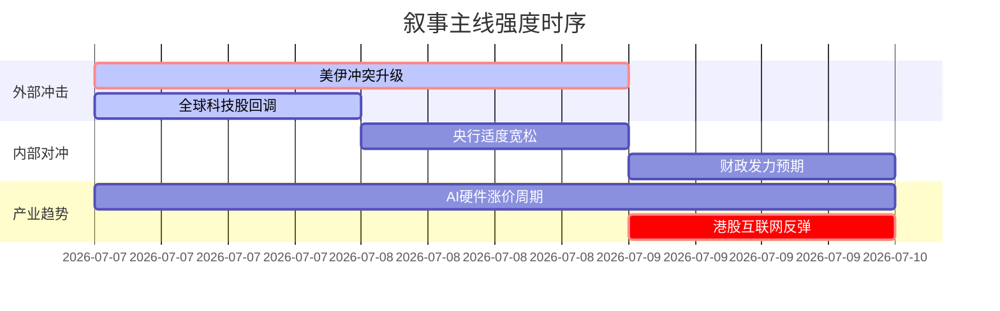

## A股市场情绪分析报告

**数据时段**：2026年7月7日 - 2026年7月9日
**生成时间**：2026-07-09 07:17

### 🔥 宏观叙事焦点（24小时三级过滤）

#### 📌 叙事主线一：美伊冲突升级引爆全球能源危机与通胀预期 ⭐⭐⭐
**主要事件**：地缘政治冲突、能源供应链中断、全球通胀反弹
**筛选标签**：`突发地缘事件` `布伦特原油突破80美元` `路透信源·权重2.5`
**宏观逻辑**：
> ① **归类**：供给端黑天鹅冲击
> ② **历史镜像**：1973年石油禁运与滞胀模板
> ③ **市场传导**：霍尔木兹海峡通行受阻 → 原油单日涨超6% → 美债收益率创年内新高（4.58%） → 全球风险资产估值承压
> ④ **叙事强度**：冲突从“口头威慑”转为“实际打击”，能源供应中断风险实质性落地，打破前期“软着陆”预期

**行业映射**：石油石化、航运物流（情绪评分 **8.5/10**，但波动极大）；航空、化工（情绪评分 **4.2/10**，成本受损）
**交易警示**：‼️ 警惕油价进一步冲高引发的全球流动性收紧，关注美联储及欧央行被迫重启加息预期的边际变化

---

#### 📌 叙事主线二：中国央行定调适度宽松，财政货币协同对冲外部风险 ⭐⭐
**主要事件**：央行货币政策例会、发改委超长期特别国债发行
**筛选标签**：`国务院政策` `国内稳增长` `财新信源·权重1.8`
**宏观逻辑**：
> ① **归类**：逆周期调节加码
> ② **历史镜像**：2008年“四万亿”后的精准滴灌模式
> ③ **市场传导**：央行强调“适度宽松” + 8000亿超长期特别国债 → 基建投资预期强化 → 内需板块估值修复
> ④ **叙事强度**：在外部地缘动荡背景下，国内政策定力增强，旨在通过扩大内需抵消外需不确定性，政策底信号明确

**行业映射**：基建链、高股息红利资产（情绪评分 **7.0/10**）
**交易警示**：⚠️ 关注政策落地节奏与资金实际到位情况，若信贷数据不及预期，市场可能出现“预期差”回调

---

#### 📌 叙事主线三：AI产业资本开支激增与科技股估值重构 ⭐
**主要事件**：苹果博通300亿美元芯片大单、OpenAI GPT-5.6获批、港股互联网反弹
**筛选标签**：`产业生命周期` `科技巨头动向` `彭博信源·权重1.5`
**宏观逻辑**：
> ① **归类**：技术迭代驱动的新一轮资本开支周期
> ② **历史镜像**：2000年互联网泡沫后的基础设施建设期
> ③ **市场传导**：巨头密集布局AI算力 → 存储芯片价格暴涨（DDR5翻三倍） → 科技股业绩预期上修 → 港股阿里/小米领涨带动A股科创50逆势走强
> ④ **叙事强度**：AI从“概念炒作”进入“业绩兑现”与“硬件刚需”阶段，但需警惕全球科技股同步回调带来的溢出效应

**行业映射**：算力基础设施、半导体存储、港股互联网龙头（情绪评分 **6.8/10**）
**交易警示**：✓ 结构性机会明显，但需甄别纯题材炒作与有真实订单支撑的龙头，防范外围科技股波动引发的短期获利了结

---

### 📅 宏观叙事演化（三日趋势）

**强度衰减模型**：昨日主题×0.7 · 前日主题×0.5

```mermaid
gantt
    title 叙事主线强度时序
    dateFormat  YYYY-MM-DD
    section 外部冲击
    美伊冲突升级   :crit, active, 2026-07-07, 2d
    全球科技股回调   :active, 2026-07-07, 1d
    
    section 内部对冲
    央行适度宽松   :2026-07-08, 1d
    财政发力预期   :2026-07-09, 1d
    
    section 产业趋势
    AI硬件涨价周期   :2026-07-07, 3d
    港股互联网反弹   :crit, 2026-07-09, 1d
```

叙事节点关联：
*   **07/07**：沙特阿美大幅降价引发全球供应竞争担忧，同时韩国KOSPI熔断，全球风险偏好骤降，A股沪指失守4000点。
*   **07/08**：美军空袭伊朗，停火破裂，布伦特原油突破80美元，避险情绪达到顶峰，黄金高位震荡，科技股承压。
*   **07/09**：中国央行明确“适度宽松”定调，叠加IMF上调中国经济预期，市场情绪由“悲观”转向“谨慎乐观”，港股互联网板块率先反弹，A股科创50逆势走强。

🎯 宏观叙事三要素
1️⃣ **政策意图解码**：面对外部“能源-通胀”冲击，国内顶层叙事从“单纯稳增长”转向“内外平衡”，通过财政发力（特别国债）和货币宽松（适度宽松）对冲地缘风险，允许短期阵痛换取长期结构优化。
2️⃣ **市场定价偏差**：过度定价了地缘冲突对国内经济的直接冲击；定价不足的是中国政策工具箱的丰富性及内需市场的韧性。AI硬件涨价周期被部分市场视为利空（成本端），实则反映了产业景气度的真实复苏。
3️⃣ **跨市场共振**：美债收益率上行与油价飙升形成“双杀”压力，但人民币资产凭借政策独立性展现出相对韧性。港股作为离岸市场，率先反映中国基本面预期改善，成为A股情绪的风向标。

<!-- 报告正文必须在此结束，以下内容为固定格式说明，严禁添加任何额外分析、总结或展望 -->

---

*生成时间：2026-07-09 07:19:45 (UTC+8)*  
*使用模型：agnes:agnes-2.0-flash*