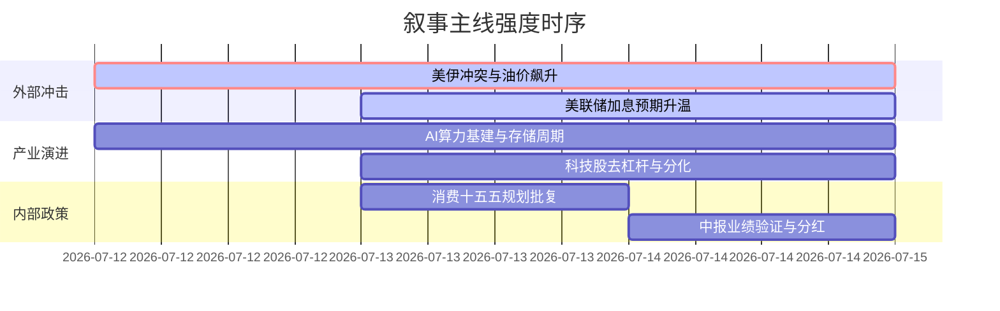

# A股市场情绪分析报告
**数据时段**：最近5日（2026.07.10-2026.07.14）
**生成时间**：2026-07-14 19:43:41 (UTC+8)

### 🔥 宏观叙事焦点（24小时三级过滤）

#### 📌 叙事主线一：美伊对峙升级与霍尔木兹海峡危机 ⭐⭐⭐
**主要事件**：地缘冲突、原油价格飙升、美联储加息预期升温  
**筛选标签**：`地缘风险溢价` `全球能源供应链` `路透信源·权重2.0`  
**宏观逻辑**：  
> ① **归类**：外部流动性收紧与供给冲击共振  
> ② **历史镜像**：1979年伊朗革命后油价暴涨模板  
> ③ **市场传导**：布伦特原油单日跳涨9.2%突破83美元 → 核心PCE预期上修 → 美联储7月加息概率定价升至50% → 美元指数走强压制全球风险资产估值  
> ④ **叙事强度**：冲突烈度超预期，战争溢价快速兑现至商品端，跨市场波动率急剧放大  

**行业映射**：油气开采/航运/高股息银行（情绪评分 **8.1/10**）  
**交易警示**：‼️ 关注油价对制造业成本的侵蚀效应及美联储鹰派表态，警惕外溢风险导致成长股估值承压  

---

#### 📌 叙事主线二：AI算力军备竞赛与半导体周期分化 ⭐⭐  
**主要事件**：技术发布、产业投资、中报业绩验证
**筛选标签**：`部委政策` `产业生命周期` `财新信源·权重1.5`  
**宏观逻辑**：  
> ① **归类**：科技产业资本开支扩张  
> ② **历史镜像**：2000年互联网基础设施投资潮 / 2023年HBM短缺周期  
> ③ **市场传导**：Meta/谷歌追加数百亿美元AI基建 → 存储芯片长周期紧缺预期确立 → 龙头财报预增（长鑫科技+1700%） → 资金向确定性算力硬件与光模块集中  
> ④ **叙事强度**：产业趋势明确但短期面临获利盘了结与外围杠杆踩踏，呈现“强逻辑、高波动”特征  

**行业映射**：半导体设备/AI终端/存储芯片（情绪评分 **6.8/10**）  
**交易警示**：⚠️ 注意SK海力士暴跌带来的情绪传染，右侧信号需等待去杠杆结束与国产替代进度验证  

---

#### 📌 叙事主线三：扩内需顶层设计与中报业绩分化 ⭐ 
**主要事件**： 行业管理政策发布、监管动态、经济数据
**筛选标签**：`地方政策` `债务周期` `新华社信源·权重1.5`  
**宏观逻辑**：  
> ① **归类**：内部结构优化与政策托底  
> ② **历史镜像**：2013年“国九条”资本市场改革模板  
> ③ **市场传导**：国务院批复《扩大消费“十五五”规划》 → “人工智能+消费”定调 → 险企分红密集落地+银行高股息护盘 → 信用监管趋严规范信贷生态  
> ④ **叙事强度**：政策意图从“总量刺激”转向“结构提质”，基本面K型分化加剧，业绩兑现成为选股核心锚点  

**行业映射**：消费复苏链/红利资产/金融合规（情绪评分 **5.2/10**）  
**交易警示**：✓ 叙事逻辑清晰，等待财政发力与促消费细则落地，防范预期差导致的板块轮动加速  

---

### 📅 宏观叙事演化（三日趋势）

**强度衰减模型**：昨日主题×0.7 · 前日主题×0.5

```mermaid
gantt
    title 叙事主线强度时序
    dateFormat  YYYY-MM-DD
    section 外部冲击
    美伊冲突与油价飙升   :crit, active, 2026-07-12, 3d
    美联储加息预期升温   :active, 2026-07-13, 2d
    
    section 产业演进
    AI算力基建与存储周期 :2026-07-12, 3d
    科技股去杠杆与分化   :2026-07-13, 2d
    
    section 内部政策
    消费十五五规划批复   :2026-07-13, 1d
    中报业绩验证与分红   :2026-07-14, 1d
```
叙事节点关联：
07/12：美军空袭伊朗+德黑兰宣布关闭霍尔木兹海峡 → 触发地缘避险叙事
07/13：布伦特原油单日暴涨9.2%突破83美元 + 沃勒鹰派发声 → 叙事进入通胀与流动性定价期
07/14：国务院批复《扩大消费“十五五”规划》+ A股缩量调整资金抱团高股息 → 叙事切换至内循环与防御验证期
🎯 宏观叙事三要素
1️⃣ 政策意图解码
当前顶层叙事从“稳增长”转向“调结构”，允许短期阵痛换取长期质量。结合“十五五”消费规划批复与央行精准逆回购投放，政策重心在于“防风险+促转型”，通过结构性工具对冲外部冲击，呵护流动性合理充裕。
2️⃣ 市场定价偏差
过度定价：海外流动性紧缩幅度（市场已提前计价50%加息概率，但国内政策对冲空间及汇率韧性被低估）
定价不足：国产算力/半导体设备替代进度（长鑫科技IPO与中报业绩预增反映产业链自主可控加速，盈利兑现确定性高于预期）
3️⃣ 跨市场共振
美债收益率上行打开政策博弈窗口 + 原油地缘溢价冲击全球供应链 = A股结构性行情窗口期（资金向高股息与业绩确定性方向收敛，科技内部呈现高低切换）

---

<!-- 报告正文必须在此结束，以下内容为固定格式说明，严禁添加任何额外分析、总结或展望 -->

---

*生成时间：2026-07-14 19:43:41 (UTC+8)*  
*使用模型：agnes:agnes-2.0-flash*