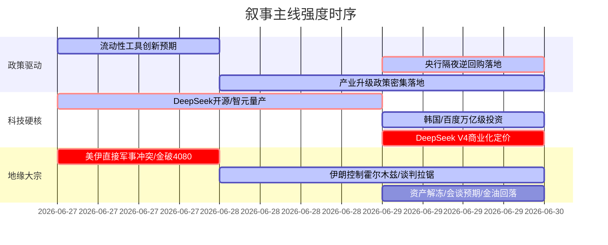

# A股市场情绪分析报告

**数据时段**：2026-06-25 至 2026-06-29  
**生成时间**：2026-06-29 22:24:28 (UTC+8)

---

### 🔥 宏观叙事焦点（24小时三级过滤）

#### 📌 叙事主线一：央行工具箱创新与流动性定价重构 ⭐⭐⭐
**主要事件**：央行首创隔夜逆回购操作、公开市场到期量激增、国债期货走强、韩国800万亿芯片/AI财政刺激  
**筛选标签**：`央行政策` `沪深300影响` `路透信源·权重2.0`  
**宏观逻辑**：  
> ① **归类**：货币政策工具政策工具精准化与全球财政扩张共振  
> ② **历史镜像**：2015年央行创立MLF/PSL工具模板 + 2020年美联储设立SRF回购机制  
> ③ **市场传导**：隔夜利率锚定更稳 → 资金利率曲线陡峭化 → 长端债牛跨资产蔓延 → 权益风险溢价压缩  
> ④ **叙事强度**：工具创新超预期，标志流动性管理从“量价双控”向“价格型工具为主”转型，打破“紧平衡”僵局预期  

**行业映射**：消费复苏链/红利低波（情绪评分 **7.2/10**）  
**交易警示**：‼️ 关注隔夜逆回购利率定价锚定性，警惕长债收益率过快下行触发监管窗口指导  

---

#### 📌 叙事主线二：硬科技供给侧突围与AI基建超级周期 ⭐⭐  
**主要事件**：智元机器人第1.5万台量产下线、DeepSeek V4峰谷定价商业化、韩国三星/SK十年2万亿美元/800万亿韩元投资、百度昆仑芯500亿估值赴港IPO、核聚变超导磁体突破  
**筛选标签**：`部委政策` `产业生命周期` `财新信源·权重1.5`  
**宏观逻辑**：  
> ① **归类**：新质生产力落地从“0到1”跨越至“1到N”规模化拐点  
> ② **历史镜像**：2019年科创板设立注册制试点模板 + 2010年“十二五”战略新兴产业决策部署  
> ③ **市场传导**：具身智能量产验证商业闭环 → 大模型推理成本指数级下降引爆应用层 → 全球算力资本开支上修 → 产业链订单确定性超预期兑现  
> ④ **叙事强度**：政策端“人工智能+”部署与资本端万亿级投资形成双轮驱动，供给侧硬科技资产稀缺性重估  

**行业映射**：人形机器人/半导体设备/光模块/液冷散热（情绪评分 **8.5/10**）  
**交易警示**：⚠️ 警惕题材炒作透支业绩兑现周期，关注DeepSeek V4商业化收入贡献及机器人供应链良率爬坡节奏  

---

#### 📌 叙事主线三：地缘博弈边际缓和与大宗资产定价重心下移 ⭐ 
**主要事件**：伊朗60亿美元资产解冻/美伊多哈会谈预期、霍尔木兹海峡监管权移交缓和、现货黄金失守4060美元/WTI原油震荡、俄罗斯柴油出口禁令考量  
**筛选标签**：`国际冲突` `能源安全` `新华社信源·权重1.5`  
**宏观逻辑**：  
> ① **归类**：地缘风险溢价出清与大宗商品供需基本面回归  
> ② **历史镜像**：2019年霍尔木兹海峡油轮遇袭后风险溢价快速消退模板  
> ③ **市场传导**：避险情绪退潮 → 黄金多头获利了结 → 原油关注OPEC+产能闲置与需求疲软 → 资源股估值修正  
> ④ **叙事强度**：美伊互动从“以暴制暴”转向“管控分歧/谈判预期”，但中东不确定性仍存，叙事驱动力边际递减  

**行业映射**：黄金/油气/航运/军工（情绪评分 **4.8/10**）  
**交易警示**：✓ 叙事逻辑清晰向下，等待美伊谈判实质性进展或OPEC+政策信号验证  

---

### 📅 宏观叙事演化（三日趋势）

**强度衰减模型**：昨日主题×0.7 · 前日主题×0.5

```mermaid
gantt
    title 叙事主线强度时序
    dateFormat  YYYY-MM-DD
    section 政策驱动
    流动性工具创新预期   :active, 2026-06-27, 1d
    央行隔夜逆回购落地   :crit, active, 2026-06-29, 1d
    产业升级政策密集落地 :active, 2026-06-28, 2d
    
    section 科技硬核
    DeepSeek开源/智元量产 :crit, active, 2026-06-27, 2d
    韩国/百度万亿级投资   :active, 2026-06-29, 1d
    DeepSeek V4商业化定价 :crit, 2026-06-29, 1d
    
    section 地缘大宗
    美伊直接军事冲突/金破4080 :crit, 2026-06-27, 1d
    伊朗控制霍尔木兹/谈判拉锯 :active, 2026-06-28, 2d
    资产解冻/会谈预期/金油回落 :2026-06-29, 1d
```
叙事节点关联：
- **06/27**：美伊互击/黄金破4080 → 地缘风险定价峰值；DeepSeek开源/智元量产 → 硬科技供给侧确证性增强
- **06/28**：伊朗宣布管控霍尔木兹30天/韩国芯片投资规划 → 地缘博弈进入“管控+谈判”阶段，产业政策预期升温
- **06/29**：央行首创隔夜逆回购/伊朗资产解冻美伊约谈/DeepSeek V4定价商业化 → **流动性工具创新落地+地缘缓和兑现+硬科技商业化闭环**三线共振

🎯 宏观叙事三要素
1️⃣ **政策意图解码**  
当前顶层叙事明确为“以科技创新引领新质生产力发展”，允许短期消费复苏节奏放缓换取产业升级结构优化。货币政策从“总量宽松”转向“工具精准化+结构定向化”，财政侧重“超长期特别国债+科技大基建”，形成**“稳汇率、控长债、强硬科技”**的政策三角稳定结构。

2️⃣ **市场定价偏差**  
- **过度定价**：短期消费复苏弹性（猪肉/红利防御性板块估值修复透支基本面）、黄金避险溢价（美伊谈判预期下风险溢价快速消退中）  
- **定价不足**：具身智能产业化速度（智元量产标志供应链成熟度超预期）、大模型推理成本下降对应用层爆发的乘数效应、隔夜逆回购工具对短端利率锚定的长远制度意义

3️⃣ **跨市场共振**  
美债收益率中枢下移（美联储年内降息预期修复）+ 美元指数高位震荡回落 + 央行创新工具锚定短端利率 + 韩国/中国万亿级AI基建投资确证 = **A股“硬科技+高股息”哑铃型配置结构性行情窗口期**延续。