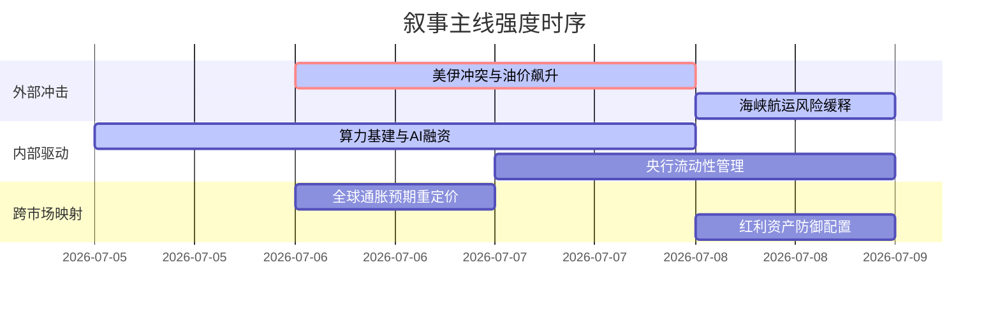

# A股市场情绪分析报告

## 数据时段：最近5日
## 生成时间：2026-07-10 20:30:00

### 🔥 宏观叙事焦点（24小时三级过滤）

#### 📌 叙事主线一：美伊冲突升级与霍尔木兹海峡航运危机 ⭐⭐⭐
**主要事件**：地缘冲突、国际商品、供应链中断  
**筛选标签**：`外交部动态` `原油供应` `路透信源·权重2.0`  
**宏观逻辑**：  
> ① **归类**：外部供给冲击与风险溢价重估  
> ② **历史镜像**：1973年石油危机模板（短期油价脉冲+通胀预期上行）  
> ③ **市场传导**：布伦特原油突破80美元 → 全球通胀预期升温 → 欧美央行降息路径推迟 → 跨境资本波动加剧 → A股风险偏好收缩  
> ④ **叙事强度**：冲突处于可控与恶化临界点，能源成本传导至中下游制造业，压制整体估值扩张空间  

**行业映射**：石油石化/航运/军工（情绪评分 **7.8/10**）  
**交易警示**：‼️ 关注OPEC+增产表态与海峡通行恢复进度，警惕油价高位回落引发的周期股获利了结  

---

#### 📌 叙事主线二：国产算力突围与AI产业资本密集落地 ⭐⭐  
**主要事件**：技术发布、产业投资、IPO进展
**筛选标签**：`部委政策` `产业生命周期` `财新信源·权重1.5`  
**宏观逻辑**：  
> ① **归类**：新质生产力核心引擎  
> ② **历史镜像**：2013年移动互联网“4G牌照发放”模板  
> ③ **市场传导**：MiniMax百亿融资+长鑫科技申购 → 算力链订单预期上修 → 科创50逆市放量 → 资金从应用端向底层硬件（光通信/存储/芯片）扩散  
> ④ **叙事强度**：技术迭代（GPT-5.6/全双工语音）与国产替代并行，产业资本开支进入加速期  

**行业映射**：半导体设备/AI服务器/商业航天（情绪评分 **6.5/10**）  
**交易警示**：⚠️ 海外科技巨头财报分化可能引发阶段性估值回调，需跟踪国产算力实际出货数据  

---

#### 📌 叙事主线三：央行流动性精准滴灌与红利资产重定价 ⭐ 
**主要事件**： 央行政策、监管合规、资产配置
**筛选标签**：`央行操作` `债务周期` `新华社信源·权重1.5`  
**宏观逻辑**：  
> ① **归类**：宏观流动性管理与资产负债表修复  
> ② **历史镜像**：2019年LPR改革叠加降准模板  
> ③ **市场传导**：央行逆回购利率持平+科创债ETF纳入质押库 → 市场利率中枢稳定 → 银行险资加大高股息配置 → 沪深300价值端抗跌 → 风格呈现“科技进攻+红利防守”双轮驱动  
> ④ **叙事强度**：适度宽松基调延续，但资金更偏向确定性现金流资产，存量博弈特征明显  

**行业映射**：国有大行/电力/煤炭（情绪评分 **5.2/10**）  
**交易警示**：✓ 叙事逻辑清晰，等待财政发力验证，注意利率下行对银行净息差的长期挤压  

---

### 📅 宏观叙事演化（三日趋势）

**强度衰减模型**：昨日主题×0.7 · 前日主题×0.5

```mermaid
gantt
    title 叙事主线强度时序
    dateFormat  YYYY-MM-DD
    section 外部冲击
    美伊冲突与油价飙升   :crit, active, 2026-07-06, 2d
    海峡航运风险缓释   :active, 2026-07-08, 1d
    
    section 内部驱动
    算力基建与AI融资   :active, 2026-07-05, 3d
    央行流动性管理   :2026-07-07, 2d
    
    section 跨市场映射
    全球通胀预期重定价   :2026-07-06, 1d
    红利资产防御配置   :2026-07-08, 1d
```
叙事节点关联：
07/06：美军空袭伊朗 → 触发能源危机叙事
07/07：布伦特突破80美元 + 沪指破4000点 → 风险偏好骤降，风格切换至防御
07/08：央行二季度例会定调“适度宽松” + MiniMax融资 → 政策底托底，科技主线资金回流
07/09：长鑫科技申购/算力合同落地 → 供给侧叙事强化，科创板块领涨
07/10：多部门部署防汛与现代流通体系建设 → 叙事进入政策验证与基本面修复期
🎯 宏观叙事三要素
1️⃣ 政策意图解码
当前顶层叙事从“总量刺激”转向“结构优化+底线思维”。外部地缘扰动倒逼内部产业链自主可控加速，央行流动性工具持续向科技创新与实体经济倾斜，政策定力与灵活性并重。
2️⃣ 市场定价偏差
过度定价：地缘冲突的长期化与全球经济衰退（油价已充分反映风险溢价）
定价不足：国内算力基建的订单兑现速度（国产替代逻辑未被完全交易）
3️⃣ 跨市场共振
美债收益率高位震荡 + 人民币汇率破6.80 = 外资流向边际改善；A股呈现“外盘避险+内盘成长”的跷跷板效应，结构性行情窗口期确立。

---

*生成时间：2026-07-10 21:18:37 (UTC+8)*  
*使用模型：agnes:agnes-2.0-flash*