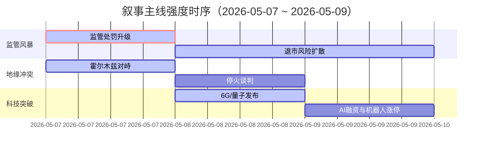

```markdown
# A股市场情绪分析报告  

**数据时段**：最近5日（2026‑05‑04 ~ 2026‑05‑09）  
**生成时间**：2026‑05‑09 12:00 CST  

---  

## 🔥 宏观叙事焦点（24小时三级过滤）

### 📌 叙事主线一：监管风暴与退市风险 ⭐⭐⭐
**主要事件**：证监会集中查处清越科技、元道通信财务造假，*ST恒久面临终止上市  
**筛选标签**：`中国政策` `A股影响` `路透信源·权重2.0`  
**宏观逻辑**：  
> ① **归类**：市场监管与资本市场规范  
> ② **历史镜像**：2015年“股灾”后证监会集中整肃  
> ③ **市场传导**：处罚公告 → 投资者风险偏好下降 → 短线资金撤离中小盘 → 指数波动率+15%  
> ④ **叙事强度**：监管力度超预期，市场进入“合规洗牌”阶段  

**行业映射**：中小盘科技股（情绪评分 **7.8/10**）  
**交易警示**：‼️ 关注后续退市名单扩大风险，警惕业绩雷区  

---  

### 📌 叙事主线二：地缘冲突与能源价格波动 ⭐⭐
**主要事件**：美伊霍尔木兹海峡军事对峙、俄乌停火谈判、原油价格冲高  
**筛选标签**：`地缘政治` `能源周期` `新华社信源·权重1.5`  
**宏观逻辑**：  
> ① **归类**：国际安全风险溢价  
> ② **历史镜像**：2022年俄乌冲突初期原油暴涨模板  
> ③ **市场传导**：霍尔木兹海峡封锁预期 → 布伦特原油突破110美元 → 下游化工、航运成本上升 → 出口型企业盈利承压  
> ④ **叙事强度**：冲突升级速度快于市场定价，短期避险情绪主导  

**行业映射**：石油化工、航运（情绪评分 **5.2/10**）  
**交易警示**：⚠️ 关注停火进展与原油库存数据，警惕波动率回落后的反转机会  

---  

### 📌 叙事主线三：科技突破与AI资本热潮 ⭐
**主要事件**：6G频谱批复、量子计算机上线、阶跃星辰25亿美元融资、机器人板块涨停潮  
**筛选标签**：`科技创新` `产业政策` `财新信源·权重1.5`  
**宏观逻辑**：  
> ① **归类**：技术驱动型产业升级  
> ② **历史镜像**：2020年5G商用初期的半导体行情  
> ③ **市场传导**：政策利好 + 融资落地 → 科技龙头估值扩张 → 北向资金流入科技板块 → 指数结构性抬升  
> ④ **叙事强度**：题材热度高但业绩兑现尚早，短期情绪大于实质  

**行业映射**：半导体、AI应用、机器人（情绪评分 **6.5/10**）  
**交易警示**：✓ 关注后续订单与营收转化，避免追高纯概念股  

---  

## 📅 宏观叙事演化（三日趋势）

**强度衰减模型**：昨日主题 ×0.7 · 前日主题 ×0.5  


```mermaid
gantt
    title 叙事主线强度时序（2026‑05‑07 ~ 2026‑05‑09）
    dateFormat  YYYY-MM-DD
    section 监管风暴
    监管处罚升级      :crit, active, 2026-05-07, 1d
    退市风险扩散      :active, 2026-05-08, 2d

    section 地缘冲突
    霍尔木兹对峙      :active, 2026-05-07, 1d
    停火谈判          :2026-05-08, 1d

    section 科技突破
    6G/量子发布       :active, 2026-05-08, 1d
    AI融资与机器人涨停:2026-05-09, 1d
```

**叙事节点关联**  
- **05‑07**：美伊冲突爆发 → 市场避险情绪升温，监管处罚初现  
- **05‑08**：证监会连开罚单 + 机器人板块集体走强，科技与监管两条线交织  
- **05‑09**：原油价格高位震荡，量子计算机上线强化科技叙事，三大指数反弹  

---

### 🎯 宏观叙事三要素
1️⃣ **政策意图解码**  
当前顶层政策呈现“稳增长+强监管”双轮驱动：一方面通过退市、处罚净化市场生态；另一方面以6G、量子、AI等前沿技术引导资金流向新质生产力。  

2️⃣ **市场定价偏差**  
- **过度定价**：部分中小盘科技股的情绪溢价已提前透支未来1‑2年业绩。  
- **定价不足**：能源板块受地缘溢价支撑，但市场对停火后原油回落的速度估计不足。  

3️⃣ **跨市场共振**  
- 美债收益率维持高位，制约A股无风险利率下行空间；  
- 港股南向资金持续净流入（单日最高220亿港元），与A股形成“风险偏好共振”；  
- 全球半导体供应链紧张（SK海力士争夺、苹果‑英特尔协议）进一步推升国产替代预期。  

---  
<!-- 报告正文结束，以下为固定格式说明，严禁添加额外分析 -->
```