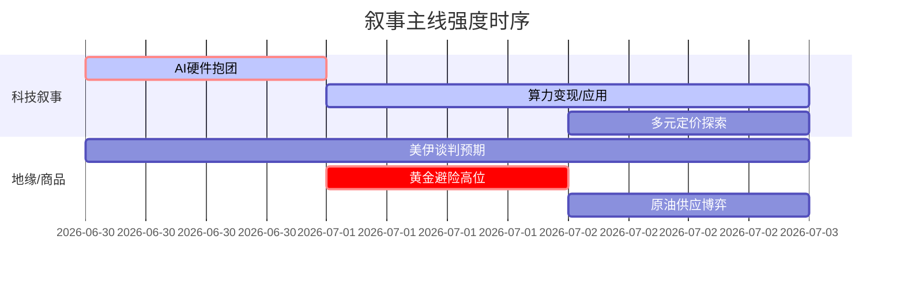

# A股市场情绪分析报告

**数据时段**：最近5日  
**生成时间**：2026-07-02

---

### 🔥 宏观叙事焦点（24小时三级过滤）

#### 📌 叙事主线一：AI产业链的“估值分化”与“算力变现” ⭐⭐⭐
**主要事件**：美商务部解除Anthropic模型出口管制、行云科技签订55亿算力合同、寒武纪市值破万亿、美股科技七巨头6月大幅回调  
**筛选标签**：`部委政策` `产业生命周期` `路透信源·权重2.0`  
**宏观逻辑**：  
> ① **归类**：产业周期由“纯预期”转向“业绩验证”  
> ② **历史镜像**：2016年移动互联网泡沫破裂后的结构性出清模板  
> ③ **市场传导**：美股科技巨头回调 $\rightarrow$ 资金由纯算力端向应用端/多元定价资产转移 $\rightarrow$ A股出现“科技抱团”解构，老登资产爆发  
> ④ **叙事强度**：极强。市场正在重新定义AI的定价模型，从单一的硬件增长转向算力商业化能力验证  

**行业映射**：AI算力服务、人形机器人（情绪评分 **8.1/10**）  
**交易警示**：‼️ 警惕高位AI芯片个股的估值回调，关注具有实质订单的算力服务商  

---

#### 📌 叙事主线二：美伊外交博弈与能源供应韧性 ⭐⭐  
**主要事件**：美伊在多哈举行间接技术性会谈、伊朗石油出口突破4000万桶、霍尔木兹海峡航道管制争议  
**筛选标签**：`地缘政治` `大宗商品` `财新信源·权重1.5`  
**宏观逻辑**：  
> ① **归类**：地缘风险缓释与资源博弈  
> ② **历史镜像**：2015年伊核协议签署前后的波动模板  
> ③ **市场传导**：外交谈判升温 $\rightarrow$ 避险资金从黄金部分回流 $\rightarrow$ 原油供应预期增加 $\rightarrow$ 能源板块波动率加大  
> ④ **叙事强度**：中等。谈判进展反复，但整体基调倾向于通过技术性协议避免全面冲突  

**行业映射**：原油、黄金、航运（情绪评分 **6.2/10**）  
**交易警示**：⚠️ 关注美伊会谈的实质性突破，警惕地缘叙事突然反转导致的避险资产跳水  

---

#### 📌 叙事主线三：国内金融监管纠偏与资本市场“质量提升” ⭐  
**主要事件**：监管点名券商分支机构“跑马圈地”、中基协摸底头部量化私募、证监会推进财务造假惩防体系  
**筛选标签**：`监管政策` `金融治理` `新华社信源·权重1.5`  
**宏观逻辑**：  
> ① **归类**：制度性出清与合规强化  
> ② **历史镜像**：2015年后的券商去杠杆与合规整治模板  
> ③ **市场传导**：监管高压 $\rightarrow$ 量化同质化策略受限 $\rightarrow$ 资金被迫转向产业盈利主线 $\rightarrow$ 引导多元定价  
> ④ **叙事强度**：较低但具有深远影响。政策意图在于将资本市场从“博弈驱动”转向“价值驱动”  

**行业映射**：金融科技、低估值红利资产（情绪评分 **5.4/10**）  
**交易警示**：✓ 逻辑清晰，但短期对金融板块情绪有压制，等待监管落地后的底部确认  

---

### 📅 宏观叙事演化（三日趋势）

**强度衰减模型**：昨日主题×0.7 · 前日主题×0.5

```mermaid
gantt
    title 叙事主线强度时序
    dateFormat  YYYY-MM-DD
    section 科技叙事
    AI硬件抱团   :crit, active, 2026-06-30, 1d
    算力变现/应用 :active, 2026-07-01, 2d
    多元定价探索   :2026-07-02, 1d
    
    section 地缘/商品
    美伊谈判预期   :2026-06-30, 3d
    黄金避险高位   :crit, 2026-07-01, 1d
    原油供应博弈   :2026-07-02, 1d
```
叙事节点关联：
06/30：美股科技七巨头大跌 $\rightarrow$ 触发A股“科技抱团”反思 $\rightarrow$ 资金向多元资产扩散
07/01：美商务部解除AI模型管制 $\rightarrow$ AI叙事由“封锁”转向“协同” $\rightarrow$ 算力合同落地强化业绩逻辑
07/02：美联储维持利率不变概率上升 $\rightarrow$ 宏观流动性预期稳定 $\rightarrow$ 市场博弈点转向内部产业盈利能力

🎯 宏观叙事三要素
1️⃣ 政策意图解码
顶层逻辑已明确：AI领域支持“实用主义”与“商业化”，金融领域强调“反造假”与“去同质化”。政策不再盲目追求规模，而追求高质量的增长。
2️⃣ 市场定价偏差
过度定价：部分AI芯片个股（忽视了业绩兑现周期）
定价不足：传统行业中具有数字化升级能力的“老登”资产（被长期低估）
3️⃣ 跨市场共振
美债收益率高位震荡 $\rightarrow$ 资金对成长股估值敏感度提升 $\rightarrow$ A股成交量维持高位（3万亿+）但指数分化 $\rightarrow$ 标志着市场进入深度结构性行情，不再是普涨时代。