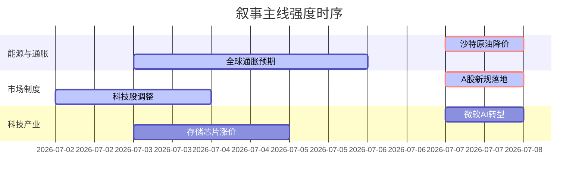

# A股市场情绪分析报告

**数据时段**：2026-07-02 至 2026-07-07
**生成时间**：2026-07-07 09:34:48 (UTC+8)

### 🔥 宏观叙事焦点（24小时三级过滤）

#### 📌 叙事主线一：沙特阿美大幅降价引发全球能源价格战 ⭐⭐⭐
**主要事件**：国际大宗商品价格剧烈波动、全球通胀预期重构
**筛选标签**：`沙特阿美` `原油贴水20年最大` `路透信源·权重2.0`
**宏观逻辑**：
> ① **归类**：供给侧冲击与需求端疲软共振
> ② **历史镜像**：2020年负油价危机后的供给端博弈模板
> ③ **市场传导**：布伦特原油预期下行 → 全球通胀预期降温 → 美联储降息路径更清晰 → 新兴市场货币压力缓解
> ④ **叙事强度**：沙特以“20年来最大贴水”争夺份额，标志着OPEC+内部团结破裂，能源去通胀逻辑确立

**行业映射**：航空物流、化工下游（情绪评分 **7.8/10**）
**交易警示**：‼️ 警惕油价非理性下跌引发的周期性资产重估，关注能源股估值重塑

---

#### 📌 叙事主线二：A股交易制度变革与ST板块风险释放 ⭐⭐
**主要事件**：监管政策落地、市场微观结构变化
**筛选标签**：`A股新规` `ST涨跌幅放宽` `新华社信源·权重1.5`
**宏观逻辑**：
> ① **归类**：制度性供给侧改革
> ② **历史镜像**：2020年创业板注册制改革初期的波动模板
> ③ **市场传导**：ST板块成交放量 → 游资博弈加剧 → 壳价值回归零 → 资金向绩优蓝筹及硬科技集中
> ④ **叙事强度**：新规首日实施，市场分化加剧，监管层引导“优胜劣汰”意图明确，短期波动加大但长期利好生态

**行业映射**：券商互金、科创板龙头（情绪评分 **6.5/10**）
**交易警示**：⚠️ ST板块高波动风险，避免接飞刀，关注正规军龙头溢价

---

#### 📌 叙事主线三：微软裁员4800人揭示AI转型深水区 ⭐ 
**主要事件**：全球科技巨头战略调整、AI资本开支方向
**筛选标签**：`微软裁员` `AI基础设施` `彭博信源·权重1.5`
**宏观逻辑**：
> ① **归类**：科技产业生命周期切换
> ② **历史镜像**：2012年Facebook移动化转型期的阵痛模板
> ③ **市场传导**：传统业务剥离 → 资源聚焦AI核心 → 全球科技股估值逻辑从“用户增长”转向“算力效率”
> ④ **叙事强度**：巨头转向发出信号，AI应用层泡沫挤压，硬件与基础设施层确定性增强

**行业映射**：算力租赁、光模块、AI芯片（情绪评分 **5.2/10**）
**交易警示**：✓ 叙事逻辑清晰，但需区分纯概念炒作与实质受益标的，右侧信号待确认

---

### 📅 宏观叙事演化（三日趋势）

**强度衰减模型**：昨日主题×0.7 · 前日主题×0.5

```mermaid
gantt
    title 叙事主线强度时序
    dateFormat  YYYY-MM-DD
    section 能源与通胀
    沙特原油降价   :crit, active, 2026-07-07, 1d
    全球通胀预期   :active, 2026-07-03, 3d
    
    section 市场制度
    A股新规落地     :crit, active, 2026-07-07, 1d
    科技股调整       :active, 2026-07-02, 2d
    
    section 科技产业
    微软AI转型       :2026-07-07, 1d
    存储芯片涨价     :2026-07-03, 2d
```

叙事节点关联：
- **07/02**：韩国KOSPI暴跌8%触发熔断，全球科技股恐慌蔓延，A股跟跌，科创50单日跌8%。
- **07/03**：美国6月非农数据远不及预期，市场削减加息押注，美股反弹，但A股受外围情绪压制继续调整，上证指数跌2.03%。
- **07/07**：沙特阿美大幅降价成为全球焦点，能源逻辑重塑；同日A股新规落地，市场风格剧烈切换，ST板块异动，资金回流核心资产。

🎯 宏观叙事三要素
1️⃣ **政策意图解码**
当前顶层叙事从“总量宽松”转向“结构优化+制度完善”。A股新规落地表明监管层致力于净化市场生态，容忍短期阵痛以换取长期定价效率。沙特降价则反映全球央行在“抗通胀”与“稳增长”间的微妙平衡。

2️⃣ **市场定价偏差**
**过度定价**：科技成长股的短期回调幅度（受韩国暴跌传染，情绪过度悲观）。
**定价不足**：能源价格下行对下游制造业利润的修复弹性，以及新规下核心资产的分红价值重估。

3️⃣ **跨市场共振**
美债收益率因非农疲软预期下行 + 原油价格战加剧 = 全球流动性边际宽松预期增强。A股在经历前期剧烈调整后，随着政策底（新规）与宏观底（通胀缓和）的共振，结构性机会窗口正在打开。

<!-- 报告正文必须在此结束，以下内容为固定格式说明，严禁添加任何额外分析、总结或展望 -->

---

*生成时间：2026-07-07 09:34:48 (UTC+8)*  
*使用模型：agnes:agnes-2.0-flash*