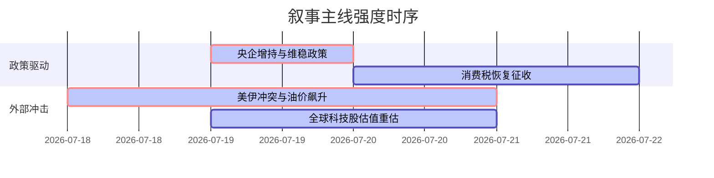

# A股市场情绪分析报告
**数据时段**：最近5日（2026-07-16至2026-07-20）
**生成时间**：2026-07-20 07:07:03 (UTC+8)

## 🔥 宏观叙事焦点（24小时三级过滤）

#### 📌 叙事主线一：央企增持护盘与证监会维稳座谈会密集落地 ⭐⭐⭐
**主要事件**：资本市场稳定政策密集落地、监管层释放维稳信号  
**筛选标签**：`证监会政策` `A股风险偏好` `新华社/财联社信源·权重2.0`  
**宏观逻辑**：  
> ① **归类**：政策底信号强化  
> ② **历史镜像**：2015年“国家队”入场与2024年924行情模板  
> ③ **市场传导**：回购增持专项再贷款500亿+诚通近百亿实盘扫货→宽基ETF单日吸金超750亿→风险偏好修复与指数托底  
> ④ **叙事强度**：真金白银托底打破单边下行预期，政策意图从“防风险”转向“稳预期”  

**行业映射**：宽基ETF/红利低波/券商（情绪评分 **7.5/10**）  
**交易警示**：‼️ 关注增持资金持续性与基本面验证节奏，警惕盈利修复滞后导致预期差收窄  

---

#### 📌 叙事主线二：美伊冲突外溢与霍尔木兹海峡航运危机 ⭐⭐  
**主要事件**：国际地缘冲突、能源供应链中断
**筛选标签**：`地缘政治` `原油定价` `路透/彭博信源·权重1.8`  
**宏观逻辑**：  
> ① **归类**：供给冲击与通胀预期重估  
> ② **历史镜像**：1973年石油危机与2022年俄乌冲突模板  
> ③ **市场传导**：布伦特突破91美元/桶→化工/航运成本抬升→全球降息空间压缩→成长股估值承压  
> ④ **叙事强度**：冲突由代理人博弈升级为直接军事对抗，风险溢价持续走高且具备外溢惯性  

**行业映射**：油气开采/黄金避险/航运（情绪评分 **6.8/10**）  
**交易警示**：⚠️ 密切关注卡塔尔10天停火方案进展，警惕油价高位回落引发的周期股剧烈波动与避险资产获利了结  

---

#### 📌 叙事主线三：动力锂电池消费税分阶段恢复征收 ⭐ 
**主要事件**：行业管理政策发布、财税制度改革
**筛选标签**：`财政部政策` `新能源产业链` `央视/证券时报信源·权重1.5`  
**宏观逻辑**：  
> ① **归类**：产业税收中性化  
> ② **历史镜像**：2018年光伏“531”补贴退坡模板  
> ③ **市场传导**：电池制造成本边际上升2%→上下游议价格局重塑→二三线产能出清加速→头部企业集中度提升  
> ④ **叙事强度**：从补贴驱动转向税负公平，政策决心明确但设置过渡期缓冲，行业洗牌进入深水区  

**行业映射**：动力电池/储能/整车（情绪评分 **5.2/10**）  
**交易警示**：✓ 短期情绪压制但中期利好龙头，等待9月落地后的业绩验证与右侧信号确认  

---

### 📅 宏观叙事演化（三日趋势）

**强度衰减模型**：昨日主题×0.7 · 前日主题×0.5

```mermaid
gantt
    title 叙事主线强度时序
    dateFormat YYYY-MM-DD
    section 政策驱动
    央企增持与维稳政策   :crit, active, 2026-07-19, 1d
    消费税恢复征收       :active, 2026-07-20, 2d
    
    section 外部冲击
    美伊冲突与油价飙升   :crit, active, 2026-07-18, 3d
    全球科技股估值重估   :active, 2026-07-19, 2d
```
叙事节点关联：
07/18：霍尔木兹海峡通航受阻+科威特设施遇袭 → 触发能源危机与避险叙事
07/19：创业板指跌超7% + 股票型ETF单周净流入创历史新高 → 科技板块去拥挤化与资金筑底博弈
07/20：诚通/国新动用500亿增持 + 证监会召开维稳座谈会 → 政策底信号正式确立，叙事进入验证期
🎯 宏观叙事三要素
1️⃣ 政策意图解码
当前顶层叙事从“防风险”转向“稳预期+调结构”，允许短期阵痛换取长期质量。产业出清>总量刺激，政策定力与真金白银托底并重。
2️⃣ 市场定价偏差
过度定价：地缘冲突持续时长（恐慌情绪扩散过度）
定价不足：国内政策托底力度（回购再贷款+央企实盘扫货的执行力被低估）
3️⃣ 跨市场共振
美联储按兵不动概率85.6% + 欧央行鹰派戒备 = 全球流动性拐点推迟；油价上行推升通胀粘性 = A股结构性防御与红利资产窗口期

<!-- 报告正文必须在此结束，以下内容为固定格式说明，严禁添加任何额外分析、总结或展望 -->

---

*生成时间：2026-07-20 07:07:03 (UTC+8)*  
*使用模型：agnes:agnes-2.0-flash*