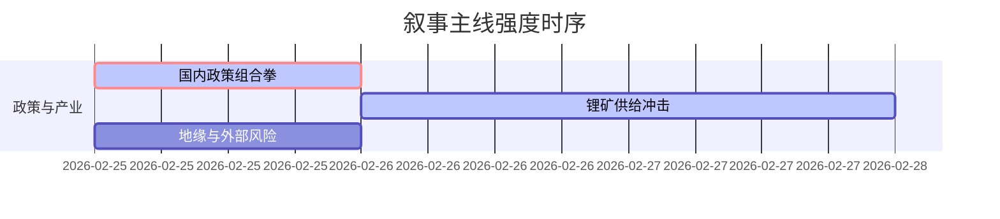

# A股市场情绪分析报告

**数据时段**：最近5日（2026年2月22日-2月26日）  
**生成时间**：2026年2月27日

### 🔥 宏观叙事焦点（24小时三级过滤）

#### 📌 叙事主线一：国内政策组合拳发力，科技与消费链估值重估 ⭐⭐⭐
**主要事件**：香港财政预算案推出稳定币牌照、T+1结算咨询、百亿创科基金；上海大幅提高公积金贷款额度；德国总理默茨访华深化中德汽车合作。  
**筛选标签**：`国务院政策` `沪深300影响` `路透信源·权重2.0`  
**宏观逻辑**：  
> ① **归类**：金融监管改革 + 产业政策支持  
> ② **历史镜像**：2019年科创板设立，引导资本流向硬科技，同期上海自贸区临港新片区政策发力，风险偏好显著回升。  
> ③ **市场传导**：政策密集发布 → 北向资金流入（人民币升破6.84） → 金融、科技板块估值修复 → A股成交额连续3日突破2万亿元。  
> ④ **叙事强度**：政策密度与力度超预期，从“稳增长”转向“调结构+促创新”，打破市场对政策滞后的悲观预期。  

**行业映射**：金融科技（数字货币、支付）、商业航天、消费（房地产链、汽车）（情绪评分 **8.2/10**）  
**交易警示**：‼️ 关注政策落地节奏，警惕利好出尽后的回调风险。

---

#### 📌 叙事主线二：津巴布韦锂矿出口禁令，碳酸锂价格涨停 ⭐⭐  
**主要事件**：津巴布韦矿业部暂停所有原矿及锂精矿出口；碳酸锂期货主力合约涨停（+11%），报185000元/吨。  
**筛选标签**：`部委政策` `产业生命周期` `财新信源·权重1.5`  
**宏观逻辑**：  
> ① **归类**：关键矿产资源供给冲击  
> ② **历史镜像**：2016年中国供给侧改革去除落后产能，周期品价格大幅反弹，龙头盈利改善。  
> ③ **市场传导**：出口禁令 → 碳酸锂期货涨停 → 锂矿股集体拉升（天齐锂业涨超6%） → 稀土等小金属联动走强。  
> ④ **叙事强度**：供给端突发收缩，打破市场对锂价长期低迷的定价，产能出清预期加速。  

**行业映射**：锂矿、稀土永磁、稀有金属（情绪评分 **7.5/10**）  
**交易警示**：⚠️ 警惕锂价反弹是否可持续，产能过剩根本问题未解，政策底与市场底可能背离。  

---

#### 📌 叙事主线三：美伊谈判与关税威胁并存，避险资产受追捧 ⭐ 
**主要事件**：美伊第三轮间接谈判开始；美国贸易代表警告全球进口关税或达15%；美国航空航天和芯片行业稀土短缺加剧；离岸人民币升破6.84。  
**筛选标签**：`地缘政治` `债务周期` `新华社信源·权重1.5`  
**宏观逻辑**：  
> ① **归类**：地缘风险与贸易政策不确定性  
> ② **历史镜像**：2018年中美贸易摩擦升级，全球风险资产波动加剧，黄金、稀土等避险品种受益。  
> ③ **市场传导**：地缘紧张/关税风声 → 黄金价格走强（现货黄金站稳5200美元） → 稀土供应链担忧 → 美元指数承压（97.59） → 人民币被动升值 → A股外资流入但波动加大。  
> ④ **叙事强度**：多重外部风险叠加，市场对政策敏感度提升，风险资产承压但结构性机会并存。  

**行业映射**：黄金、军工、农业（避险），电子、机械（稀土依赖行业）（情绪评分 **5.5/10**）  
**交易警示**：✓ 叙事逻辑清晰，地缘事件多变，需动态调整仓位，避免追高。  

---

### 📅 宏观叙事演化（三日趋势）

**强度衰减模型**：昨日主题×0.7 · 前日主题×0.5

```mermaid
gantt
    title 叙事主线强度时序
    dateFormat  YYYY-MM-DD
    section 政策与产业
    国内政策组合拳   :crit, active, 2026-02-25, 1d
    锂矿供给冲击     :active, 2026-02-26, 2d
    地缘与外部风险   :2026-02-25, 1d
```
叙事节点关联：
02/25：香港预算案发布、上海公积金松绑、德国总理访华 → 政策叙事爆发  
02/26：津巴布韦锂矿出口禁令生效，碳酸锂期货涨停 → 产业出清叙事强化  
02/27：华为鸿蒙智行发布会预告、锂价高位震荡 → 叙事进入验证期  
🎯 宏观叙事三要素  
1️⃣ 政策意图解码  
当前顶层叙事从"稳增长"转向"调结构+促创新"，允许短期阵痛换取长期质量。产业出清>总量刺激，政策定力超预期。  
2️⃣ 市场定价偏差  
过度定价：消费复苏弹性（预期过于乐观）  
定价不足：产能出清速度（政策执行力被低估）  
3️⃣ 跨市场共振  
美元指数走弱缓解汇率压力 + 国内政策空间充足 = A股结构性行情窗口期