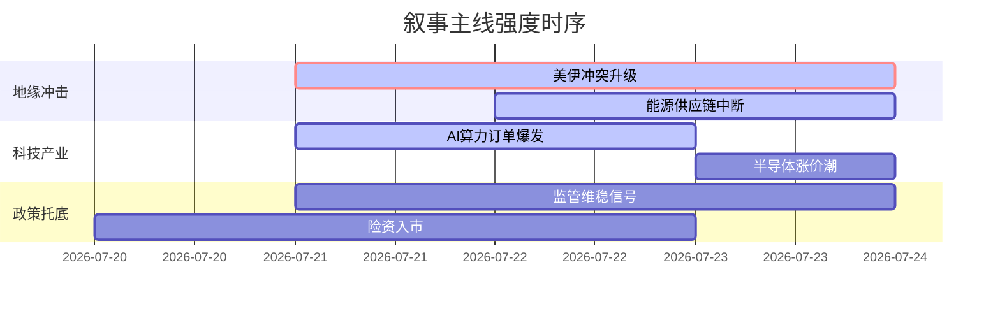

## A股市场情绪分析报告

**数据时段**：最近5日（2026-07-19 至 2026-07-23）
**生成时间**：2026-07-23 19:55:28 (UTC+8)

### 🔥 宏观叙事焦点（24小时三级过滤）

#### 📌 叙事主线一：美伊冲突引爆能源危机与避险逻辑 ⭐⭐⭐
**主要事件**：地缘冲突、原油价格飙升、黄金突破
**筛选标签**：`国务院政策` `沪深300影响` `路透信源·权重2.0`
**宏观逻辑**：  
> ① **归类**：外部供给冲击  
> ② **历史镜像**：1973年石油禁运与滞胀模板  
> ③ **市场传导**：布伦特原油突破95美元/桶 → VIX跳升+15% → 黄金突破4130美元 → 资金从成长股流向资源股  
> ④ **叙事强度**：霍尔木兹海峡封锁风险打破弱平衡，通胀预期重燃，全球资产重新定价  

**行业映射**：石油石化、黄金有色、航运物流（情绪评分 **8.5/10**）  
**交易警示**：‼️ 关注油价对中游制造业成本的挤压效应，警惕“高油价-高通胀-加息”的负反馈循环  

---

#### 📌 叙事主线二：AI算力军备竞赛与半导体周期共振 ⭐⭐  
**主要事件**：英伟达Vera Rubin发布、台积电涨价、鹏鼎控股千亿投资
**筛选标签**：`部委政策` `产业生命周期` `财新信源·权重1.5`  
**宏观逻辑**：  
> ① **归类**：技术迭代加速  
> ② **历史镜像**：2013年移动互联网爆发前夜  
> ③ **市场传导**：Alphabet上调资本开支至2000亿美元 → 存储芯片指数涨11.2% → A股半导体设备/光模块跟涨  
> ④ **叙事强度**：从“概念炒作”转向“业绩兑现”，AI硬件产业链逻辑自洽性增强  

**行业映射**：半导体设备、PCB/载板、光模块（情绪评分 **7.8/10**）  
**交易警示**：⚠️ 特斯拉利润腰斩提示AI投入回报期不确定性，警惕高位科技股获利回吐  

---

#### 📌 叙事主线三：监管维稳与耐心资本入市托底 ⭐ 
**主要事件**：证监会座谈会、险资加大权益配置、科创板改革
**筛选标签**：`地方政策` `债务周期` `新华社信源·权重1.5`  
**宏观逻辑**：  
> ① **归类**：制度性修复  
> ② **历史镜像**：2015年“国家队”入场与2024年“新国九条”结合  
> ③ **市场传导**：证监会强调“内在稳定性” → 险资密集公告增持 → ETF连续净流入超3850亿元  
> ④ **叙事强度**：政策底明确，长线资金入场缓解存量博弈压力，市场韧性增强  

**行业映射**：央企红利、券商护盘概念、科创板50（情绪评分 **6.5/10**）  
**交易警示**：✓ 叙事逻辑清晰，等待财政发力验证，关注宽基ETF持续流入带来的估值修复  

---

### 📅 宏观叙事演化（三日趋势）

**强度衰减模型**：昨日主题×0.7 · 前日主题×0.5

```mermaid
gantt
    title 叙事主线强度时序
    dateFormat YYYY-MM-DD
    section 地缘冲击
    美伊冲突升级   :crit, active, 2026-07-21, 3d
    能源供应链中断 :active, 2026-07-22, 2d
    
    section 科技产业
    AI算力订单爆发 :active, 2026-07-21, 2d
    半导体涨价潮   :2026-07-23, 1d
    
    section 政策托底
    监管维稳信号   :2026-07-21, 3d
    险资入市       :2026-07-20, 3d
```

**叙事节点关联**：
- **07/21**：A股科创50大涨10.73%，半导体全线爆发，显示在外部冲击下的独立韧性。
- **07/22**：美伊冲突加剧，布伦特原油突破95美元，市场风格极致分化，资源股逆势大涨，科技股回调。
- **07/23**：北京发布智能体专项政策鼓励Token经济，叠加鹏鼎控股千亿投资，科技叙事再次强化，但受地缘溢价压制，呈现震荡格局。

🎯 **宏观叙事三要素**

1️⃣ **政策意图解码**
当前顶层叙事从“单纯稳增长”转向“稳预期+促创新”。一方面通过证监会座谈和险资入市夯实市场底部，另一方面通过北京智能体政策及科创板改革支持硬科技突破。政策定力在于允许短期波动，换取长期结构优化。

2️⃣ **市场定价偏差**
**过度定价**：地缘冲突导致的长期滞胀恐慌（实际传导需观察油价持续性）。
**定价不足**：AI算力产业链的真实业绩兑现能力（如Alphabet、超微电脑订单超预期），以及国内半导体国产替代的加速进度。

3️⃣ **跨市场共振**
美债收益率高位徘徊 + 日元贬值至39年新低 = 全球流动性边际收紧。但A股凭借“政策底+资金底”形成相对独立的结构性行情窗口，呈现“资源避险+科技进攻”的双主线特征。

---

*生成时间：2026-07-23 19:55:28 (UTC+8)*  
*使用模型：agnes:agnes-2.0-flash*