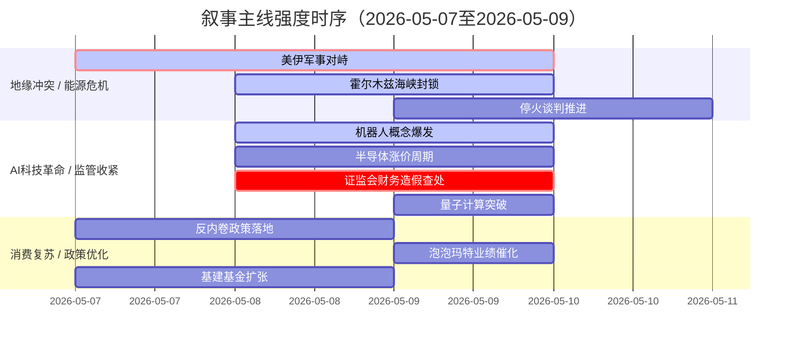

# A股市场情绪分析报告

**数据时段**：2026年5月5日 — 2026年5月9日（最近5个交易日）
**生成时间**：2026-05-09 12:00

---

## 🔥 宏观叙事焦点（24小时三级过滤）

### 📌 叙事主线一：美伊霍尔木兹海峡军事对峙与能源价格冲击 ⭐⭐⭐
**主要事件**：美伊霍尔木兹海峡爆发军事冲突，美军拦截伊朗油轮，伊核停火谈判推进
**筛选标签**：`地缘冲突` `能源安全` `国际油价` `国防军工`
**宏观逻辑**：
> ① **归类**：地缘风险驱动型能源危机
> ② **历史镜像**：2022年2月俄乌冲突爆发初期的能源价格冲击模板
> ③ **市场传导**：霍尔木兹海峡商船停运 → 布伦特原油冲击100美元/桶 → 黄金突破4600美元 → A股绿电/军工/算力硬件领涨 → 南向资金单日净流入220亿港元
> ④ **叙事强度**：军事冲突实际发生（非预期升级），全球能源供应链直接受损，风险溢价急剧扩张

**行业映射**：
- 国防军工（情绪评分 **8.5/10**）：湖南天雁、长城军工涨停，军工板块午后持续走强
- 绿色能源/绿电（情绪评分 **8.2/10**）：华电辽能8连板，晋控电力、粤电力A、湖南发展等十余股涨停
- 黄金/贵金属（情绪评分 **7.8/10**）：现货黄金重返4600美元关口，国内黄金ETF一季度增仓50.44吨（同比+114.88%）
- 航运物流（情绪评分 **6.5/10**）：中远海运恢复中东六国新订舱业务，航运运力重新开放

**交易警示**：‼️ 高度关注停火谈判进展（5月8日特朗普宣布俄乌停火三天、5月25日美方提出15点停火方案），地缘缓和预期可能导致能源价格快速回落，警惕高位追涨风险

---

### 📌 叙事主线二：AI科技革命浪潮与A股监管升级 ⭐⭐
**主要事件**：人形机器人概念爆发、量子计算突破、AI芯片全球竞备；证监会密集查处财务造假
**筛选标签**：`AI产业趋势` `国产替代` `科技监管` `半导体自主可控`
**宏观逻辑**：
> ① **归类**：科技产业周期上行叠加监管周期收紧
> ② **历史镜像**：2019-2021年国产芯片替代周期 + 2021年中概股监管风暴的组合模板
> ③ **市场传导**：
>   - 科技端：阶跃星辰25亿美元融资赴港IPO → Anthropic与Akamai签署18亿美元计算协议 → 英伟达再创历史新高 → A股机器人概念股集体涨停（绿的谐波、乔锋智能、巨轮智能等）
>   - 监管端：证监会重罚清越科技（1.73亿）、元道通信（2.39亿），*ST恒久面临退市 → 市场风险偏好结构性分化
>   - 产业端：英特尔/AMD上调Q1-Q2 CPU价格、CPU缺货交期延长 → 半导体周期触底反弹信号
> ④ **叙事强度**：产业趋势与监管政策双线并行，科技成长与价值重估交织演绎

**行业映射**：
- 机器人/人工智能（情绪评分 **7.8/10**）：绿的谐波、华勤技术盘中创新高，恒锋工具涨超10%
- 半导体/算力硬件（情绪评分 **7.5/10**）：Intel大涨8%逼近6000亿市值，Soitec涨13.67%，A股算力租赁、光通信板块涨停潮
- 量子计算（情绪评分 **7.2/10**）：本源悟空-180超导量子计算机正式上线，180比特自主芯片
- 消费电子（情绪评分 **5.8/10**）：智能手机出货量同比-14.6%，PC市场"最便宜时刻"来临

**交易警示**：⚠️ 科技板块内部剧烈分化（AI硬件强于AI软件，美股AI赢家指数创新高 vs AI软件先驱指数回调），警惕监管升级带来的短期冲击，关注政策底与市场底的背离风险

---

### 📌 叙事主线三：国内消费政策优化与结构性复苏 ⭐
**主要事件**：外卖价格战监管、消费复苏信号、泡泡玛特全球化爆发
**筛选标签**：`消费政策` `反内卷` `新消费` `出海增长`
**宏观逻辑**：
> ① **归类**：需求端政策引导 + 消费结构升级
> ② **历史镜像**：2021年反垄断/共同富裕政策周期 + 2023年消费复苏预期的复合模板
> ③ **市场传导**：
>   - 监管端：市场监管总局转发"外卖大战该结束了" → 平台经济反内卷信号明确
>   - 产业端：泡泡玛特Q1海外营收162.7亿元（同比+291.9%）、预计2026年不低于20%增长 → 新消费出海逻辑验证
>   - 数据端：物流业景气指数49.7%（新订单连续两月回升）、黄金消费量+4.41%（金条及金币+46.4%）→ 消费结构性复苏
>   - 基建端：太阳能装机同比+33.2%、黄石产业发展基金增资275%至30亿元 → 稳增长政策持续发力
> ④ **叙事强度**：政策基调从"稳增长"向"调结构"过渡，允许短期阵痛换取长期质量

**行业映射**：
- 消费电子/潮玩（情绪评分 **6.8/10**）：泡泡玛特全年业绩亮眼但港股跌超20%（业绩不及部分预期），出海逻辑强劲
- 食品饮料/乳制品（情绪评分 **5.5/10**）：蒙牛旗下马鞍山公司增资34%
- 平台经济（情绪评分 **5.2/10**）：反内卷政策落地，短期压制价格战模式但中长期利好行业健康度
- 基础建设（情绪评分 **4.8/10**）：地方产业基金大规模扩张，但基建股表现相对平淡

**交易警示**：✓ 叙事逻辑清晰但催化力度偏弱，等待后续消费数据验证和政策发力节奏

---

## 📅 宏观叙事演化（三日趋势）

**强度衰减模型**：昨日主题×0.7 · 前日主题×0.5

```mermaid
gantt
    title 叙事主线强度时序（2026-05-07至2026-05-09）
    dateFormat  YYYY-MM-DD
    section 地缘冲突 / 能源危机
    美伊军事对峙 :crit, active, 2026-05-07, 3d
    霍尔木兹海峡封锁 :active, 2026-05-08, 2d
    停火谈判推进 :2026-05-09, 2d

    section AI科技革命 / 监管收紧
    机器人概念爆发 :active, 2026-05-08, 2d
    半导体涨价周期 :2026-05-08, 2d
    证监会财务造假查处 :crit, 2026-05-08, 2d
    量子计算突破 :2026-05-09, 1d

    section 消费复苏 / 政策优化
    反内卷政策落地 :2026-05-07, 2d
    泡泡玛特业绩催化 :2026-05-09, 1d
    基建基金扩张 :2026-05-07, 2d
```

**叙事节点关联**：
- **5/07**：美伊霍尔木兹海峡军事冲突爆发 → 地缘风险溢价飙升 → A股早盘承压，防御性板块（军工、黄金）率先走强
- **5/08**：① 机器人/AI概念股集体涨停（绿的谐波、乔锋智能创新高）；② 证监会重罚清越科技、元道通信，*ST恒久拟退市；③ Intel/AMD宣布Q1-Q2涨价 → 科技成长与监管收紧双线交织
- **5/09**：① 本源悟空-180量子计算机上线；② 阶跃星辰25亿美元融资+赴港IPO预期；③ 泡泡玛特业绩发布但港股逆势跌超20%；④ 政策层推进反内卷、外卖大战监管 → 科技产业叙事持续强化，消费复苏叙事进入验证期

---

### 🎯 宏观叙事三要素

**1️⃣ 政策意图解码**
当前顶层政策从"总量维稳"向"结构优化"深度转型。对外：地缘冲突中保持战略定力，通过能源多元化和国防现代化对冲外部风险；对内：以"反内卷"为抓手推动供给侧出清，允许部分行业短期阵痛换取长期健康发展。科技自主可控（6G、量子计算、AI芯片）已成为最高优先级产业政策方向。

**2️⃣ 市场定价偏差**
- **过度定价**：美股AI算力链（英伟达、微软等）已部分透支未来12个月增长预期；A股机器人概念短期涨幅过大，部分个股脱离基本面
- **定价不足**：国内绿电/军工板块对地缘冲突的定价严重滞后（能源安全溢价未充分计入）；半导体周期触底反弹的预期尚未被市场完全消化；黄金配置价值被低估（一季度ETF增仓114.88%但仓位仍处历史低位）

**3️⃣ 跨市场共振**
- **原油**：布伦特原油100美元/桶预期下，通胀传导链条将压制全球央行宽松空间
- **美债**：桥水达里奥警告美国走向"失序时代"，建议配置5%-15%黄金，10年期美债收益率波动加大
- **美元**：地缘冲突推升避险情绪，美元指数高位震荡压制新兴市场汇率
- **A股窗口**：南向资金单日220亿港元净流入 + ETF市场成交突破5000亿元 + 沪指重返3900点 → 机构投资者风险偏好显著回升，结构性行情窗口打开

---

<!-- 报告正文到此结束，以下为固定格式说明，严禁添加任何额外分析、总结或展望 -->