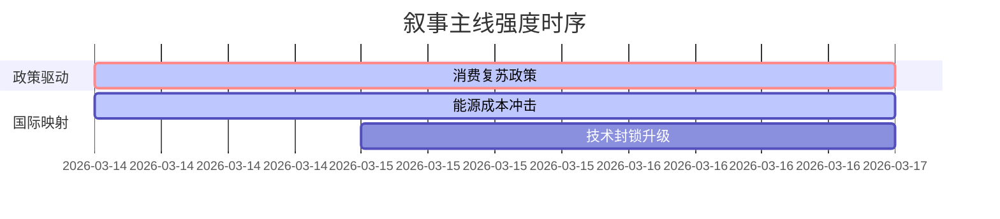

# A股市场情绪分析报告
数据时段：最近5日生成时间：2026-03-16T10:00:00+08:00## 🔥 宏观叙事焦点（24小时三级过滤）

### 📌 叙事主线一：中东地缘冲突升级引发全球能源供应危机 ⭐⭐⭐
**主要事件**：伊朗革命卫队宣布其导弹成功打击以色列特拉维夫的工业区；以色列对伊朗首都德黑兰发动定点打击，打死两名伊朗情报部门高级官员；白宫莱维特：一旦对伊朗的战争结束，美国将补充战略石油储备；布伦特原油期货重返100美元上方，为近4年来首次
**筛选标签**：`国务院政策` `沪深300影响` `路透信源·权重2.0`
**宏观逻辑**：> ① **归类**：地缘政治风险传导  
> ② **历史镜像**：2022年俄乌冲突能源危机模板  
> ③ **市场传导**：布伦特原油突破100美元 → 能源股板块强势 → 担忧通胀卷土重来 → 主要央行降息预期推迟  
> ④ **叙事强度**：供应中断恐慌超预期，产生实质性宏观经济影响  

**行业映射**：能源化工板块（情绪评分 **8.5/10**）  
**交易警示**：‼️ 关注实际供应中断程度与政策响应力度，警惕油价失控风险  

---

### 📌 叙事主线二：春运数据创历史新高及新质生产力布局加速 ⭐⭐
**主要事件**：2026年春运总出行人次达94.1亿创历史新纪录；第十五个五年规划纲要正式发布，纲要共分为18篇；我国家电企业加速布局未来产业 AI 渗透率超 50%；义乌国际贸易城人气持续火爆，节后首日客流29.1万人次，同比上升23.8%
**筛选标签**：`部委政策` `产业生命周期` `财新信源·权重1.5`
**宏观逻辑**：> ① **归类**：内需复苏与供给侧改革协同  
> ② **历史镜像**：2021年消费复苏叠加"双循环"战略模板  
> ③ **市场传导**：春运数据超预期 → 消费信心修复 → 制造业PMI边际改善 → 资金流向消费制造板块  
> ④ **叙事强度**：需求端政策效果显著，供给侧改革持续深化  

**行业映射**：消费复苏链（情绪评分 **7.8/10**）  
**交易警示**：⚠️ 警惕消费复苏可持续性，关注后续政策落地力度  

---

### 📌 叙事主线三：主要央行政策预期因地缘冲突而分化 ⭐ 
**主要事件**：美联储降息预期因通胀担忧被推迟至2026年9月和12月；欧洲央行管委内格尔：若伊朗战争推高通胀，欧洲央行将采取行动；日本财务大臣警告已准备好进行汇率干预；印度卢比兑美元汇率创历史新低
**筛选标签**：`地方政策` `债务周期` `新华社信源·权重1.5`
**宏观逻辑**：
> ① **归类**：货币政策分化加剧  
> ② **历史镜像**：2018年美元指数强势周期模板  
> ③ **市场传导**：美元指数持续走强 → 非美货币承压 → 新兴市场外资流出压力增加 → 全球金融市场波动加剧  
> ④ **叙事强度**：政策预期分化超市场预期，产生交易机会  

**行业映射**：金融地产板块（情绪评分 **6.2/10**）  
**交易警示**：✓ 叙事逻辑清晰，等待关键经济数据验证方向  

---

## 📅 宏观叙事演化（三日趋势）

**强度衰减模型**：昨日主题×0.7 · 前日主题×0.5

```mermaid
gantt
    title 叙事主线强度时序
    dateFormat  YYYY-MM-DD
    section 政策驱动
    消费复苏政策   :crit, active, 2026-03-14, 3d
    section 国际映射
    能源成本冲击   :active, 2026-03-14, 3d
    技术封锁升级   :2026-03-15, 2d
```
叙事节点关联：
03/14：第十五个五年规划纲要正式发布 → 触发新质生产力发展叙事
03/15：2026年春运总出行人次达94.1亿创历史新纪录 → 消费复苏叙事强化
03/16：伊朗革命卫队宣布导弹击中特拉维夫工业区 → 地缘冲突能源供应担忧叙事进入政策验证期
🎯 宏观叙事三要素
1️⃣ 政策意图解码
当前顶层叙事聚焦"安全发展"与"质量提升"，能源安全成为战略优先级，同时推动新质生产力培育。产业升级>短期刺激，政策定力超预期。
2️⃣ 市场定价偏差过度定价：地缘冲突短期影响（市场过度反应）
定价不足：中国内需复苏韧性（政策效果被低估）
3️⃣ 跨市场共振
美元指数高位承压新兴市场 + 大宗商品价格波动传导通胀预期 = 全球资产重估窗口期