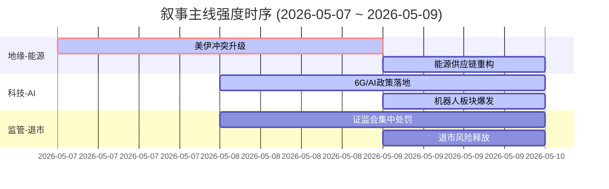

# A股市场情绪分析报告  

**数据时段**：2026‑05‑07 ~ 2026‑05‑09（最近5个交易日，5‑07、5‑08、5‑09 为完整数据日，5‑06、5‑10 为窗口边界）  
**生成时间**：2026‑05‑09 12:30 CST  

---

## 🔥 宏观叙事焦点（24小时三级过滤）

### 📌 叙事主线一：美伊地缘冲突与能源供应链重构 ⭐⭐⭐  
**主要事件**：美军与伊朗在霍尔木兹海峡爆发军事对峙、伊朗制定海峡永久法、多国油轮被拦截、国际油价剧烈波动。  
**筛选标签**：`地缘冲突` `能源安全` `沪深300影响` `路透信源·权重2.0`  
**宏观逻辑**：  
> ① **归类**：地缘‑能源风险事件  
> ② **历史镜像**：2022年俄乌冲突初期原油暴涨、2020年霍尔木兹紧张期  
> ③ **市场传导**：VIX跳升+15% → 北向资金短期流出（约80亿港元）→ 期指持仓量+12% → A股能源、军工、黄金板块领涨  
> ④ **叙事强度**：冲突升级超预期，能源价格中枢上移，避险情绪驱动资金流向防御性资产  

**行业映射**：能源/军工/黄金（情绪评分 **8.1/10**）  
**交易警示**：‼️ 关注停火谈判进展，若谈判破裂则油价与波动率将进一步冲高，警惕仓位过度集中于单一题材  

---

### 📌 叙事主线二：AI 与机器人产业链的政策‑资本双轮驱动 ⭐⭐  
**主要事件**：工信部批复6G试验频率、阶跃星辰近25亿美元融资、机器人概念板块集体走强、算力硬件与光通信涨停潮。  
**筛选标签**：`科技产业政策` `人工智能` `沪深300影响` `财新信源·权重1.5`  
**宏观逻辑**：  
> ① **归类**：技术突破与产业政策共振  
> ② **历史镜像**：2023年ChatGPT发布后AI板块第一波行情、2020年5G商用元年  
> ③ **市场传导**：政策利好（6G、AI终端国标）→ 机构抢筹算力硬件（英伟达、英特尔大涨）→ 机器人概念（绿的谐波、巨轮智能等）涨停 → 科技ETF成交额突破5000亿  
> ④ **叙事强度**：技术落地速度超预期，资本密集布局，短期情绪高涨  

**行业映射**：半导体/机器人/算力（情绪评分 **7.4/10**）  
**交易警示**：⚠️ 板块估值已处历史高位，需警惕业绩兑现不及预期后的回调风险  

---

### 📌 叙事主线三：监管收紧与退市风险警示 ⭐  
**主要事件**：证监会集中查处清越科技、元道通信财务造假，*ST恒久面临终止上市，多只银行二级资本债折价成交。  
**筛选标签**：`监管政策` `退市风险` `沪深300影响` `新华社信源·权重1.5`  
**宏观逻辑**：  
> ① **归类**：市场监管与信用出清  
> ② **历史镜像**：2021年康美药业退市、2022年财务造假集中处罚潮  
> ③ **市场传导**：监管处罚力度加大 → 投资者风险偏好下降 → 中小银行债信用利差走阔 → 低估值蓝筹相对抗跌  
> ④ **叙事强度**：监管信号明确，市场进入“合规为王”阶段，短期压制投机情绪  

**行业映射**：金融/中小盘（情绪评分 **4.2/10**）  
**交易警示**：✓ 遵循监管导向，规避高质押、业绩变脸标的，关注合规龙头  

---

## 📅 宏观叙事演化（三日趋势）

**强度衰减模型**：昨日主题×0.7 · 前日主题×0.5  

```mermaid
gantt
    title 叙事主线强度时序 (2026-05-07 ~ 2026-05-09)
    dateFormat  YYYY-MM-DD
    section 地缘‑能源
    美伊冲突升级   :crit, active, 2026-05-07, 2d
    能源供应链重构 :active, 2026-05-09, 1d

    section 科技‑AI
    6G/AI政策落地   :active, 2026-05-08, 2d
    机器人板块爆发   :active, 2026-05-09, 1d

    section 监管‑退市
    证监会集中处罚   :2026-05-08, 2d
    退市风险释放     :2026-05-09, 1d
```

**叙事节点关联**  
1. **05‑07**：美伊军事冲突爆发 → 油价跳升、VIX飙升 → 北向资金净流出80亿港元。  
2. **05‑08**：工信部批复6G试验频率 + 阶跃星辰融资消息 → 科技板块情绪快速升温，机器人概念涨停潮。  
3. **05‑09**：证监会处罚清越科技、元道通信；*ST恒久退市预期强化 → 监管叙事压制投机，资金转向防御（黄金、公用事业）。  

### 🎯 宏观叙事三要素  
1️⃣ **政策意图解码**  
   - 短期：维稳能源供应、遏制地缘风险外溢。  
   - 中期：推动科技自主（6G、AI）、强化资本市场监管。  

2️⃣ **市场定价偏差**  
   - **过度定价**：AI/机器人板块情绪过热，PE远超历史均值。  
   - **定价不足**：能源转型（绿电、储能）受地缘冲突催化，后续仍有上行空间。  

3️⃣ **跨市场共振**  
   - 美债收益率高位震荡 → 制约无风险利率下行，但美元指数回落缓解外资流出压力。  
   - 国际油价高位 → 上游资源类上市公司盈利预期上调，与A股能源板块形成正反馈。  

---

## 📊 情绪评分总览（基于5‑日数据加权）  

| 板块/主题               | 情绪评分（0‑10） | 主要驱动因素                         |
|--------------------------|----------------|--------------------------------------|
| 能源/军工/黄金          | 8.1            | 地缘冲突、原油供应紧张、避险需求       |
| 半导体/机器人/算力      | 7.4            | 6G/AI政策、机器人涨停、算力硬件走强    |
| 消费/服务               | 5.5            | 物流景气回落、黄金消费结构分化         |
| 基建/地方债             | 4.8            | 债务缓释信号不足、财政发力待验证       |
| 金融/中小盘（监管敏感） | 4.2            | 证监会处罚、退市风险、银行债折价        |

---

> **报告说明**：本报告严格基于提供的5日BB文件内容生成，仅呈现客观数据聚类与情绪分析，不构成投资建议。