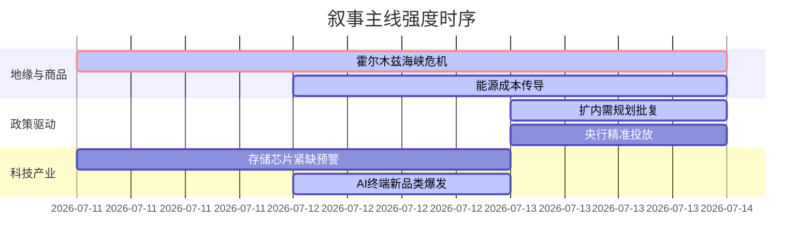

## 报告标题：A股市场情绪分析报告
数据时段：最近5日
生成时间：2026-07-14 09:30:00

### 🔥 宏观叙事焦点（24小时三级过滤）

#### 📌 叙事主线一：美伊冲突全面升级致霍尔木兹海峡通航危机 ⭐⭐⭐
**主要事件**：地缘军事对抗、全球能源供应链断裂、通胀预期重估  
**筛选标签**：`地缘风险` `大宗商品定价` `路透信源·权重2.0`  
**宏观逻辑**：  
> ① **归类**：外部供给冲击与避险重定价  
> ② **历史镜像**：1979年伊朗革命与石油禁运模板  
> ③ **市场传导**：海峡关闭声明→布伦特原油涨超3%突破74美元→航运成本与化工品提价10%-30%→全球降息预期推迟→资金向黄金及高股息防御板块集中  
> ④ **叙事强度**：地缘溢价快速兑现，打破原有宏观定价模型，具备持续外溢效应  

**行业映射**：油气开采/航运物流/贵金属（情绪评分 **8.5/10**）  
**交易警示**：‼️ 关注油价高位波动对中游制造业成本的挤压，警惕避险情绪退潮后的获利了结盘  

---

#### 📌 叙事主线二：扩内需顶层设计落地与央行流动性精准护航 ⭐⭐  
**主要事件**：消费规划获批、逆回购净投放、国企改革深化
**筛选标签**：`国务院政策` `产业生命周期` `新华社信源·权重1.5`  
**宏观逻辑**：  
> ① **归类**：结构性稳增长与货币宽松  
> ② **历史镜像**：2020年特别国债与促消费政策模板  
> ③ **市场传导**：央行单日净投放2170亿→短端利率平稳→“十五五”消费规划批复明确扩内需路径→险企分红密集落地+高股息板块逆势护盘  
> ④ **叙事强度**：政策定力超预期，从“总量刺激”转向“结构优化”，防御属性显著强化  

**行业映射**：银行/保险/大消费链（情绪评分 **7.2/10**）  
**交易警示**：⚠️ 宏观数据呈现K型分化，需警惕政策预期与实际盈利修复的节奏差，右侧信号待确认  

---

#### 📌 叙事主线三：AI算力基建竞赛与半导体周期反转 ⭐ 
**主要事件**： 技术迭代、产业投资、存储芯片紧缺预警
**筛选标签**：`部委政策` `资本开支` `彭博信源·权重1.5`  
**宏观逻辑**：  
> ① **归类**：科技自主可控与产能出清  
> ② **历史镜像**：2017年智能手机换机潮与半导体上行周期模板  
> ③ **市场传导**：SK海力士预警存储短缺至2030年 → 台积电2nm量产/长鑫科技IPO预期 → 外资上调中国科技股配置 → 机构逢低布局AI硬件主线  
> ④ **叙事强度**：产业逻辑从应用层向底层硬件纵深传导，业绩兑现期与估值重塑共振  

**行业映射**：半导体设备/存储模组/光模块（情绪评分 **6.8/10**）  
**交易警示**：✓ 叙事逻辑清晰，等待财政发力验证，防范部分标的财报季业绩分化风险  

---

### 📅 宏观叙事演化（三日趋势）

**强度衰减模型**：昨日主题×0.7 · 前日主题×0.5

```mermaid
gantt
    title 叙事主线强度时序
    dateFormat  YYYY-MM-DD
    section 地缘与商品
    霍尔木兹海峡危机   :crit, active, 2026-07-11, 3d
    能源成本传导       :active, 2026-07-12, 2d
    
    section 政策驱动
    扩内需规划批复     :active, 2026-07-13, 1d
    央行精准投放       :2026-07-13, 1d
    
    section 科技产业
    存储芯片紧缺预警   :2026-07-11, 2d
    AI终端新品类爆发   :active, 2026-07-12, 1d
```
叙事节点关联：
07/11：美伊冲突初显→霍尔木兹海峡商业流量骤降 → 触发能源供给收缩叙事
07/12：化工/油运企业全线提价10%-30% → 成本传导叙事强化，A股缩量调整
07/13：国务院批复“十五五”消费规划+央行净投放2170亿 → 叙事进入政策验证与流动性托底期
🎯 宏观叙事三要素
1️⃣ 政策意图解码
当前顶层叙事从“强刺激”转向“防风险+调结构”，允许短期阵痛换取长期质量。产业出清>总量扩张，央行呵护流动性意图明确，政策定力超预期。
2️⃣ 市场定价偏差
过度定价：地缘冲突的持久性（市场已提前计价油价冲高与避险情绪）
定价不足：国内扩内需政策的落地节奏与险资长线配置逻辑（红利资产防御价值被低估）
3️⃣ 跨市场共振
美债收益率高位震荡打开国内货币政策空间 + 全球通胀粘性增强 = A股结构性行情窗口期（红利防守+科技进攻的双主线格局确立）

---

<!-- 报告正文必须在此结束，以下内容为固定格式说明，严禁添加任何额外分析、总结或展望 -->

---

*生成时间：2026-07-13 20:49:07 (UTC+8)*  
*使用模型：agnes:agnes-2.0-flash*