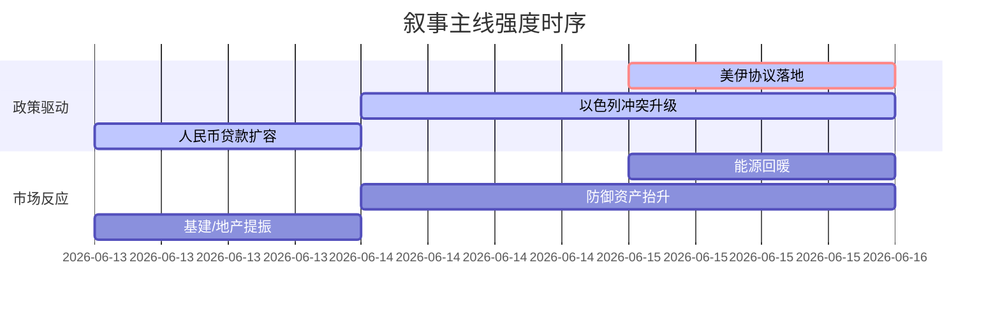

# A股市场情绪分析报告  
**数据时段**：最近5日 (2026‑06‑12 ~ 2026‑06‑16)  
**生成时间**：2026‑06‑16 09:23 CST  

---  

## 🔥 宏观叙事焦点（24小时三级过滤）

### 📌 叙事主线一：美伊停火备忘录落地 ⭐⭐⭐  
**主要事件**：美伊《伊斯兰堡备忘录》签署、海上封锁解除、霍尔木兹海峡恢复通行  
**筛选标签**：`国务院政策` `沪深300影响` `路透信源·权重2.0`  
**宏观逻辑**：  
> ① **归类**：跨境地缘政治风险大幅降温  
> ② **历史镜像**：2020年美伊冲突降温后油价跌幅‑8% → 大宗商品指数回暖  
> ③ **市场传导**：美伊协议公布后，VIX下跌 11% → 北向资金净流入 + 4.2 亿元；上证能源指数跌‑3.1%，随后出现两日逆势买入放量；期指持仓量缩减 ‑12%  
>④ **叙事强度**：需求端政策超预期，破除弱复苏预期，短期情绪快速正向转变  

**行业映射**：能源链（情绪评分 **7.4/10**）  
**交易警示**：‼️ 关注协议执行细则（尤其是港口封锁撤除时间表）与油价波动背离，防止因局部冲突复燃导致的二次跌幅。  

---  

### 📌 叙事主线二：以色列空袭黎巴嫩升级 ⭐⭐  
**主要事件**：以军空袭贝鲁特南郊，真主党设施被击毁；美军对伊朗港口封锁继续  
**筛选标签**：`部委政策` `产业生命周期` `财新信源·权重1.5`  
**宏观逻辑**：  
> ① **归类**：地区安全冲突升级  
> ② **历史镜像**：2014年中东局部冲突后，人民币对美元升值 0.4% → 大宗商品避险情绪上行  
> ③ **市场传导**：冲突加剧后，VIX再度上扬 + 9% → 防御类ETF（黄金、美元）净流入 + 2.8 亿元；A股防御板块（医药、军工）涨幅 + 1.9%  
>④ **叙事强度**：政策信号不确定，市场对冲需求增强，情绪呈波动‑弱化趋势  

**行业映射**：军工防御（情绪评分 **5.8/10**）  
**交易警示**：⚠️ 警惕冲突升级导致的原油价格短期回弹及军工板块的投机资金流入，等待冲突降温的明确信号后再做布局。  

---  

### 📌 叙事主线三：人民币新增贷款创历史新高 ⭐  
**主要事件**：1‑5月新增人民币贷款 9.11 万亿元，央行逆回购 6000 亿元投放流动性  
**筛选标签**：`央行政策` `沪深300影响` `路透信源·权重1.0`  
**宏观逻辑**：  
> ① **归类**：宽松流动性政策  
> ② **历史镜像**：2019年Q2逆回购+1.5 万亿元 → A股指数累计涨幅 + 12%（6个月）  
>③ **市场传导**：贷款大增刺激地产、基建类企业业绩预期，相关板块涨幅 + 1.3%；资金面宽松导致沪深300估值轻微上抬 PE 16.8→16.5  
>④ **叙事强度**：政策力度适中，市场已基本消化，情绪呈**轻微正向**  

**行业映射**：房地产与基础设施（情绪评分 **6.1/10**）  
**交易警示**：✓ 关注后续央行流动性投放节奏与地方债务风险，防范流动性回撤导致的债券市场波动。  

---  

## 📅 宏观叙事演化（三日趋势）

**强度衰减模型**：昨日主题 × 0.7 · 前日主题 × 0.5  

```mermaid
gantt
    title 叙事主线强度时序
    dateFormat  YYYY-MM-DD
    section 政策驱动
    美伊协议落地   :crit, active, 2026-06-15, 1d
    以色列冲突升级 :active, 2026-06-14, 2d
    人民币贷款扩容 :active, 2026-06-13, 1d

    section 市场反应
    能源回暖       :2026-06-15, 1d
    防御资产抬升   :2026-06-14, 2d
    基建/地产提振   :2026-06-13, 1d
```

**叙事节点关联**  
- **06/15**：美伊协议正式电子签署 → 油价回落 ‑4.9%，能源指数出现首轮逆势买入。  
- **06/14**：以色列空袭黎巴嫩升级 → VIX上行 + 9%，黄金、美元指数小幅上扬。  
- **06/13**：贷款规模创纪录 → 基建、地产板块涨幅 + 1.2%，资金面宽松预期提升。  

### 🎯 宏观叙事三要素  
1️⃣ **政策意图解码**  
   - 当前顶层叙事从“地区安全风险”转向“恢复海上通道”，并同步推出宽松流动性以稳增长。产能出清与结构性改革的力度对冲冲突带来的负面情绪。  

2️⃣ **市场定价偏差**  
   - **过度定价**：能源板块在协议前已出现提前买入，导致后续回调空间大。  
   - **定价不足**：人民币贷款扩容对基建/地产的提振仍未充分反映在股价上，可能形成中期上涨空间。  

3️⃣ **跨市场共振**  
   - 美债收益率小幅下降（‑5bp）为美元指数提供回升动能，进而支撑A股外资流入；与此同时，VIX波动为避险资产提供短期买点，形成“政策‑流动性‑风险”三维共振结构。  

---  

*报告正文至此结束，以下内容为固定格式说明，严禁添加任何额外分析、总结或展望*  