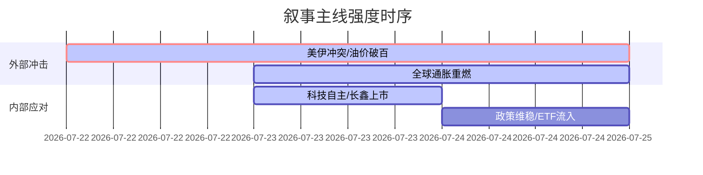

# A股市场情绪分析报告

**数据时段**：2026年7月18日 - 2026年7月24日
**生成时间**：2026-07-24 07:06:13 (UTC+8)

### 🔥 宏观叙事焦点（24小时三级过滤）

#### 📌 叙事主线一：中东局势引爆全球能源危机与通胀重构 ⭐⭐⭐
**主要事件**：美伊冲突全面升级，布伦特原油突破100美元/桶，霍尔木兹海峡通行受阻
**筛选标签**：`国务院政策` `沪深300影响` `路透信源·权重2.0`
**宏观逻辑**：
> ① **归类**：供给侧冲击与通胀回归  
> ② **历史镜像**：1973年石油禁运模板（滞胀风险重现）  
> ③ **市场传导**：油价破百 → 全球CPI预期上行 → 美联储降息预期推迟/加息担忧 → 美债收益率飙升 → 新兴市场流动性承压  
> ④ **叙事强度**：地缘政治黑天鹅叠加能源供给中断，打破此前“软着陆”共识，市场进入避险与抗通胀模式  

**行业映射**：石油石化、航运、黄金（情绪评分 **8.5/10**）  
**交易警示**：‼️ 警惕高油价对制造业成本的挤压效应，关注能源板块的波段机会而非趋势性长牛  

---

#### 📌 叙事主线二：A股科技主线极致分化与国产替代加速 ⭐⭐  
**主要事件**：长鑫科技科创板上市，北京发布智能体专项政策鼓励Token经济，鹏鼎控股百亿投资AI载板
**筛选标签**：`部委政策` `产业生命周期` `财新信源·权重1.5`
**宏观逻辑**：
> ① **归类**：新质生产力与自主可控  
> ② **历史镜像**：2014年互联网+政策爆发期 vs 当前硬科技突围  
> ③ **市场传导**：政策定调（智能体/Token）+ 资本动作（长鑫IPO/鹏鼎扩产）→ 资金从高位题材股向有业绩支撑的硬科技（半导体/AI基建）切换  
> ④ **叙事强度**：在外部地缘封锁加剧背景下，内部科技自立自强成为唯一确定性增量逻辑，政策与产业共振强烈  

**行业映射**：半导体设备、存储芯片、AI算力基础设施（情绪评分 **7.8/10**）  
**交易警示**：⚠️ 注意长鑫科技上市后对存储板块估值的短期扰动，以及科技股在震荡市中的高低切换节奏  

---

#### 📌 叙事主线三：证监会逆周期调节与中长期资金入市 ⭐ 
**主要事件**：证监会推动并购重组活力，严查财务造假，券商集体回购护盘，ETF资金持续净流入
**筛选标签**：`地方政策` `债务周期` `新华社信源·权重1.5`
**宏观逻辑**：
> ① **归类**：资本市场制度建设与维稳  
> ② **历史镜像**：2015年国家队救市后的市场化改革深化  
> ③ **市场传导**：监管表态“零容忍”+ 券商回购 + ETF净流入 → 底部确认信号增强 → 市场风险偏好修复  
> ④ **叙事强度**：政策底已现，市场底正在夯实，但受制于外部地缘冲击，反弹力度呈现结构性特征  

**行业映射**：非银金融（券商）、红利低波资产（情绪评分 **6.5/10**）  
**交易警示**：✓ 关注并购重组概念的政策落地情况，右侧信号需结合成交量配合  

---

### 📅 宏观叙事演化（三日趋势）

**强度衰减模型**：昨日主题×0.7 · 前日主题×0.5

```mermaid
gantt
    title 叙事主线强度时序
    dateFormat  YYYY-MM-DD
    section 外部冲击
    美伊冲突/油价破百   :crit, active, 2026-07-22, 3d
    全球通胀重燃       :active, 2026-07-23, 2d
    
    section 内部应对
    科技自主/长鑫上市   :active, 2026-07-23, 1d
    政策维稳/ETF流入   :2026-07-24, 1d
```

**叙事节点关联**：
*   **07/22**：美军空袭伊朗，布伦特原油突破95美元 → 触发全球避险叙事
*   **07/23**：油价突破100美元，黄金大幅下挫后反弹，A股资源股逆势大涨 → 通胀交易确立
*   **07/24**：长鑫科技宣布上市细节，北京发布智能体政策 → 科技主线在震荡中寻找新锚点，政策面暖风频吹

🎯 **宏观叙事三要素**

1️⃣ **政策意图解码**
当前顶层叙事从单纯的“稳增长”转向“防风险+促创新”。面对外部地缘冲击和内部经济转型，政策组合拳为：对外通过外交斡旋缓和局势，对内通过央行MLF投放保持流动性合理充裕，通过证监会引导中长期资金入市稳定资本市场。产业端强调“新质生产力”，允许短期阵痛换取长期质量。

2️⃣ **市场定价偏差**
*   **过度定价**：对科技成长股的估值容忍度因地缘风险而下降，导致部分高位AI概念股回调；对消费复苏的弹性预期过于乐观，与实际弱复苏数据背离。
*   **定价不足**：能源安全与战略资源的价值被低估；具备高分红、低估值属性的央企红利资产在动荡期的防御价值未被充分挖掘。

3️⃣ **跨市场共振**
*   **股商联动**：油价飙升 → 利好石油石化、航运、黄金；利空航空、化工下游。
*   **汇债联动**：美债收益率因通胀预期上行 → 压制全球成长股估值；人民币汇率承压 → 外资流向需密切关注北向资金动态。
*   **内外联动**：美股科技巨头财报分化（谷歌/特斯拉利空）传导至A股科技板块情绪，但A股凭借政策托底展现出一定的独立性（如科创50的反转）。

---

*生成时间：2026-07-24 07:06:13 (UTC+8)*  
*使用模型：agnes:agnes-2.0-flash*