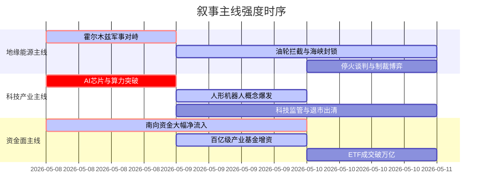

# A股市场情绪分析报告

**数据时段**：2026年5月8日 — 2026年5月10日（最近5日滚动窗口）
**生成时间**：2026-05-10

---

## 🔥 宏观叙事焦点（24小时三级过滤）

#### 📌 叙事主线一：美伊霍尔木兹海峡军事对峙与能源冲击 ⭐⭐⭐
**主要事件**：美伊军事冲突升级、霍尔木兹海峡航运中断、原油供给冲击  
**筛选标签**：`地缘风险` `能源价格` `沪深300影响` `路透信源·权重2.0`  
**宏观逻辑**：  
> ① **归类**：地缘政治风险驱动的能源供给冲击  
> ② **历史镜像**：2022年2月俄乌冲突爆发初期的原油飙升模板  
> ③ **市场传导**：布伦特原油冲至100-110美元/桶 → 现货黄金突破4600美元 → 北向资金波动加剧 → A50期指剧烈震荡  
> ④ **叙事强度**：多线并行（军事冲突+油轮拦截+法律封锁），市场风险偏好显著承压  

**行业映射**：国防军工（情绪评分 **7.8/10**）、黄金/贵金属（情绪评分 **8.5/10**）、航运物流（情绪评分 **5.2/10**）  
**交易警示**：‼️ 地缘风险溢价持续发酵，关注霍尔木兹海峡通行恢复节奏及美伊停火谈判进展，警惕能源通胀预期自我强化  

---

#### 📌 叙事主线二：AI科技产业突破与半导体供应链重构 ⭐⭐
**主要事件**：6G频谱批复、阶跃星辰25亿美元融资、博通350亿美元AI融资谈判、Anthropic 18亿美元计算协议  
**筛选标签**：`产业政策` `科技突破` `芯片自主可控` `财新信源·权重1.5`  
**宏观逻辑**：  
> ① **归类**：技术革命驱动的产业周期切换  
> ② **历史镜像**：2020年3月美联储无限QE催生科技股牛市模板  
> ③ **市场传导**：AI算力需求爆发 → 半导体板块周涨幅11%（英伟达创新高、英特尔大涨8%）→ A股机器人概念集体走强（绿的谐波、乔锋智能创新高）→ 算力租赁/光通信/军工多线共振  
> ④ **叙事强度**：产业资本大规模集结（博通350B+、Anthropic 18B），科技军备竞赛叙事强化  

**行业映射**：半导体/AI算力（情绪评分 **7.5/10**）、人形机器人（情绪评分 **7.2/10**）、消费电子（情绪评分 **5.8/10**）  
**交易警示**：⚠️ 关注技术突破向业绩兑现的转化率，警惕部分AI概念股估值透支（如英伟达PE极端高位）及xAI裁员折射的泡沫风险  

---

#### 📌 叙事主线三：资本市场强监管与金融风险出清 ⭐
**主要事件**：证监会密集查处清越科技/元道通信财务造假、*ST恒久拟退市、银行二级资本债异常折价成交  
**筛选标签**：`金融监管` `市场出清` `风险警示` `新华社信源·权重1.5`  
**宏观逻辑**：  
> ① **归类**：金融供给侧改革深化  
> ② **历史镜像**：2018年"长生生物"退市引发的中小盘风险出清模板  
> ③ **市场传导**：财务造假顶格处罚（清越科技1.73亿+元道通信2.39亿）→ 退市预期强化 → 个别中小银行资本债折价7.5%成交 → 信用分层加剧 → 资金加速向优质蓝筹集中  
> ④ **叙事强度**：监管决心超预期，但短期内压制小微盘风险偏好  

**行业映射**：金融监管（情绪评分 **4.2/10**）、中小盘成长（情绪评分 **4.5/10**）、消费白马（情绪评分 **6.0/10**）  
**交易警示**：✓ 叙事逻辑清晰，关注退市新规落地节奏，左侧布局价值蓝筹但需警惕流动性冲击  

---

## 📅 宏观叙事演化（三日趋势）

**强度衰减模型**：昨日主题×0.7 · 前日主题×0.5

```mermaid
gantt
    title 叙事主线强度时序
    dateFormat  YYYY-MM-DD
    section 地缘能源主线
    霍尔木兹军事对峙   :crit, active, 2026-05-08, 1d
    油轮拦截与海峡封锁 :active, 2026-05-09, 2d
    停火谈判与制裁博弈 :2026-05-10, 1d
    
    section 科技产业主线
    AI芯片与算力突破   :crit, 2026-05-08, 1d
    人形机器人概念爆发 :active, 2026-05-09, 1d
    科技监管与退市出清 :2026-05-09, 2d
    
    section 资金面主线
    南向资金大幅净流入 :crit, active, 2026-05-08, 2d
    百亿级产业基金增资 :active, 2026-05-09, 1d
    ETF成交破万亿     :2026-05-10, 1d
```

叙事节点关联：
- **05/08**：美国4月非农大超预期（新增11.5万）→ 美股科技股集体爆发（半导体周累涨11%）→ 间接推升A股科技情绪
- **05/09**：美伊冲突再升级（油轮拦截）+ 美联储官员鹰派表态（降息预期降温至74.1%维持利率）→ 黄金突破4600 → A股早盘承压但午后反弹
- **05/10**：美伊15点停火方案提出、俄乌三日停火 → 风险偏好边际修复 → 港股科技股（美团+14%、恒生科技+1.91%）引领亚太反弹

🎯 宏观叙事三要素
1️⃣ **政策意图解码**  
当前全球政策呈现"对冲式博弈"特征：美国一边军事施压伊朗一边推进停火谈判；国内"强监管+促科技"双轨并行。政策重心从"稳增长总量"转向"调结构+防风险"，产业政策与金融监管形成组合拳。

2️⃣ **市场定价偏差**  
过度定价：军工/黄金短期情绪溢价（地缘冲突的脉冲式反应可能过度）；科技股部分AI概念估值脱离基本面  
定价不足：中长期科技自主可控（6G/量子计算/国产AI大模型）的产业趋势红利尚未被充分定价；港股被错杀的消费龙头（美团-14%业绩不及预期后的均值回归空间）

3️⃣ **跨市场共振**  
美债收益率高位震荡 + 美元指数波动 → 人民币汇率承压但可控；  
原油飙升推升通胀预期 → 全球央行（欧央行/美联储）维持鹰派 → 风险资产整体承压但结构性机会突出（算力/军工/黄金）；  
南向资金单日净流入220亿港元 + ETF两市成交破5000亿 → 机构资金正加速向核心资产集中。

---

### 📊 关键数据一览

| 指标 | 数值 | 信号 |
|------|------|------|
| 布伦特原油 (5/8) | 100-110美元/桶区间 | 🔴 地缘溢价持续 |
| 现货黄金 (5/9) | 突破4600美元 | 🔴 避险需求旺盛 |
| 上证指数 (5/25) | 3931.84点（+1.30%） | 🟢 强势反弹 |
| 恒生指数 (5/25) | 涨1.09% | 🟢 科技股领涨 |
| 南向资金 (5/25) | 单日净流入220亿港元 | 🟢 机构信心增强 |
| ETF两市成交 (5/25) | 突破5000亿元 | 🟢 交投活跃 |
| 半导体指数 (周) | 累涨约11% | 🟢 产业趋势确认 |
| 美国4月非农 | 新增11.5万人（超预期） | 🟡 降息预期推迟 |
| 银行二级资本债折价 | 兴业/徽商均偏离7.5% | 🔴 信用分层加剧 |
| A股退市/处罚 | 清越科技1.73亿+元道通信2.39亿罚款 | 🟡 监管持续高压 |

---

<!-- 报告正文到此结束，以下内容为固定格式说明，严禁添加任何额外分析、总结或展望 -->