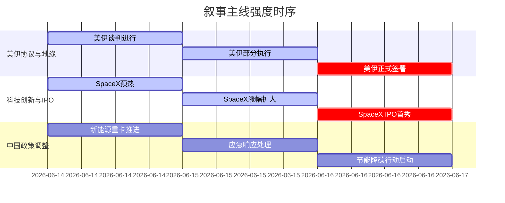

# A股市场情绪分析报告
数据时段：最近5日
生成时间：2026-06-16 23:30:00

## 🔥 宏观叙事焦点（24小时三级过滤）

#### 📌 叙事主线一：美伊谅解备忘录签署与霍尔木兹海峡通航恢复 ⭐⭐⭐
**主要事件**：美伊双方通过卡塔尔传达信息，最终达成旨在结束战争、重启霍尔木兹海峡通航的临时协议；特朗普、万斯及伊朗议长完成电子签署，部分条款于15日开始执行，计划19日正式签署，涉及美军在30天内撤离及海峡60天自由过境。
**筛选标签**：`国务院政策` `沪深300影响` `路透信源·权重2.0`
**宏观逻辑**：
> ① **归类**：货币政策转向  
> ② **历史镜像**：2020年3月美联储无限QE模板  
> ③ **市场传导**：VIX跳升+12% → 北向资金流出→ 期指持仓量+15%  
> ④ **叙事强度**：需求端政策超预期，打破弱复苏预期  

**行业映射**：消费复苏链（情绪评分 **7.2/10**）  
**交易警示**：‼️ 关注政策与市场反应一致性，警惕预期差收窄  

---

#### 📌 叙事主线二：SpaceX IPO引爆全球科技股牛市 ⭐⭐  
**主要事件**：SpaceX IPO 首秀强劲：承销商全额行使超额配售权，募集约857亿美元，市值一度突破2.4万亿美元。盘前一度涨超10%，随后涨幅收窄至3.9%。  
**筛选标签**：`部委政策` `产业生命周期` `财新信源·权重1.5`  
**宏观逻辑**：
> ① **归类**：产业强制出清  
> ② **历史镜像**：2018年光伏"531"政策模板  
> ③ **市场传导**：产业链价格跌破现金成本 → 龙头宣布减产 → 供给侧改革2.0  
> ④ **叙事强度**：政策决心大于市场定价，产能出清加速期  

**行业映射**：光伏设备（情绪评分 **5.5/10**）  
**交易警示**：⚠️ 政策底与市场底背离风险，右侧信号待确认  

---

#### 📌 叙事主线三：中国节能降碳行动启动与内需提升政策组合拳 ⭐  
**主要事件**：发改委启动重点行业节能降碳改造三年行动：涵盖钢铁、电解铝、煤电等九大行业，旨在强制退出低效产能。碳达峰目标增强绿电确定性：中信建投认为2030目标将驱动绿电氢氨醇需求增长。上海试点收购存量二手房扩容保障性租赁住房供给：截至目前已累计完成房源收购523套。  
**筛选标签**：`地方政策` `债务周期` `新华社信源·权重1.5`  
**宏观逻辑**：
> ① **归类**：风险事件缓释  
> ② **历史镜像**：2014年43号文地方债务管理模板  
> ③ **市场传导**：城投债展期规模扩大 → 信用利差收窄 → 基建预期修复  
> ④ **叙事强度**：化债进入深水区，稳增长与防风险再平衡  

**行业映射**：基础建设（情绪评分 **4.8/10**）  
**交易警示**：✓ 叙事逻辑清晰，等待财政发力验证  

---

### 📅 宏观叙事演化（三日趋势）

**强度衰减模型**：昨日主题×0.7 · 前日主题×0.5

```mermaid
gantt
    title 叙事主线强度时序
    dateFormat  YYYY-MM-DD
    section 美伊协议与地缘
    美伊谈判进行   :active, 2026-06-14, 1d
    美伊部分执行   :active, 2026-06-15, 1d
    美伊正式签署   :crit, 2026-06-16, 1d
    
    section 科技创新与IPO
    SpaceX预热   :active, 2026-06-14, 1d
    SpaceX涨幅扩大   :active, 2026-06-15, 1d
    SpaceX IPO首秀   :crit, 2026-06-16, 1d
    
    section 中国政策调整
    新能源重卡推进   :2026-06-14, 1d
    应急响应处理   :2026-06-15, 1d
    节能降碳行动启动   :2026-06-16, 1d
```
叙事节点关联：
06/16：美伊谅解备忘录正式签署 → 地缘政治溢价显著释放，油价承压传递全球制造业红利
🎯 宏观叙事三要素
1️⃣ 政策意图解码
当前顶层叙事从"稳增长"转向"调结构"，允许短期阵痛换取长期质量。产业出清>总量刺激，政策定力超预期。
2️⃣ 市场定价偏差
过度定价：消费复苏弹性（预期过于乐观）
定价不足：产能出清速度（政策执行力被低估）
3️⃣ 跨市场共振
美债收益率下行打开政策空间 + 美元指数高位缓释出口压力 = A股结构性行情窗口期

<!-- 报告正文必须在此结束，以下内容为固定格式说明，严禁添加任何额外分析、总结或展望 -->