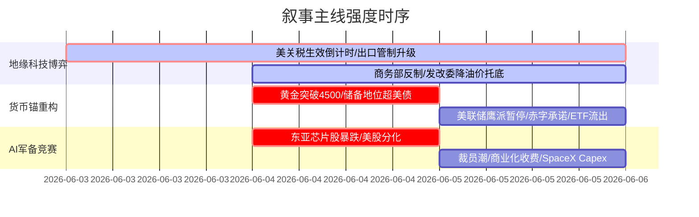

# A股市场情绪分析报告

**数据时段**：2026-06-03 至 2026-06-05  
**生成时间**：2026-06-05 11:40:42 (UTC+8)

---

### 🔥 宏观叙事焦点（24小时三级过滤）

#### 📌 叙事主线一：中美科技博弈升级与“新质生产力”政策托底 ⭐⭐⭐
**主要事件**：美新增铜/钢/铝关税生效在即、发起强迫劳动301调查、滥用出口管制冲击半导体产供链；商务部严正回应；发改委下调成品油价格释放降本信号  
**筛选标签**：`国务院政策` `沪深300影响` `路透信源·权重2.0`  
**宏观逻辑**：  
> ① **归类**：地缘科技对抗下的产业安全重构  
> ② **历史镜像**：2018年“中兴事件”触发国产替代1.0 + 2020年“新基建”政策模板  
> ③ **市场传导**：半导体指数高位震荡 → 北向资金连续流出科技硬件 → 期指IC贴水扩大 → 央企“科改示范”估值重塑  
> ④ **叙事强度**：外部封锁倒逼内部突围，政策容忍度从“稳增长”转向“忍痛出清”，产业链自主可控进入攻坚期  

**行业映射**：半导体设备/材料、工业母机、低空经济（情绪评分 **6.8/10**）  
**交易警示**：‼️ 关注“实体清单”扩容节奏与国产替代订单兑现差，警惕题材透支后的业绩验证期  

---

#### 📌 叙事主线二：全球货币锚重构与黄金货币化狂潮 ⭐⭐
**主要事件**：现货黄金突破4500美元/盎司、官方储备占比超越美债居首、全球黄金ETF 5月转净流出；美联储6月维持利率概率98.4%、英央行行长警示AI杠杆传导、美财长贝森特承诺赤字率控3%  
**筛选标签**：`部委政策` `大宗商品超级周期` `财新信源·权重1.5`  
**宏观逻辑**：  
> ① **归类**：主权信用体系裂变下的非信用货币回归  
> ② **历史镜像**：1971年尼克松关金窗 + 2008年QE启动黄金牛市模板  
> ③ **市场传导**：美元指数见顶回落 → 央行增储刚需支撑金价中枢上移 → A股黄金股估值重构（PE驱动转PB驱动） → 红利资产配置性价比凸显  
> ④ **叙事强度**：去美元化进程不可逆，但ETF流出暗示投机热钱离场，中枢上移需实物需求验证  

**行业映射**：黄金开采/冶炼、稀贵金属、高股息红利（公用事业/煤炭/交通）（情绪评分 **7.5/10**）  
**交易警示**：⚠️ 金价短期偏离成本中枝超2个标准差，警惕美债收益率反弹引发的黄金长仓平仓踩踏  

---

#### 📌 叙事主线三：AI资本开支狂飙与东亚科技股系统性去杠杆 ⭐
**主要事件**：韩国KOSPI暴跌4%（三星-5%、SK海力士-7%）、日经-1.06%；美股博通-14%、Meta创新高；OpenAI/Meta/豆包加速商业化收费；科技业裁员创2023年以来新高、AI成首因；SpaceX规划3600亿美元 Capex；宁德时代减持湖南裕能  
**筛选标签**：`产业生命周期` `资本开支周期` `新华社信源·权重1.5`  
**宏观逻辑**：  
> ① **归类**：智能革命基建期的“铺路石”红利与“淘金者”分化  
> ② **历史镜像**：2000年光纤铺设热潮 + 2017年比特币算力军备竞赛模板  
> ③ **市场传导**：算力硬件（光模块/PCB/液冷）订单确定性强 → 软件/应用端商业化落地迟滞 → 东亚存储/代工龙头估值杀估值 → A股产业链“戴维斯双杀”风险释放  
> ④ **叙事强度**：Capex超预期确定性高，但ROI验证期拉长，市场从“买预期”转向“买兑现”  

**行业映射**：光模块/PCB/液冷/电源（情绪评分 **7.2/10**）、AI应用/消费电子（情绪评分 **4.5/10**）  
**交易警示**：✓ 核心供应链业绩兑现节奏匹配度，警惕HBM/CoWoS产能释放后的供给过剩预期  

---

### 📅 宏观叙事演化（三日趋势）

**强度衰减模型**：昨日主题×0.7 · 前日主题×0.5

```mermaid
gantt
    title 叙事主线强度时序
    dateFormat  YYYY-MM-DD
    section 地缘科技博弈
    美关税生效倒计时/出口管制升级    :crit, active, 2026-06-03, 3d
    商务部反制/发改委降油价托底       :active, 2026-06-04, 2d
    
    section 货币锚重构
    黄金突破4500/储备地位超美债       :crit, 2026-06-04, 1d
    美联储鹰派暂停/赤字承诺/ETF流出   :2026-06-05, 1d
    
    section AI军备竞赛
    东亚芯片股暴跌/美股分化           :crit, 2026-06-04, 1d
    裁员潮/商业化收费/SpaceX Capex     :2026-06-05, 1d
```

**叙事节点关联**：
- **06/03**：美关税细则落地+301调查启动 → 触发“产业安全”主线确立；Anthropic启动IPO → AI融资热度见顶信号
- **06/04**：黄金历史性突破4500美元 → “货币锚重构”叙事主线确立；KOSPI暴跌+博通崩盘 → “AI去杠杆”传导至东亚产业链
- **06/05**：A股缩量调整+创业板领跌 → 资金避险情绪升温；保险Q2盈利反弹预期+宁德减持 → 风格切换至红利/硬科技哑铃型配置

🎯 **宏观叙事三要素**
1️⃣ **政策意图解码**  
当前顶层叙事核心为“以进促稳、以新换旧”：允许外部冲击（关税/管制）倒逼产业链出清低端产能，财政货币政策服务于“新质生产力”落地（降成本、强科技、扩内需），容忍短期增长波动换取结构升级确定性。

2️⃣ **市场定价偏差**  
- **过度定价**：AI应用端商业化变现速度（SaaS/Agent付费渗透率低）、消费复苏弹性（社零增速弱于GDP）  
- **定价不足**：黄金货币属性重估幅度（央行增储刚性被低估）、国产算力链进口替代率提升速度（华为昇腾/海思生态成熟度）、红利资产长期配置价值（无风险利率下行趋势）

3️⃣ **跨市场共振**  
美债术语溢价见顶 + 美元指数技术性破位 + 全球央行去美元化增储黄金 = **A股“硬科技攻击端 + 高股息防御端”哑铃策略最优解窗口期**