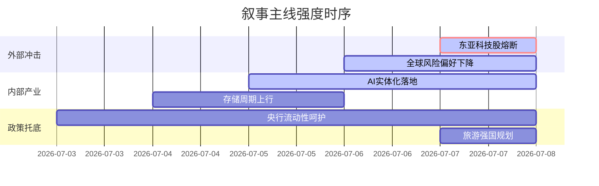

## A股市场情绪分析报告

**数据时段**：2026-07-03 至 2026-07-07（最近5日）
**生成时间**：2026-07-07 20:30

### 🔥 宏观叙事焦点（24小时三级过滤）

#### 📌 叙事主线一：东亚科技股流动性危机与全球风险重估 ⭐⭐⭐
**主要事件**：韩国KOSPI熔断、日韩股市暴跌、美股科技股震荡
**筛选标签**：`全球风险偏好` `科技股估值重构` `路透信源·权重2.0`  
**宏观逻辑**：  
> ① **归类**：系统性流动性冲击  
> ② **历史镜像**：2010年5月“闪崩”与2022年成长股杀估值模板  
> ③ **市场传导**：韩国KOSPI跌8%触发熔断 → 存储芯片巨头（三星/SK海力士）业绩预期波动 → 全球科技股避险情绪蔓延 → A股科技板块跟跌  
> ④ **叙事强度**：外部风险敞口急剧扩大，打破“A股独立于外围”的预期，北向资金流出压力增大，市场风险偏好降至冰点  

**行业映射**：半导体/存储芯片、科技成长股（情绪评分 **3.5/10**）  
**交易警示**：‼️ 警惕“杀估值”从日韩向A股科技龙头扩散，关注外资流向及科技股业绩兑现能力  

---

#### 📌 叙事主线二：AI产业从“概念”向“实体”与“应用”深化 ⭐⭐  
**主要事件**：高盛预测AI资本开支7.6万亿、支付宝AI开放平台上线、微软裁员重组聚焦AI
**筛选标签**：`产业生命周期` `科技巨头动向` `财新信源·权重1.5`  
**宏观逻辑**：  
> ① **归类**：产业基本面验证  
> ② **历史镜像**：2010年移动互联网渗透率拐点  
> ③ **市场传导**：微软剥离非核心业务/高盛上调资本开支预期 → 资金从纯题材炒作转向有业绩支撑的AI基础设施及应用端 → 内存价格暴涨印证需求旺盛  
> ④ **叙事强度**：叙事逻辑从“故事”转向“事实”，虽然短期受外围波动压制，但中长期产业趋势未改，具备结构性机会  

**行业映射**：AI应用层、存储芯片、算力基础设施（情绪评分 **6.8/10**）  
**交易警示**：⚠️ 关注个股分化，纯概念炒作退潮，利好具备真实订单和成本转嫁能力的龙头  

---

#### 📌 叙事主线三：国内政策托底与监管净化市场生态 ⭐ 
**主要事件**：国务院同意旅游强国规划、央行增持黄金、监管整治“低俗赌约”
**筛选标签**：`国务院政策` `流动性呵护` `新华社信源·权重1.5`  
**宏观逻辑**：  
> ① **归类**：稳增长与防风险并重  
> ② **历史镜像**：2015年股灾后的监管强化与2020年消费券发放  
> ③ **市场传导**：央行逆回购+购金提供流动性底气 → 旅游规划提振内需预期 → 监管打击非理性炒作（如股吧赌约） → 市场生态逐步回归价值投资  
> ④ **叙事强度**：政策底信号明确，但市场信心恢复滞后，属于“防御性”叙事，难以驱动大幅上涨，但能遏制系统性下跌  

**行业映射**：大消费（旅游/餐饮）、黄金/贵金属、高股息蓝筹（情绪评分 **5.2/10**）  
**交易警示**：✓ 政策效力显现需要时间，关注财政发力具体落地节奏  

---

### 📅 宏观叙事演化（三日趋势）

**强度衰减模型**：昨日主题×0.7 · 前日主题×0.5

```mermaid
gantt
    title 叙事主线强度时序
    dateFormat  YYYY-MM-DD
    section 外部冲击
    东亚科技股熔断   :crit, active, 2026-07-07, 1d
    全球风险偏好下降 :active, 2026-07-06, 2d
    
    section 内部产业
    AI实体化落地     :active, 2026-07-05, 3d
    存储周期上行     :2026-07-04, 2d
    
    section 政策托底
    央行流动性呵护   :2026-07-03, 5d
    旅游强国规划     :2026-07-07, 1d
```

**叙事节点关联：**
*   **07/03**：韩国股市初现动荡迹象，A股科技板块跟随调整，但国内政策面（央行逆回购）提供缓冲。
*   **07/04-05**：存储芯片涨价逻辑强化，AI产业资本开支预期升温，部分抵消外部悲观情绪，市场呈现结构性分化。
*   **07/06**：沙特阿美大幅下调油价加剧全球通缩担忧，微软裁员4800人引发科技股对AI转型成本的重新定价，市场焦虑感上升。
*   **07/07**：韩国KOSPI单日暴跌8%触发熔断，成为压垮市场情绪的最后一根稻草，A股沪指失守4000点，两市缩量，恐慌情绪蔓延至全市场。

**🎯 宏观叙事三要素**
1️⃣ **政策意图解码**
当前顶层叙事在“稳外贸/稳预期”与“调结构/防风险”之间平衡。央行购金与逆回购显示对流动性的重视，但监管层对非理性炒作（如低俗赌约）的零容忍，表明旨在挤出泡沫，而非全面放水刺激。

2️⃣ **市场定价偏差**
*   **过度定价**：对外围科技股崩盘的恐慌传染（A股基本面并未恶化，仅是情绪跟随）。
*   **定价不足**：国内AI应用落地（支付宝、腾讯）及存储周期上行的实际业绩贡献。

3️⃣ **跨市场共振**
*   **负向共振**：日韩科技股暴跌 vs A股科技板块承压。
*   **正向对冲**：美元强势/美债收益率波动 vs 央行增持黄金/人民币中间价维稳。
*   **结论**：A股正处于外部冲击与内部结构优化的博弈期，短期情绪低迷，但中期产业逻辑（AI+存储）依然坚实。

---

*生成时间：2026-07-07 20:39:27 (UTC+8)*  
*使用模型：agnes:agnes-2.0-flash*