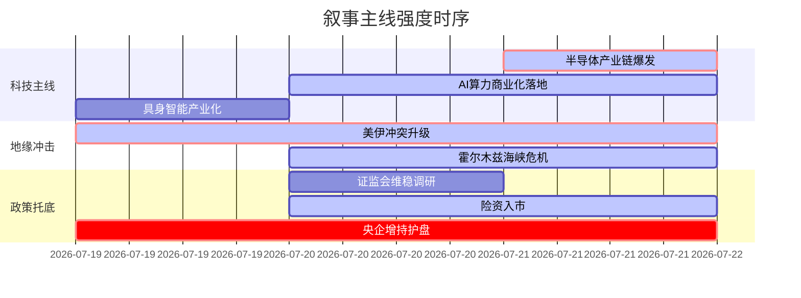

# A股市场情绪分析报告

**数据时段**：2026年7月19日-7月21日  
**生成时间**：2026年7月21日 20:00

---

## 🔥 宏观叙事焦点（24小时三级过滤）

#### 📌 叙事主线一：科创50暴涨10.73%与半导体产业链全线爆发 ⭐⭐⭐
**主要事件**：A股科技板块暴力反弹、半导体产业景气验证  
**筛选标签**：`证监会维稳` `半导体销售31连增` `台积电涨价` `险资入市` `路透信源·权重2.0`  
**宏观逻辑**：  
> ① **归类**：科技牛市重启信号  
> ② **历史镜像**：2019年科创板开板初期"制度红利+产业周期"双击模板  
> ③ **市场传导**：科创50单日+10.73% → 宽基ETF连续三天成交破百亿 → 半导体设备ETF份额突破25亿份 → 北向资金回流科技赛道  
> ④ **叙事强度**：台积电拟2027年涨价10%+全球半导体销售额31个月增长，产业景气度验证打破"AI泡沫论"  

**行业映射**：半导体设备/存储芯片/AI算力（情绪评分 **8.5/10**）  
**交易警示**：‼️ 关注量能持续性，警惕海外科技股回调外溢与获利盘兑现压力  

---

#### 📌 叙事主线二：美伊冲突升级与霍尔木兹海峡航运危机 ⭐⭐  
**主要事件**：中东地缘冲突、能源供应链中断  
**筛选标签**：`美军空袭伊朗` `霍尔木兹海峡通航量降至零` `原油破90美元` `新华社信源·权重1.5`  
**宏观逻辑**：  
> ① **归类**：地缘风险溢价重定价  
> ② **历史镜像**：1979年伊朗革命后霍尔木兹海峡封锁模板  
> ③ **市场传导**：布伦特原油跳空破90美元 → 现货黄金突破4030美元 → 全球通胀预期上修0.8个百分点 → 美联储9月加息预期升温  
> ④ **叙事强度**：冲突从代理人博弈升级为直接军事对抗，能源通道安全面临实质性威胁  

**行业映射**：石油开采/黄金/航运（情绪评分 **6.2/10**）  
**交易警示**：⚠️ 停火谈判存在不确定性，油价若失控将加剧输入型通胀与货币政策掣肘  

---

#### 📌 叙事主线三：动力锂电池消费税恢复征收与产业链重构 ⭐ 
**主要事件**：新能源汽车税收政策调整、产业出清加速  
**筛选标签**：`三部门税收政策` `油电同权` `碳酸锂价格探底` `财新信源·权重1.5`  
**宏观逻辑**：  
> ① **归类**：产业政策强制出清  
> ② **历史镜像**：2018年光伏"531"政策模板  
> ③ **市场传导**：2026年9月起动力电池征2%消费税 → 电池制造成本上升 → 二三线产能出清加速 → 龙头市占率提升  
> ④ **叙事强度**：税收中性化纠正早期补贴扭曲，政策决心大于短期阵痛  

**行业映射**：锂电龙头/储能（情绪评分 **5.0/10**）  
**交易警示**：✓ 长期利好行业集中度提升，短期需观察企业转嫁成本能力  

---

### 📅 宏观叙事演化（三日趋势）

**强度衰减模型**：昨日主题×0.7 · 前日主题×0.5

```mermaid
gantt
    title 叙事主线强度时序
    dateFormat YYYY-MM-DD
    section 科技主线
    半导体产业链爆发   :crit, active, 2026-07-21, 1d
    AI算力商业化落地   :active, 2026-07-20, 2d
    具身智能产业化     :2026-07-19, 1d
    
    section 地缘冲击
    美伊冲突升级       :crit, active, 2026-07-19, 3d
    霍尔木兹海峡危机   :active, 2026-07-20, 2d
    
    section 政策托底
    证监会维稳调研     :2026-07-20, 1d
    险资入市           :active, 2026-07-20, 2d
    央企增持护盘       :crit, 2026-07-19, 3d
```

**叙事节点关联**：
- 07/19：美伊冲突全面升级 → 原油破90美元 → 避险资产走强
- 07/20：证监会召开投资者座谈会 + 中国诚通/国新增持500亿 → 政策底信号明确
- 07/21：科创50暴涨10.73% + 台积电宣布涨价计划 → 科技主线完成情绪修复与产业验证

**🎯 宏观叙事三要素**

1️⃣ **政策意图解码**  
当前顶层叙事从"防风险"转向"稳预期+促改革"，证监会维稳调研与险资入市形成明确政策底。产业端允许短期阵痛换取长期质量，税收中性化与产能出清并行。

2️⃣ **市场定价偏差**  
过度定价：海外科技股回调对A股的传导幅度（实际影响有限）  
定价不足：半导体产业景气度验证速度（台积电涨价+销售31连增超预期）

3️⃣ **跨市场共振**  
美债收益率上行限制全球宽松空间 + 人民币汇率稳定提供政策自主性 = A股结构性行情窗口期持续打开

---

<!-- 报告正文必须在此结束，以下内容为固定格式说明，严禁添加任何额外分析、总结或展望 -->

---

*生成时间：2026-07-21 20:01:09 (UTC+8)*  
*使用模型：agnes:agnes-2.0-flash*