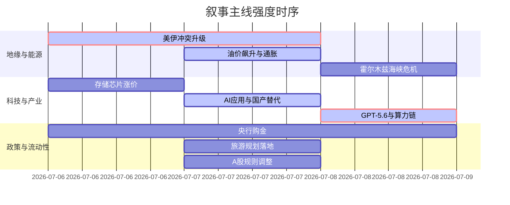

## A股市场情绪分析报告

**数据时段**：2026年7月3日 - 2026年7月8日
**生成时间**：2026-07-08 19:55:18 (UTC+8)

### 🔥 宏观叙事焦点（24小时三级过滤）

#### 📌 叙事主线一：美伊冲突急剧升级与能源供应链重构 ⭐⭐⭐
**主要事件**：地缘政治冲突、能源制裁、全球通胀预期
**筛选标签**：`国务院政策` `全球大宗商品` `路透信源·权重2.0`
**宏观逻辑**：
> ① **归类**：地缘政治黑天鹅
> ② **历史镜像**：1979年伊朗革命导致油价翻倍模板 / 2022年俄乌冲突能源危机
> ③ **市场传导**：美军空袭伊朗+撤销石油豁免 → 霍尔木兹海峡风险溢价飙升 → 布伦特原油突破79美元 → 全球通胀预期升温 → 美联储降息预期推迟
> ④ **叙事强度**：冲突已从“口头威慑”转为“实际军事打击”，市场定价从“避险”转向“供给中断恐慌”

**行业映射**：石油石化、航运、军工（情绪评分 **8.5/10**）
**交易警示**：‼️ 关注油价对A股高耗能行业的成本挤压效应，警惕全球滞胀风险传导

---

#### 📌 叙事主线二：AI产业从“应用爆发”转向“硬核算力与自主可控” ⭐⭐
**主要事件**：GPT-5.6发布、OpenAI获准、中国工信部警示、存储芯片涨价
**筛选标签**：`科技行业` `产业生命周期` `财新信源·权重1.5`
**宏观逻辑**：
> ① **归类**：技术迭代与国产替代加速
> ② **历史镜像**：2010年智能手机产业链爆发 / 2020年半导体缺芯潮
> ③ **市场传导**：OpenAI获准发布GPT-5.6 → 全球AI军备竞赛白热化 → 中国工信部警示Claude Code后门 → 中企加速弃用英伟达转向自研/国产芯片 → 存储芯片价格暴涨（DDR5翻三倍）
> ④ **叙事强度**：AI叙事从“软应用”回归“硬底座”，国产算力链成为A股唯一具备全球共振效应的成长主线

**行业映射**：算力芯片、存储半导体、AI安全（情绪评分 **7.8/10**）
**交易警示**：⚠️ 警惕美股科技股（三星、SK海力士）回调带来的情绪扰动，A股科创50逆势走强显示资金抱团防御性成长

---

#### 📌 叙事主线三：A股结构性行情与政策底支撑 ⭐ 
**主要事件**：央行增持黄金、旅游强国规划、A股缩量震荡
**筛选标签**：`中国政策` `流动性政策` `新华社信源·权重1.5`
**宏观逻辑**：
> ① **归类**：政策托底与资产多元化
> ② **历史镜像**：2023年央行连续购金启动 / 2015年牛市初期政策护航
> ③ **市场传导**：央行连续20个月增持黄金 → 官方信号明确去美元化与避险 → 《旅游强国建设“十五五”规划》获批 → 提振内需预期 → A股沪指在4000点附近缩量企稳，资金流向红利低波与科创双主线
> ④ **叙事强度**：在外部地缘风暴下，内部政策定力增强，市场呈现“轻指数、重结构”特征

**行业映射**：黄金珠宝、大消费（旅游/航空）、红利低波（情绪评分 **6.2/10**）
**交易警示**：✓ 政策底已现，但市场情绪仍受外围地缘风险压制，右侧信号需等待油价企稳或冲突降级

---

### 📅 宏观叙事演化（三日趋势）

**强度衰减模型**：昨日主题×0.7 · 前日主题×0.5

```mermaid
gantt
    title 叙事主线强度时序
    dateFormat  YYYY-MM-DD
    section 地缘与能源
    美伊冲突升级   :crit, active, 2026-07-06, 2d
    油价飙升与通胀   :active, 2026-07-07, 1d
    霍尔木兹海峡危机 :2026-07-08, 1d
    
    section 科技与产业
    存储芯片涨价   :2026-07-06, 1d
    AI应用与国产替代 :active, 2026-07-07, 1d
    GPT-5.6与算力链 :crit, active, 2026-07-08, 1d
    
    section 政策与流动性
    央行购金       :2026-07-06, 3d
    旅游规划落地   :2026-07-07, 1d
    A股规则调整    :2026-07-07, 1d
```

叙事节点关联：
*   **07/06**：沙特阿美大幅降价引发全球供应竞争担忧 → 油价波动加剧
*   **07/07**：美伊局势恶化，霍尔木兹海峡船只遇袭 → 避险情绪引爆，日韩股市熔断，A股科技股逆势抗跌
*   **07/08**：OpenAI获准发布GPT-5.6 + 中国工信部警示 → AI叙事分化，国产算力链成为资金避风港；同时央行继续增持黄金，夯实避险底色

🎯 宏观叙事三要素
1️⃣ **政策意图解码**
当前顶层叙事在“稳增长”与“防风险”之间寻找平衡。一方面通过《旅游强国规划》刺激内需，另一方面通过央行购金和打击虚假信息维护金融稳定。面对外部地缘冲击，政策重心转向“科技自主可控”与“能源安全”。

2️⃣ **市场定价偏差**
**过度定价**：全球滞胀风险（市场尚未充分计入AI对生产率的提升以抵消通胀）。
**定价不足**：A股科技板块的韧性（在外部制裁和地缘压力下，科创50逆势走强，显示资金对国产替代逻辑的极度认可）。

3️⃣ **跨市场共振**
美伊冲突 → 油价上涨 → 全球通胀预期升温 → 美联储降息预期推迟 → 美元走强 → 新兴市场资本流出压力增大。
**A股应对**：通过“内循环”（旅游、消费）和“硬科技”（AI、半导体）两条主线对冲外部冲击，形成独立的结构性行情。

---

*生成时间：2026-07-08 19:55:18 (UTC+8)*  
*使用模型：agnes:agnes-2.0-flash*