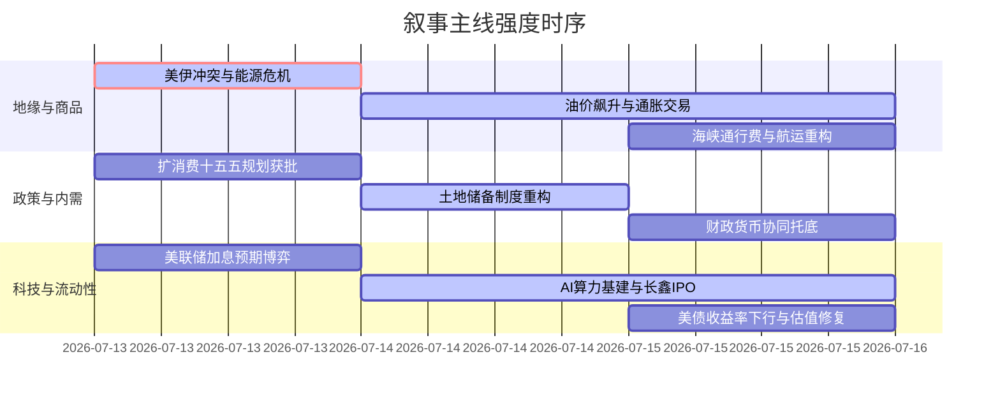

# A股市场情绪分析报告
**数据时段**：最近5日
**生成时间**：2026-07-15 20:00

### 🔥 宏观叙事焦点（24小时三级过滤）

#### 📌 叙事主线一：美伊军事冲突与霍尔木兹海峡危机 ⭐⭐⭐
**主要事件**：地缘冲突、能源供应链中断、全球通胀预期上修  
**筛选标签**：`地缘政治` `大宗商品定价` `路透信源·权重2.0`  
**宏观逻辑**：  
> ① **归类**：外部供给冲击与风险溢价显性化  
> ② **历史镜像**：1979年伊朗革命与两伊战争石油禁运模板  
> ③ **市场传导**：布伦特原油单日暴涨超9%突破83美元 → 全球再通胀交易升温 → 美联储降息预期推迟/加息概率重定价 → 避险资金涌入油气、航运及高股息防御板块  
> ④ **叙事强度**：地缘风险直接冲击核心航道，能源成本传导链条清晰，短期压制全球风险偏好  

**行业映射**：油气开采、航运化工（情绪评分 **8.5/10**）  
**交易警示**：‼️ 关注OPEC+闲置产能释放与外交斡旋进展，警惕油价高位回落引发的周期股估值杀跌与输入性成本传导  

---

#### 📌 叙事主线二：国务院批复“十五五”扩消费规划与土地制度改革 ⭐⭐  
**主要事件**：产业政策、内需刺激、财政货币协同
**筛选标签**：`部委政策` `经济结构转型` `财新信源·权重1.5`  
**宏观逻辑**：  
> ① **归类**：政策驱动型需求修复与存量破局  
> ② **历史镜像**：2015年促消费政策包与土地储备制度迭代模板  
> ③ **市场传导**：顶层定调“调结构” → 财政货币协同发力托底 → 资金向红利资产与新质生产力两端分化 → 中报业绩披露期结构性行情延续  
> ④ **叙事强度**：政策决心明确，从总量刺激转向精准滴灌，稳增长与防风险再平衡  

**行业映射**：高股息金融/公用事业、AI终端应用（情绪评分 **7.8/10**）  
**交易警示**：⚠️ 政策落地节奏与市场盈利修复斜率存在时间差，警惕微盘股流动性挤压与业绩证伪风险  

---

#### 📌 叙事主线三：阿斯麦上调指引验证AI算力景气度与美联储框架重塑 ⭐ 
**主要事件**：技术发布、产业投资、全球流动性边际宽松
**筛选标签**：`产业周期` `科技资本开支` `彭博信源·权重1.5`  
**宏观逻辑**：  
> ① **归类**：产业景气上行与估值重塑  
> ② **历史镜像**：2023年英伟达产业链爆发与半导体周期上行模板  
> ③ **市场传导**：半导体设备订单放量+长鑫科技IPO催化 → 硬科技资本开支确认 → 叠加美债收益率下行打开估值空间 → 成长风格右侧机会显现  
> ④ **叙事强度**：产业逻辑坚实，全球算力军备竞赛白热化，国产替代与出海链双轮驱动  

**行业映射**：存储芯片、光通信/AI硬件（情绪评分 **7.5/10**）  
**交易警示**：✓ 叙事逻辑清晰，等待外资回流与机构调仓验证，注意海外科技股财报波动外溢  

---

### 📅 宏观叙事演化（三日趋势）

**强度衰减模型**：昨日主题×0.7 · 前日主题×0.5

```mermaid
gantt
    title 叙事主线强度时序
    dateFormat  YYYY-MM-DD
    section 地缘与商品
    美伊冲突与能源危机   :crit, active, 2026-07-13, 1d
    油价飙升与通胀交易   :active, 2026-07-14, 2d
    海峡通行费与航运重构   :2026-07-15, 1d
    
    section 政策与内需
    扩消费十五五规划获批   :2026-07-13, 1d
    土地储备制度重构   :active, 2026-07-14, 1d
    财政货币协同托底   :2026-07-15, 1d

    section 科技与流动性
    美联储加息预期博弈   :2026-07-13, 1d
    AI算力基建与长鑫IPO   :active, 2026-07-14, 2d
    美债收益率下行与估值修复   :2026-07-15, 1d
```
叙事节点关联：
07/13：美伊恢复海上封锁 → 触发能源危机与避险叙事
07/14：国务院批复扩消费规划+央行逆回购全额投放 → 政策底与流动性底共振
07/15：阿斯麦上调全年指引+宽基ETF放量1800亿扫货 → 产业景气与资金面右侧信号确认
🎯 宏观叙事三要素
1️⃣ 政策意图解码
当前顶层叙事从“总量刺激”转向“结构优化+底线思维”，允许短期阵痛换取长期质量。产业出清>货币大水，政策定力超预期。扩消费与土地改革旨在打通内循环堵点，配合央行常态化票据发行，跨部门工具联动强化主权信用管理。
2️⃣ 市场定价偏差
过度定价：地缘冲突的长期化（油价已计价战争溢价，但忽略OPEC闲置产能对冲）
定价不足：国内中报业绩分化中的确定性（高端制造与出海链盈利韧性被低估，红利资产防御价值重估）
3️⃣ 跨市场共振
美债收益率冲高回落打开国内政策空间 + 美元指数高位震荡缓释出口压力 = A股结构性行情窗口期。亚太科技股波动外溢倒逼国内资金向“硬科技自主可控”与“高股息现金流”哑铃型配置收敛。

<!-- 报告正文必须在此结束，以下内容为固定格式说明，严禁添加任何额外分析、总结或展望 -->

---

*生成时间：2026-07-15 20:14:42 (UTC+8)*  
*使用模型：agnes:agnes-2.0-flash*