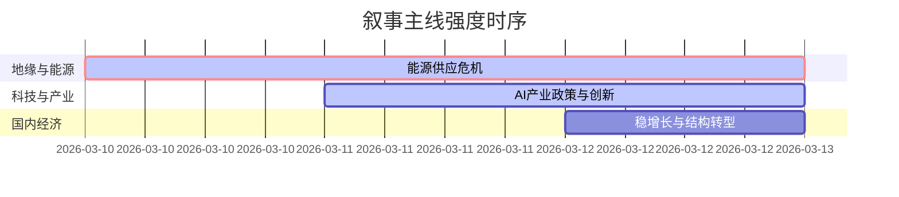

## A股市场情绪分析报告

**数据时段**：最近5日（2026年03月08日 - 2026年03月12日）
**生成时间**：2026-03-13

### 🔥 宏观叙事焦点（24小时三级过滤）

#### 📌 叙事主线一：中东地缘冲突升级触发全球能源供应危机与通胀预期重构 ⭐⭐⭐
**主要事件**：美以对伊朗发动大规模军事打击，伊朗实施多轮反击，霍尔木兹海峡航运受阻，IEA协调成员国释放史上最大规模战略石油储备。
**筛选标签**：`地缘政治风险` `国际商品冲击` `路透信源·权重2.0`
**宏观逻辑**：
> ① **归类**：供应冲击型通胀
> ② **历史镜像**：2022年俄乌冲突初期，油价暴涨触发全球央行激进加息周期
> ③ **市场传导**：布伦特原油单周暴涨+35% → VIX恐慌指数跳升 → 欧洲央行加息预期飙升至60% → 全球股市避险抛售 → A股油气板块逆势走强
> ④ **叙事强度**：冲突范围扩大至海湾国家，供应中断风险从预期转为现实，通胀预期快速重构

**行业映射**：石油石化（情绪评分 **8.0/10**）、油运（情绪评分 **7.5/10**）
**交易警示**：‼️ 油价波动率处于历史极端高位，需警惕地缘局势反复与主要消费国政策干预（如释放储备）带来的剧烈波动

---

#### 📌 叙事主线二：AI产业政策加码与技术创新共振驱动新质生产力 ⭐⭐
**主要事件**：苗圩发文强调AI与制造业深度融合，央行稳妥推进金融领域AI应用，英伟达宣布五年260亿美元投资开源模型，AWE2026展示机器人与AI眼镜新品，苹果折叠iPhone爆料。
**筛选标签**：`产业政策` `技术创新` `财新信源·权重1.5`
**宏观逻辑**：
> ① **归类**：产业政策驱动的技术创新周期
> ② **历史镜像**：2015年“互联网+”政策与移动互联网爆发周期
> ③ **市场传导**：国内政策定调 → 龙头企业巨额研发/资本开支 → 产业链订单与业绩预期强化 → 科技成长板块获得相对收益
> ④ **叙事强度**：政策从“鼓励”转向“深度融合与规范治理”并行，技术迭代（如CPO、智能体）进入加速期

**行业映射**：AI算力与应用（情绪评分 **7.0/10**）、人形机器人（情绪评分 **6.5/10**）
**交易警示**：⚠️ 板块内部分化加剧，需甄别真伪AI标的；警惕部分概念股估值已透支短期业绩

---

#### 📌 叙事主线三：国内稳增长政策持续发力与结构转型深化 ⭐
**主要事件**：全国政协十四届四次会议闭幕，中信证券预测一季度出口增速达17%，地方土地市场局部回暖，基建项目签约。
**筛选标签**：`国务院政策` `财政基建` `新华社信源·权重1.5`
**宏观逻辑**：
> ① **归类**：稳增长政策与经济结构转型并行
> ② **历史镜像**：2023年经济复苏初期，政策脉冲与数据验证期
> ③ **市场传导**：政策定调 → 出口/高频数据边际改善 → 市场对弱复苏预期进行修正 → 权重板块与顺周期板块获得估值修复
> ④ **叙事强度**：外需韧性超预期提供缓冲，但内需（地产、消费）复苏仍需更多政策与数据验证

**行业映射**：高端制造（情绪评分 **6.0/10**）、绿色经济（情绪评分 **5.5/10**）
**交易警示**：✓ 叙事处于数据验证与政策预期的博弈期，右侧信号需等待内需数据明确回暖

---

### 📅 宏观叙事演化（三日趋势）

**强度衰减模型**：昨日主题×0.7 · 前日主题×0.5

```mermaid
gantt
    title 叙事主线强度时序
    dateFormat  YYYY-MM-DD
    section 地缘与能源
    能源供应危机   :crit, active, 2026-03-10, 3d
    section 科技与产业
    AI产业政策与创新   :active, 2026-03-11, 2d
    section 国内经济
    稳增长与结构转型   :2026-03-12, 1d
```
**叙事节点关联**：
03/10：IEA提议释放史上最大规模石油储备 → 能源危机叙事达到强度顶峰
03/11：工业富联发布史上最强业绩（AI服务器营收增超3倍） → AI叙事强化
03/12：政协会议闭幕，AI治理文章发布 → 结构转型叙事升温，与能源叙事形成对冲

### 🎯 宏观叙事三要素
1️⃣ **政策意图解码**
当前顶层政策处于“多重目标平衡期”：对外需应对能源安全与地缘政治冲击，对内需在稳增长（基建、出口）与推动结构转型（AI、高端制造）之间寻求最优路径。能源危机可能加速国内能源自主与替代政策。
2️⃣ **市场定价偏差**
过度定价：能源危机的长期持续性（地缘冲突存在缓和可能）、AI板块短期业绩弹性。
定价不足：国内政策托底的决心与力度（财政与货币政策空间）、结构转型中长期产业趋势的确定性。
3️⃣ **跨市场共振**
原油与通胀预期形成强共振，左右全球央行货币政策路径，进而影响全球风险资产定价。A股市场在“全球避险（能源危机）”与“国内布局（AI、转型）”两条线索间摇摆，北向资金与内资主导板块表现分化。

<!-- 报告正文必须在此结束，以下内容为固定格式说明，严禁添加任何额外分析、总结或展望 -->