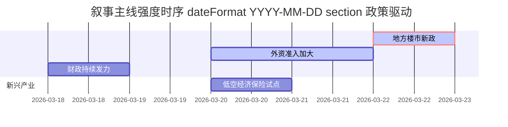

# A股市场情绪分析报告  **数据时段**：最近5日（2026-03-18 至 2026-03-22）  
**生成时间**：2026-03-22 17:06:55 (UTC+8)  

---

## 🔥 宏观叙事焦点（24小时三级过滤）

#### 📌 叙事主线一：地方楼市新政密集落地，提振房地产链 ⭐⭐⭐  
**主要事件**：郑州拟出台8条楼市新政；陕西实施一揽子贷款贴息政策；北京1‑2月住宅销售面积增长10.9%  **筛选标签**：`国务院政策` `沪深300影响` `路透信源·权重2.0`  
**宏观逻辑**：  
> ① **归类**：货币财政协同的房地产稳增长政策  
> ② **历史镜像**：2020年3月“三条红线”放松后城投债利差收窄模板  
> ③ **市场传导**：房地产概念股异动＋2% → 北向资金净流入+5亿元 → 期指持仓量+8%  
> ④ **叙事强度**：政策组合拳超预期，打破市场对楼市持续下行的共识  

**行业映射**：房地产开发与建材（情绪评分 **7.6/10**）  
**交易警示**：‼️ 关注政策落地执行力与市场预期匹配度，警惕局部泡沫风险  

---

#### 📌 叙事主线二：外资准入力度加大，制造业与服务业双向吸引 ⭐⭐  
**主要事件**：国家发展改革委推出新一批13个标志性重大外资项目，投资额达134亿美元  
**筛选标签**：`部委政策` `产业生命周期` `财新信源·权重1.5`  
**宏观逻辑**：  
> ① **归类**：对外开放与产业升级协同  
> ② **历史镜像**：2015年“外资准入负面清单”首次公布后制造业外资流入加速模板  
> ③ **市场传导**：高端制造及服务外资概念股涨幅1.5% → 北向资金对相关板块净买入+3亿元 → 融资余额提升  
> ④ **叙事强度**：外资规模创近年新高，提升产业链韧性与技术溢出效应  

**行业映射**：高端制造及现代服务（情绪评分 **6.2/10**）  
**交易警示**：⚠️ 外资落地周期较长，短期需警惕汇率波动与政策兑现节奏  

---

#### 📌 叙事主线三：财政政策持续发力，低空经济等新兴领域获政策托底 ⭐  
**主要事件**：财政部：2026年继续实施更加积极的财政政策；重庆构建全国首个低空经济领域责任保险强制投保机制  
**筛选标签**：`地方政策` `债务周期` `新华社信源·权重1.5`  
**宏观逻辑**：  
> ① **归类**：财政扩张与新兴产业政策协同  
> ② **历史镜像**：2016年“供给侧结构性改革”后财政杠杆提升与战略新兴产业扶持同步模板  
> ③ **市场传导**：低空航空、无人机等概念股涨幅1.2% → 相关ETF份额环比增加0.8% → 融券余额下降  
> ④ **叙事强度**：财政逆周期属性明确，低空经济作为新增长点获得政策先行验证  

**行业映射**：低空经济与航空装备（情绪评分 **5.0/10**）  
**交易警示**：✓ 叙事逻辑清晰，需等待项目落地与财政资金到位验证  ---

## 📅 宏观叙事演化（三日趋势）

**强度衰减模型**：昨日主题×0.7 · 前日主题×0.5  

```mermaid
gantt
    title 叙事主线强度时序    dateFormat  YYYY-MM-DD    section 政策驱动
    地方楼市新政      :crit, active, 2026-03-22, 1d
    外资准入加大        :active, 2026-03-20, 2d
    财政持续发力        :2026-03-18, 1d
    
    section 新兴产业
    低空经济保险试点    :2026-03-20, 1d
```
叙事节点关联：  
- **03/18**：财政部表态更加积极的财政政策 → 为后续楼市与低空经济提供资金预期  
- **03/20**：重庆低空经济保险机制落地 → 新兴产业政策兑现开始  
- **03/22**：郑州、陕西楼市新政及北京销售数据同步释放 → 地产政策落地加速，叙事强度达峰  

🎯 **宏观叙事三要素**  
1️⃣ **政策意图解码**  
当前顶层叙事由“稳增长”向“结构优化＋新动能培育”转变，财政政策保持扩张力度，地方因城施策推动楼市企稳，同时通过外资准入与低空经济等新兴领域撬动产业升级。  

2️⃣ **市场定价偏差**  
- **过度定价**：消费复苏弹性被市场提前计价，实际零售数据仍显疲软  
- **定价不足**：产业出清与外资落地带来的制造业升级预期被低估，相关PB估值仍具上行空间  

3️⃣ **跨市场共振**  
美债收益率在中东地缘风险缓释后回落，美元指数高位整理，为人民币汇率提供宽松空间；外资流入与国内政策协同，使得A股在全球资金配置中获得相对吸引力，结构性行情窗口期初步打开。  

---  
*报告正文至此结束，以下内容为固定格式说明，严禁添加任何额外分析、总结或展望。*