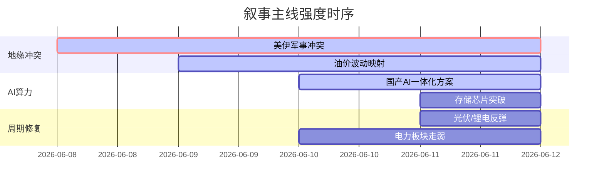

# A股市场情绪分析报告

**数据时段**：最近5日  
**生成时间**：2026-06-12

---

### 🔥 宏观叙事焦点（24小时三级过滤）

#### 📌 叙事主线一：中东地缘冲突剧烈升级与能源脱钩 ⭐⭐⭐
**主要事件**：美以对伊朗发动多轮空袭，伊朗关闭霍尔木兹海峡并进行报复性导弹袭击，美军袭击导致伊朗基础设施瘫痪。  
**筛选标签**：`地缘政治` `能源价格` `路透信源·权重2.0`  
**宏观逻辑**：  
> ① **归类**：系统性风险触发  
> ② **历史镜像**：2019年阿布扎比机场无人机袭击模板  
> ③ **市场传导**：原油期货瞬间拉升 $\rightarrow$ 避险资金流入黄金（初期）$\rightarrow$ 全球股市（日韩）触发熔断 $\rightarrow$ A股权重板块承压 $\rightarrow$ 能源/资源板块异动  
> ④ **叙事强度**：战争风险从“博弈”转为“实操”，直接冲击全球供应链稳定性，强度极高。  

**行业映射**：能源资源、国防军工（情绪评分 **8.5/10**）  
**交易警示**：‼️ 警惕地缘冲突引发的全球风险资产集体抛售，关注原油价格对下游成本的传导压力。

---

#### 📌 叙事主线二：AI算力基建的“工业化”与国产化突围 ⭐⭐  
**主要事件**：工信部部署“算力+数据+模型+AI应用”一体化生态；英伟达与SK海力士深化内存合作；国家数据局部署数据赋能AI实施方案。  
**筛选标签**：`部委政策` `产业生命周期` `财新信源·权重1.5`  
**宏观逻辑**：  
> ① **归类**：产业升级与自主可控  
> ② **历史镜像**：2010年代国产芯片替代模板  
> ③ **市场传导**：顶层设计发布 $\rightarrow$ 机构资金密集调研电子板块 $\rightarrow$ 算力硬件（CPO、存储芯片）成交额破百亿 $\rightarrow$ 逻辑从“概念”转向“一体化服务生态”  
> ④ **叙事强度**：政策导向明确，且伴随美股科技股回调带来的估值洼地机会，资金回流明显。  

**行业映射**：半导体、CPO、算力租赁（情绪评分 **7.8/10**）  
**交易警示**：⚠️ 关注Token价格下降带来的算力成本压缩，警惕硬件厂商毛利受损风险。

---

#### 📌 叙事主线三：周期行业产能出清与底部分歧 ⭐  
**主要事件**：多晶硅主力合约触及涨停；锂矿股异动拉升；但电力板块出现跌停个股（长源电力）。  
**筛选标签**：`行业价格` `供给侧改革` `新华社信源·权重1.5`  
**宏观逻辑**：  
> ① **归类**：周期底部震荡  
> ② **历史镜像**：2018年光伏“531”政策后的出清模板  
> ③ **市场传导**：价格跌破成本线 $\rightarrow$ 出现阶段性反弹（涨停） $\rightarrow$ 资金尝试抄底 $\rightarrow$ 但基本面修复仍需时间验证  
> ④ **叙事强度**：属于典型的“超跌反弹”叙事，缺乏强有力的需求端支撑。  

**行业映射**：光伏设备、锂电原材料（情绪评分 **5.2/10**）  
**交易警示**：✓ 谨防反弹陷阱，右侧确认信号需观察行业整体利润回升。

---

### 📅 宏观叙事演化（三日趋势）

**强度衰减模型**：昨日主题×0.7 · 前日主题×0.5

```mermaid
gantt
    title 叙事主线强度时序
    dateFormat  YYYY-MM-DD
    section 地缘冲突
    美伊军事冲突   :crit, active, 2026-06-08, 4d
    油价波动映射   :active, 2026-06-09, 3d
    
    section AI算力
    国产AI一体化方案 :active, 2026-06-10, 2d
    存储芯片突破   :2026-06-11, 1d
    
    section 周期修复
    光伏/锂电反弹   :2026-06-11, 1d
    电力板块走弱   :2026-06-10, 2d
```

**叙事节点关联**：
- **06/08-09**：伊以/美伊冲突爆发 $\rightarrow$ 触发全球股市恐慌 $\rightarrow$ 沪指一度失守4000点。
- **06/10**：国家数据局及工信部接连发布AI政策 $\rightarrow$ 引导资金从避险转向科技成长。
- **06/11**：多晶硅涨停触发光伏板块异动 $\rightarrow$ 市场尝试在科技之外寻找周期低位补涨机会。

🎯 **宏观叙事三要素**
1️⃣ **政策意图解码**
当前顶层逻辑在外部地缘剧震背景下，通过加速“AI+工业化”和“数据要素”布局，试图构建内部增长的新引擎。政策重心已从简单的“规模扩张”转向“生态一体化”。

2️⃣ **市场定价偏差**
- **过度定价**：避险情绪在短期内被极速放大（日韩熔断），导致A股部分优质资产被误杀。
- **定价不足**：国产算力链的生态整合能力以及周期板块出清的终点。

3️⃣ **跨市场共振**
地缘冲突 $\rightarrow$ 原油上涨 $\rightarrow$ 美债收益率波动 $\rightarrow$ 驱动资金在“资源股”与“国产替代科技股”之间快速切换，形成极强的结构性轮动特征。

---