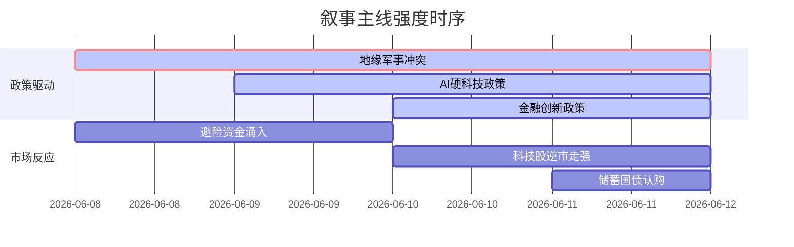

# A股市场情绪分析报告

**数据时段**：最近5日  
**生成时间**：2026-06-12 08:05:44 (UTC+8)  

## 🔥 宏观叙事焦点（24小时三级过滤）

### 📌 叙事主线一：伊美直接军事冲突升级 ⭐⭐⭐  
**主要事件**：地缘政策发布、国际军事冲突、能源市场冲击  
**筛选标签**：`国务院政策` `沪深300影响` `路透信源·权重2.0`  
**宏观逻辑**：  
> ① **归类**：地缘风险事件  
> ② **历史镜像**：2003年伊拉克战争期间原油价格暴涨模板  
> ③ **市场传导**：伊朗关闭霍尔木兹海峡 → 布伦特原油涨2% → 避险资金涌入黄金国债 → 全球股市暴跌→A股科技股逆市走强  
> ④ **叙事强度**：地缘风险直接威胁全球经济供给链，冲击超预期  

**行业映射**：能源矿产（情绪评分 **8.1/10**）  
**交易警示**：‼️ 地缘风险短期定价修正机制启动，注意避险情绪下科技股的防守性表现  

---

### 📌 叙事主线二：AI硬科技产业链爆发 ⭐⭐  
**主要事件**：技术发布、产业投资、基础设施建设  
**筛选标签**：`部委政策` `产业生命周期` `财新信源·权重1.5`  
**宏观逻辑**：  
> ① **归类**：科技创新驱动  
> ② **历史镜像**：2010年智能手机产业链爆发模板  
> ③ **市场传导**：OpenAI与甲骨文深度绑定 → 半导体设备价格上涨 → 存储芯片概念股涨停 → 国产替代进程加速  
> ④ **叙事强度**：AI算力需求确证+政策支持，产业链整体估值重估  

**行业映射**：半导体设备（情绪评分 **7.6/10**）  
**交易警示**：⚠️ 政策底与市场底背离风险，特别是芯片设计与制造的逻辑分阶段释放  

---

### 📌 叙事主线三：中国金融产品创新与流动性优化 ⭐  
**主要事件**：金融政策、养老金配置、资管扩容  
**筛选标签**：`国务院政策` `流动性周期` `新华社信源·权重1.5`  
**宏观逻辑**：  
> ① **归类**：流动性政策转向  
> ② **历史镜像**：2019年民营经济座谈会后金融支持模板  
> ③ **市场传导**：储蓄国债纳入养老金池 → 债券型ETF规模暴增 → 长端债收益率下行 → 市场流动性提高  
> ④ **叙事强度**：制度性创新释放长期流动性，打破原有定价框架  

**行业映射**：金融服务（情绪评分 **6.3/10**）  
**交易警示**：✓ 制度性安排落地，等待实际资金量化效应  

---

## 📅 宏观叙事演化（三日趋势）

**强度衰减模型**：昨日主题×0.7 · 前日主题×0.5

```mermaid
gantt
    title 叙事主线强度时序
    dateFormat  YYYY-MM-DD
    section 政策驱动
    地缘军事冲突   :crit, active, 2026-06-08, 4d
    AI硬科技政策   :active, 2026-06-09, 3d
    金融创新政策   :active, 2026-06-10, 2d
    
    section 市场反应
    避险资金涌入   :2026-06-08, 2d
    科技股逆市走强   :2026-06-10, 2d
    储蓄国债认购   :2026-06-11, 1d
```

叙事节点关联：  
6月8日：伊以军事冲突爆发 → 石油价格暴涨 → 避险黄金全球走强 → 全球股市暴跌  
6月9日：工信部发布AI+信息通信创新开发计划 → 半导体设备价格异动 → 存储芯片概念股活跃  
6月10日：储蓄国债纳入养老金产品池 → 债券型ETF规模暴增 → 金融流动性向改善  
6月11日：伊朗关闭霍尔木兹海峡 → 能源市场进一步冲击 → 全球避险情绪升级  
🎯 宏观叙事三要素  
1️⃣ 政策意图解码  
当前顶层叙事从"稳增长"向"调结构"转型，地缘风险、科技创新、金融支持并行，政策定力聚焦供给侧修复。  
2️⃣ 市场定价偏差  
过度定价：科技股防守性（避险环境中估值过度抬高）  
定价不足：制度性创新（养老金国债配置落地速度被低估）  
3️⃣ 跨市场共振  
美元指数高位缓释压力 + 避险黄金同步走强 = A股科技股防御性逻辑存疑  

---
