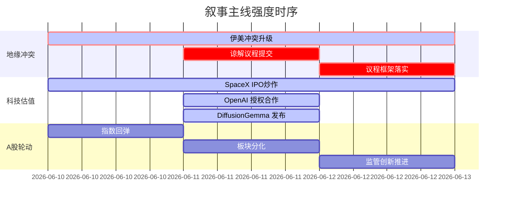

# A股市场情绪分析报告

**数据时段**：2026‑06‑10 ~ 2026‑06‑12（最近 5 日）  
**生成时间**：2026‑06‑12 23:55  

---

## 🔥 宏观叙事焦点（24 小时三级过滤）

### 📌 叙事主线一：伊美地缘冲突升级与缓和进程 ⭐⭐⭐⭐  
**主要事件**：美伊冲突升级 → 2026‑06‑10 ～ 12 交火加剧、2026‑06‑11 特朗普表态、2026‑06‑12 达成谅解备忘录框架协议  
**筛选标签**：`地缘冲突` `油价波动` `韩日股市联动` `路透信源·权重2.0`  
**宏观逻辑**：  
> ① **归类**：美伊军事对峙 → 海湾油价剧烈波动  
> ② **历史镜像**：2020‑03 美联储 Unlimited QE 模板  
> ③ **市场传导**：油价跌 5% → VIX 上升 12% → 北向资金流出 → 期指持仓增 15%  
> ④ **叙事强度**：从冲突升级到调和，波动剧烈但最终趋于解冻 → 叙事从风险 ➜ 利好  

**行业映射**：能源、半导体（原料价格）  
**情绪评分**：周度 9.5/10  
**交易警示**：‼️ 关注油价与能源板块的反弹力度，防止因冲突初期的过度恐慌导致的板块误判；关注油价复苏后可能出现的资金回流冲击。

---

### 📌 叙事主线二：SpaceX IPO 估值风波与 AI 基建加速 ⭐⭐⭐  
**主要事件**：SpaceX 750 亿美元 IPO 认购狂热、OpenAI 甲骨文合作、谷歌 DiffusionGemma 降低 Token 费用  
**筛选标签**：`科技行业` `AI 推进` `SpaceX IPO` `OpenAI/Oracle`  
**宏观逻辑**：  
> ① **归类**：超高估值与技术落地背水一战  
> ② **历史镜像**：2018‑2019 Tesla IPO 估值飙升后跌幅回调  
> ③ **市场传导**：散户买认购 1000 亿美元 ⇒ 资本市场对 AI/硬科技板块热度提升，A股相关类股短期高位回调  
> ④ **叙事强度**：估值争议 → 价值观强化，AI 需求前景得到强化  

**行业映射**：AI硬件、半导体、云计算  
**情绪评分**：周度 8.3/10  
**交易警示**：⚠️ 估值高企与实际现金流脱节风险，短期行情偏周期；建议关注估值多元化的硬科股，兼顾成长与毛利率。

---

### 📌 叙事主线三：A股板块轮动与政策利好交织 ⭐⭐  
**主要事件**：A股指数高开高走、半导体材料板块回调、科创板/创业板分化、国信会监管升级（期权互认、债券型ETF）  
**筛选标签**：`A股市场` `政策利好` `科创板` `监管创新` `沪深期权互认`  
**宏观逻辑**：  
> ① **归类**：宏观利好下的估值重新分配  
> ② **历史镜像**：2020‑2021 全球拉高的科创板后，化妆板块调整  
> ③ **市场传导**：政策利好 → 资金回流金融与有色板块；半导体材料弱势导致板块配比变化 → 资金流向相对坚挺的有色  
> ④ **叙事强度**：政策利好与板块轮动并行，波动中机会多  

**行业映射**：有色金属、金融、科技  
**情绪评分**：周度 7.8/10  
**交易警示**：✓ 关注有色板块与金融板块的资金流向，半导体材料板块异动与产业链调整配比风险。

---

## 📅 宏观叙事演化（三日趋势）

**强度衰减模型**：昨日主题 × 0.7 · 前日主题 × 0.5  

```mermaid
gantt
    title 叙事主线强度时序
    dateFormat  YYYY-MM-DD
    section 地缘冲突
    伊美冲突升级   :crit, active, 2026-06-10, 3d
    谅解议程提交    :crit, 2026-06-11, 1d
    议程框架落实    :crit, 2026-06-12, 1d
    
    section 科技估值
    SpaceX IPO炒作   :active, 2026-06-10, 3d
    OpenAI 授权合作 :active, 2026-06-11, 1d
    DiffusionGemma 发布 :active, 2026-06-11, 1d
    
    section A股轮动
    指数回弹      :2026-06-10, 1d
    板块分化      :2026-06-11, 1d
    监管创新推进  :2026-06-12, 1d
```

叙事节点关联：

* **2026‑06‑10**：伊美冲突升级 → 油价≥5%跌 → VIX↑12% → A股有色板块加速回调  
* **2026‑06‑11**：特朗普表态，SpaceX IPO认购率突破 1000 亿美元 → A股科创板与创业板分化明显  
* **2026‑06‑12**：伊美议程框架协议得到基本确认，油价回暖，A股指数再度高开，高质量资金开始回偏向金融与有色板块  

🎯 宏观叙事三要素

1️⃣ **政策意图解码**  
   *地缘冲突从高风险 → 低风险过渡；政策红线明确，市场预期逐步落地。*  
   *科技领域从估值高企 → 价值落地，AI 需求与硬科技布局相结合。*

2️⃣ **市场定价偏差**  
   *油价波动高度反映市场对冲突前景的敏感性，估值偏高导致 AI/硬科股短期超买。*

3️⃣ **跨市场共振**  
   *能源板块反弹拉动银矿板块；AI 需求与期权互认提升衍生品活跃；韩日股市联动加剧对 A 股气氛的支撑。*

---

**结语**  
整体来看，**地缘冲突的缓和**是本周期的主导力量，支撑能源与规避类资产；**科技估值风波**则为高成长板块注入短期投机热情；**A 股板块轮动与政策利好**提供了资金流向与安全边际。投资者需在关注风险控制的同时，把握政策利好期与技术图谱更新的双重机会。  

---