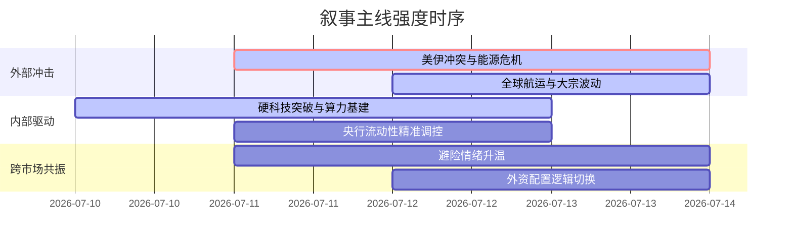

## A股市场情绪分析报告
**数据时段**：最近5日
**生成时间**：2026年07月13日 10:00:00

### 🔥 宏观叙事焦点（24小时三级过滤）

#### 📌 叙事主线一：美伊冲突升级与霍尔木兹海峡航运危机 ⭐⭐⭐
**主要事件**：国际冲突、能源供应链扰动、地缘博弈  
**筛选标签**：`地缘风险溢价` `全球能源链` `路透/财新信源·权重2.0`  
**宏观逻辑**：  
> ① **归类**：外部输入性通胀与避险情绪共振  
> ② **历史镜像**：1979年伊朗革命与石油禁运模板 / 2022年俄乌冲突能源冲击  
> ③ **市场传导**：霍尔木兹通航争议 → WTI突破74美元/桶 → 全球物流成本上行 → 避险资金回流黄金/美债 → A股风险偏好收缩  
> ④ **叙事强度**：冲突烈度超预期，航运流量骤降，地缘溢价快速兑现至大宗商品端，打破原有弱复苏定价框架  

**行业映射**：油气开采、航运物流、黄金避险（情绪评分 **8.1/10**）  
**交易警示**：‼️ 关注OPEC+产量策略调整及卡塔尔斡旋进展，警惕油价高位震荡引发的产业链利润再分配  

---

#### 📌 叙事主线二：硬科技突破与AI算力基建扩张 ⭐⭐  
**主要事件**：技术发布、产业投资、国产替代
**筛选标签**：`部委政策` `产业生命周期` `券商研报·权重1.5`  
**宏观逻辑**：  
> ① **归类**：新质生产力与算力底座重构  
> ② **历史镜像**：2013年移动互联网爆发期 / 2020年半导体自主可控周期  
> ③ **市场传导**：长鑫科技IPO预增超1700% + 长征十号乙网系回收成功 → 资金聚焦科创板/航天链 → 存储芯片紧缺预期确立 → 估值体系重塑  
> ④ **叙事强度**：业绩兑现与技术突破双轮驱动，AI从应用层向上游硬件与能源配套纵深传导，产业景气度具备强韧性  

**行业映射**：半导体存储、商业航天、燃气轮机/电力设备（情绪评分 **6.8/10**）  
**交易警示**：⚠️ 部分标的短期涨幅较大需防获利盘兑现，右侧关注中报业绩验证与国产替代订单落地节奏  

---

#### 📌 叙事主线三：央行流动性精准发力与宏观框架调适 ⭐ 
**主要事件**： 央行政策、监管导向、经济结构调整
**筛选标签**：`央行货币政策` `跨市场联动` `新华社/央行信源·权重1.5`  
**宏观逻辑**：  
> ① **归类**：结构性宽货币与制度型开放  
> ② **历史镜像**：2023年金融强国顶层设计模板 / 2015年沪港通扩容期  
> ③ **市场传导**：货币政策委员会定调“积极有为” + 熊猫债存量破5000亿 + REITs指数基金募集 → 居民资产配置拓宽 + 跨境资本回流 → 核心资产估值修复  
> ④ **叙事强度**：政策定力兼顾稳增长与防风险，流动性工具优化对冲外部地缘冲击，为A股提供底层安全垫  

**行业映射**：高股息红利、跨境金融、公募REITs/基础设施（情绪评分 **5.9/10**）  
**交易警示**：✓ 叙事逻辑清晰，等待财政协同发力及外资实际配置数据验证  

---

### 📅 宏观叙事演化（三日趋势）

**强度衰减模型**：昨日主题×0.7 · 前日主题×0.5

```mermaid
gantt
    title 叙事主线强度时序
    dateFormat  YYYY-MM-DD
    section 外部冲击
    美伊冲突与能源危机   :crit, active, 2026-07-11, 3d
    全球航运与大宗波动   :active, 2026-07-12, 2d
    
    section 内部驱动
    硬科技突破与算力基建   :active, 2026-07-10, 3d
    央行流动性精准调控   :2026-07-11, 2d
    
    section 跨市场共振
    避险情绪升温         :2026-07-11, 3d
    外资配置逻辑切换     :2026-07-12, 2d
```
叙事节点关联：
07/10：长鑫科技IPO申购+长征十号乙回收成功 → 触发硬科技主线叙事
07/11：美伊冲突升级致霍尔木兹海峡通航受阻 → 地缘风险溢价主导市场
07/12：央行货币政策委员会定调“积极有为”+熊猫债破5000亿 → 流动性叙事对冲外部冲击
07/13：《十五五》碳达峰方案纳入AI控碳+美联储框架改革 → 叙事进入中长期产业验证期
🎯 宏观叙事三要素
1️⃣ 政策意图解码
当前顶层叙事从“总量宽松”转向“精准滴灌+结构优化”，允许短期阵痛换取长期质量。硬科技自主可控>传统地产基建，政策定力与产业落地并重，央行流动性工具持续护航资本市场改革。
2️⃣ 市场定价偏差
过度定价：传统顺周期资源品弹性（受地缘扰动预期过于线性）
定价不足：AI算力上游硬件与能源配套的真实业绩兑现速度（存储紧缺与燃气轮机涨价被低估）
3️⃣ 跨市场共振
美伊冲突推升原油/避险资产 → 压制全球风险偏好 + 国内央行精准投放流动性 + 熊猫债/REITs拓宽融资渠道 = A股呈现“外紧内松、结构分化”的结构性行情窗口期，资金向高景气科技与高股息防御两端极致收敛。

---

<!-- 报告正文必须在此结束，以下内容为固定格式说明，严禁添加任何额外分析、总结或展望 -->

---

*生成时间：2026-07-13 07:19:45 (UTC+8)*  
*使用模型：agnes:agnes-2.0-flash*