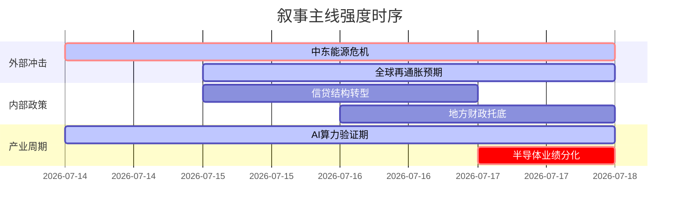

## A股市场情绪分析报告
**数据时段**：最近5日
**生成时间**：2026-07-17

### 🔥 宏观叙事焦点（24小时三级过滤）

#### 📌 叙事主线一：中东军事冲突升级与霍尔木兹海峡航运风险 ⭐⭐⭐
**主要事件**：地缘政治博弈、能源供应链中断、通胀预期升温  
**筛选标签**：`国务院政策` `能源安全预警` `路透信源·权重2.5`  
**宏观逻辑**：  
> ① **归类**：外部风险溢价冲击  
> ② **历史镜像**：1979年伊朗革命与石油禁运模板  
> ③ **市场传导**：美军封锁恢复→布伦特原油突破85美元→IEA供应安全预警 → 全球再通胀预期升温→A股资金向高股息/资源股避险迁移  
> ④ **叙事强度**：冲突外溢超预期，能源成本曲线重塑，压制整体风险偏好  

**行业映射**：能源化工与航运链（情绪评分 **8.5/10**）  
**交易警示**：‼️ 关注IEA库存数据与OPEC+应急产能释放节奏，警惕油价高位回落引发周期股获利了结  

---

#### 📌 叙事主线二：央行信贷“降速提质”定调与地方财政楼市纾困 ⭐⭐  
**主要事件**：货币政策框架调整、房地产去库存、直接融资扩容
**筛选标签**：`部委政策` `信用周期转换` `财新信源·权重2.0`  
**宏观逻辑**：  
> ① **归类**：宏观信用结构优化  
> ② **历史镜像**：2016年棚改货币化与供给侧改革模板  
> ③ **市场传导**：社融增速放缓但企业债净融资破2万亿 → 宽基ETF放量扫货1800亿 → 存量博弈下资金抱团红利防御  
> ④ **叙事强度**：政策定力强化，从规模扩张转向结构精准滴灌，金融监管趋严  

**行业映射**：金融与地产链（情绪评分 **7.0/10**）  
**交易警示**：⚠️ 政策底与市场底存在时滞，需跟踪地方补贴资金落地效率及销售端实际转化数据  

---

#### 📌 叙事主线三：AI算力景气验证与半导体板块业绩分化 ⭐ 
**主要事件**：全球科技巨头财报超预期、国产存储IPO推进、A股科技股阶段性调整
**筛选标签**：`产业趋势` `估值重构` `彭博信源·权重1.8`  
**宏观逻辑**：  
> ① **归类**：产业周期与技术迭代共振  
> ② **历史镜像**：2020年半导体缺货涨价周期  
> ③ **市场传导**：ASML二度上调指引+台积电追加投资 → 长鑫科技战略配售曝光 → A股算力硬件短期获利回吐 → 资金向创新药/白酒切换  
> ④ **叙事强度**：全球资本开支未减，但A股进入中报业绩验证期，逻辑从“炒预期”转向“看落地”  

**行业映射**：半导体与硬科技（情绪评分 **6.2/10**）  
**交易警示**：✓ 叙事逻辑清晰，右侧信号待确认，警惕高位股流动性踩踏风险  

---

### 📅 宏观叙事演化（三日趋势）

**强度衰减模型**：昨日主题×0.7 · 前日主题×0.5

```mermaid
gantt
    title 叙事主线强度时序
    dateFormat  YYYY-MM-DD
    section 外部冲击
    中东能源危机   :crit, active, 2026-07-14, 4d
    全球再通胀预期 :active, 2026-07-15, 3d
    
    section 内部政策
    信贷结构转型   :2026-07-15, 2d
    地方财政托底   :2026-07-16, 2d
    
    section 产业周期
    AI算力验证期   :active, 2026-07-14, 4d
    半导体业绩分化 :crit, 2026-07-17, 1d
```
叙事节点关联：
07/14：美伊冲突重启海上封锁 → 触发能源安全与避险叙事
07/15：央行定调信贷“降速提质”+ 宽基ETF放量 → 政策与资金面共振，防御风格确立
07/16：ASML二度上调指引 + 长鑫科技申购 → 产业景气度验证，科技股高低切换启动
07/17：A股科技板块集中兑现 + 超20地楼市补贴 → 叙事进入政策验证与存量博弈期
🎯 宏观叙事三要素
1️⃣ 政策意图解码
当前顶层叙事从“总量刺激”转向“结构优化”，允许外部冲击下的市场波动，以财政补贴与信贷提质对冲地产与出口压力。产业出清>总量扩张，政策定力超预期。
2️⃣ 市场定价偏差
过度定价：中东冲突长期化对A股的直接拖累（地缘风险已部分计入周期股）
定价不足：国内宽基资金托底力度与AI产业链真实订单落地速度（硬科技业绩兑现期将至）
3️⃣ 跨市场共振
美债收益率下行打开国内政策空间 + 原油高位震荡推升类债资产需求 = A股红利防御与资源周期双主线窗口期

---

*生成时间：2026-07-17 07:20:28 (UTC+8)*  
*使用模型：agnes:agnes-2.0-flash*