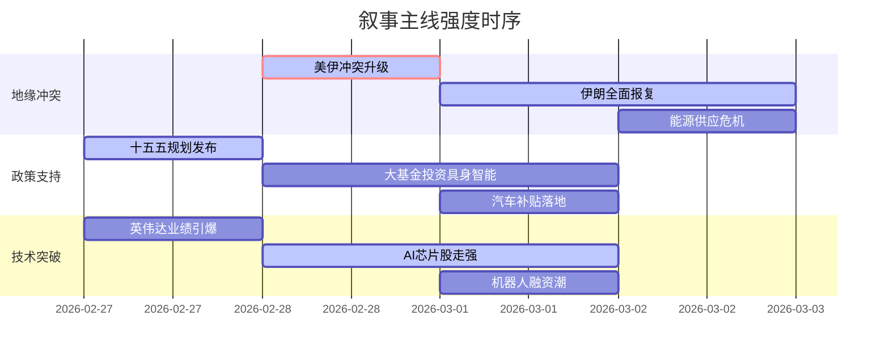

## A股市场情绪分析报告

**数据时段**：2026年2月27日至2026年3月3日  
**生成时间**：2026年3月3日  

### 🔥 宏观叙事焦点（24小时三级过滤）

#### 📌 叙事主线一：十五五规划审议与产业政策密集落地 ⭐⭐⭐  
**主要事件**：行业管理政策发布、央行政策、监管  
**筛选标签**：`国家战略` `科技自立` `消费刺激`  
**宏观逻辑**：  
> ① **归类**：结构性政策强化，聚焦新质生产力与科技自立  
> ② **历史镜像**：2020年“新基建”政策模板，通过大基金投资带动产业链升级  
> ③ **市场传导**：国家大基金投资具身智能 → 机器人股涨停 → 科技板块融资资金净流入  
> ④ **叙事强度**：政策落地速度超预期，从十五五规划到地方配套细则同步推进，打破弱复苏预期  

**行业映射**：科技自主可控（情绪评分 **8.5/10**），消费复苏链（情绪评分 **7.0/10**）  
**交易警示**：‼️ 政策效果待验证，避免追高题材股，关注业绩持续性  

---

#### 📌 叙事主线二：AI产业链业绩爆发与技术突破 ⭐⭐  
**主要事件**：技术发布、产业投资  
**筛选标签**：`AI芯片` `商业化加速` `政策支持`  
**宏观逻辑**：  
> ① **归类**：产业技术迭代，AI从概念向商业化快速过渡  
> ② **历史镜像**：2019年5G商用化模板，硬件需求先行拉动全产业链  
> ③ **市场传导**：英伟达业绩超预期 → A股算力芯片股走强 → 融资资金加仓电子板块  
> ④ **叙事强度**：需求端旺盛，但估值已部分透支，需警惕分化  

**行业映射**：AI算力与硬件（情绪评分 **8.2/10**）  
**交易警示**：⚠️ 估值偏高，关注下游应用落地与产能释放节奏  

---

#### 📌 叙事主线三：美伊军事冲突升级与全球能源风险 ⭐  
**主要事件**：国际冲突、关税政策  
**筛选标签**：`地缘风险` `能源安全` `避险资产`  
**宏观逻辑**：  
> ① **归类**：黑天鹅事件，短期冲击能源供应链  
> ② **历史镜像**：1990年海湾战争模板，油价飙升引发全球通胀担忧  
> ③ **市场传导**：冲突爆发 → 油价跳升 → 油气股涨停 → 黄金上涨 → 航空股下跌  
> ④ **叙事强度**：短期冲击剧烈，但中长期影响取决于冲突持续时间与外交进展  

**行业映射**：能源与国防（情绪评分 **9.0/10**），航空与旅游（情绪评分 **3.0/10**）  
**交易警示**：✓ 事件驱动，快进快出，控制仓位，关注霍尔木兹海峡局势演变  

---

### 📅 宏观叙事演化（三日趋势）  
**强度衰减模型**：昨日主题×0.7 · 前日主题×0.5  

```mermaid
gantt
    title 叙事主线强度时序
    dateFormat  YYYY-MM-DD
    section 地缘冲突
    美伊冲突升级   :crit, active, 2026-02-28, 1d
    伊朗全面报复   :active, 2026-03-01, 2d
    能源供应危机   :2026-03-02, 1d
    
    section 政策支持
    十五五规划发布 :active, 2026-02-27, 1d
    大基金投资具身智能 :2026-02-28, 2d
    汽车补贴落地   :2026-03-01, 1d
    
    section 技术突破
    英伟达业绩引爆 :2026-02-27, 1d
    AI芯片股走强   :active, 2026-02-28, 2d
    机器人融资潮   :2026-03-01, 1d
```
**叙事节点关联**：  
- **2/28**：美以联合空袭伊朗，哈梅内伊身亡 → 地缘风险急速升温，油价飙升  
- **3/1**：伊朗发起“真实承诺4”报复，关闭霍尔木兹海峡 → 航运危机加剧，油气股全线爆发  
- **3/2**：“三桶油”历史性涨停，监管层提示风险 → 政策介入对冲，叙事强度见顶回落  

🎯 **宏观叙事三要素**  
1️⃣ **政策意图解码**：顶层叙事从“稳增长”转向“调结构”，科技自立与产业升级为核心，允许短期阵痛换取长期质量，政策定力超预期。  
2️⃣ **市场定价偏差**：  
   - 过度定价：消费复苏弹性（如汽车股预期过于乐观）  
   - 定价不足：产能出清速度（如光伏行业政策执行力被低估）  
3️⃣ **跨市场共振**：美债收益率下行打开国内政策空间 + 美元指数高位缓释出口压力 + 人民币走强吸引外资流入 → A股结构性行情窗口期，但地缘风险或短期扰动节奏。