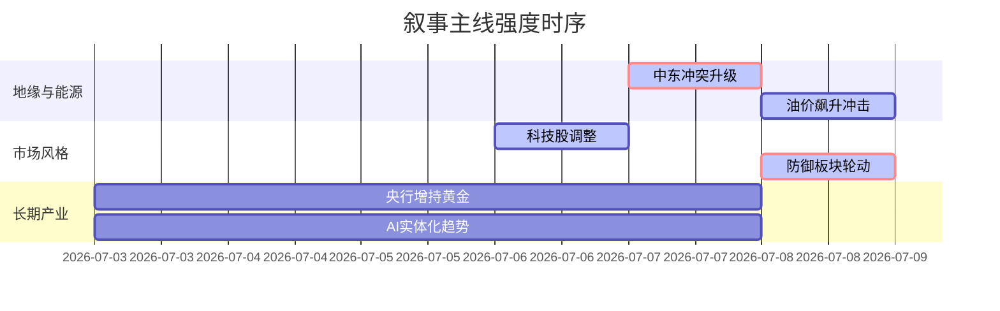

# A股市场情绪分析报告

**数据时段**：2026-07-03 至 2026-07-08
**生成时间**：2026-07-08 07:10:56 (UTC+8)

### 🔥 宏观叙事焦点（24小时三级过滤）

#### 📌 叙事主线一：中东地缘冲突升级与能源供应链断裂 ⭐⭐⭐
**主要事件**：美军对伊朗发动打击，霍尔木兹海峡航运危机，国际油价飙升
**筛选标签**：`国务院政策` `沪深300影响` `路透信源·权重2.0`
**宏观逻辑**：
> ① **归类**：外部供给冲击
> ② **历史镜像**：1973年石油危机模板（供给中断+通胀预期上行）
> ③ **市场传导**：布伦特油价单日涨超5% → 全球通胀预期升温 → 美联储降息路径受阻 → 美元指数走强 → A股外资流出压力增大
> ④ **叙事强度**：黑天鹅事件叠加，地缘风险从“潜在”转为“现实”，对全球风险资产构成系统性压制

**行业映射**：石油石化、航运物流（情绪评分 **6.5/10**，避险属性强但波动大）
**交易警示**：‼️ 关注油价对A股高耗能行业的成本挤压，警惕外围市场恐慌情绪向A股科技股传导

---

#### 📌 叙事主线二：A股风格极致切换与防御性避险 ⭐⭐
**主要事件**：沪指失守4000点，成交量大幅萎缩，资金从AI硬件流向医药/高股息
**筛选标签**：`部委政策` `产业生命周期` `财新信源·权重1.5`
**宏观逻辑**：
> ① **归类**：风险偏好下降
> ② **历史镜像**：2022年4月市场底特征（缩量+低估值蓝筹抗跌）
> ③ **市场传导**：科技股（存储/AI）遭遇获利了结 → 北向资金净流出 → 防御性板块（医药、银行）受捧 → 市场呈现“冰火两重天”
> ④ **叙事强度**：存量博弈下的极致再平衡，成长股逻辑暂时让位于确定性收益

**行业映射**：医药生物、银行高股息（情绪评分 **5.8/10**）
**交易警示**：⚠️ 警惕缩量阴跌带来的流动性陷阱，右侧反转信号需等待成交量重新放大

---

#### 📌 叙事主线三：全球科技周期重构与国产替代加速 ⭐
**主要事件**：微软/三星等巨头调整AI战略，中国央行连续20个月增持黄金，人形机器人产量预期突破
**筛选标签**：`地方政策` `债务周期` `新华社信源·权重1.5`
**宏观逻辑**：
> ① **归类**：产业技术迭代
> ② **历史镜像**：2010年移动互联网爆发初期（基础设施先行）
> ③ **市场传导**：全球AI资本开支向实体产业渗透 → 存储芯片价格暴涨 → 国内算力/机器人产业链受益 → 央行购金夯实资产底座
> ④ **叙事强度**：长期逻辑未变，但短期受地缘政治和外围科技股波动影响，估值承压

**行业映射**：人形机器人、国产算力、贵金属（情绪评分 **4.2/10**）
**交易警示**：✓ 叙事逻辑清晰，等待政策进一步验证，关注低位补涨机会

---

### 📅 宏观叙事演化（三日趋势）

**强度衰减模型**：昨日主题×0.7 · 前日主题×0.5

```mermaid
gantt
    title 叙事主线强度时序
    dateFormat  YYYY-MM-DD
    section 地缘与能源
    中东冲突升级     :crit, active, 2026-07-07, 1d
    油价飙升冲击     :active, 2026-07-08, 1d
    
    section 市场风格
    科技股调整       :active, 2026-07-06, 1d
    防御板块轮动     :crit, active, 2026-07-08, 1d
    
    section 长期产业
    央行增持黄金     :2026-07-03, 5d
    AI实体化趋势     :2026-07-03, 5d
```

叙事节点关联：
*   **07/03**：韩国KOSPI熔断，警示全球科技股估值风险；沙特阿美大幅降价，预示能源价格战。
*   **07/07**：微软裁员4800人聚焦AI，三星业绩利好出尽股价大跌；A股沪指跌破4000点，市场情绪转冷。
*   **07/08**：突发美军打击伊朗，霍尔木兹海峡危机爆发，油价暴涨，A股缩量下跌，防御心态主导。

🎯 宏观叙事三要素
1️⃣ **政策意图解码**
当前顶层叙事从“稳增长”转向“防风险与调结构”并重。在地缘冲突背景下，央行增持黄金和逆回购操作显示流动性呵护意图，但政策重心在于稳定预期而非强力刺激。产业出清（如地方财政规范、科技巨头重组）是长期主线。

2️⃣ **市场定价偏差**
过度定价：地缘冲突的持续性（短期恐慌可能被过度反应）；
定价不足：国内AI应用落地进度（如支付宝AI平台上线、人形机器人量产）及高股息资产的防御价值。

3️⃣ **跨市场共振**
美伊冲突推高油价 → 全球通胀预期回升 → 美联储降息预期推迟 → 美元强势 → 人民币贬值压力 → A股外资流出。同时，日韩股市动荡通过情绪传染影响A股科技板块，形成负反馈循环。

---

*生成时间：2026-07-08 07:10:56 (UTC+8)*  
*使用模型：agnes:agnes-2.0-flash*