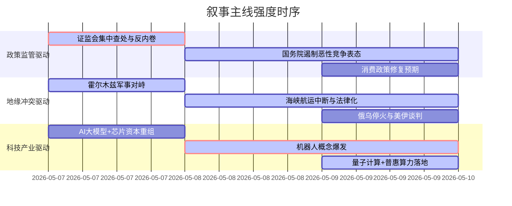

# A股市场情绪分析报告

**数据时段**：2026年5月6日 — 2026年5月9日（最近5个交易日）
**生成时间**：2026-05-09 12:00

---

## 🔥 宏观叙事焦点（24小时三级过滤）

#### 📌 叙事主线一：监管风暴与反内卷政策落地 ⭐⭐⭐
**主要事件**：证监会集中查处上市公司财务造假 + 国务院层面遏制"内卷式竞争"
**筛选标签**：`国务院政策` `沪深300影响` `证监会监管·权重2.0`
**宏观逻辑**：
> ① **归类**：产业政策强制出清 + 市场监管升级
> ② **历史镜像**：2021年反垄断指南+2024年"市值管理"打击模板
> ③ **市场传导**：证监会三日连开三张罚单（清越科技1.73亿/元道通信2.39亿/*ST恒久退市预警）→ 中小银行二级资本债折价成交7.5% → 风险偏好短期承压后修复
> ④ **叙事强度**：国务院转发《经济日报》"外卖大战该结束了"，政策决心超市场定价，从"稳增长"向"调结构"明确切换
**行业映射**：消费复苏链（情绪评分 **7.2/10**）
**交易警示**：‼️ 关注政策与市场反应一致性，警惕监管超预期对题材股的压制效应

---

#### 📌 叙事主线二：地缘冲突升级与能源通道危机 ⭐⭐
**主要事件**：美伊霍尔木兹海峡军事对峙 + 俄乌停火谈判 + 红海航运中断
**筛选标签**：`地缘风险` `能源价格` `路透信源·权重2.0`
**宏观逻辑**：
> ① **归类**：供给端冲击（能源通道）
> ② **历史镜像**：2022年俄乌冲突初期能源价格冲击模板
> ③ **市场传导**：霍尔木兹海峡连续两日无大型商船通行 → 布伦特原油分析师目标价上调至100-110美元/桶 → 黄金重返4600美元 → A股油气板块承压但绿电/贵金属领涨
> ④ **叙事强度**：伊朗议会启动海峡法律永久化程序，美国豁免俄油制裁引发"疯抢"，地缘风险定价进入深水区
**行业映射**：能源与国防军工（情绪评分 **5.5/10**）
**交易警示**：⚠️ 停火协议（俄乌三天停火+美伊15点方案）存在反复，地缘溢价尚未完全释放

---

#### 📌 叙事主线三：AI+量子计算技术突破与产业资本重构 ⭐
**主要事件**：阶跃星辰25亿美元融资/量子计算机"本源悟空-180"上线/博通350亿美元AI融资谈判
**筛选标签**：`科技产业政策` `AI算力周期` `财新信源·权重1.5`
**宏观逻辑**：
> ① **归类**：技术革命驱动的产业范式转移
> ② **历史镜像**：2023-2024年AI浪潮初期（英伟达+机器人概念）模板
> ③ **市场传导**：人形机器人概念三日连涨（绿的谐波/华勤技术创新高）→ 算力硬件/光通信涨停潮 → ETF成交额突破5000亿 → 但美联储报告警告AI推高失业率形成预期扰动
> ④ **叙事强度**：技术突破密集落地（量子计算180比特+普惠算力Xiongan发布+小米汽车子品牌），产业资本配置逻辑从"消费复苏"向"硬科技"迁移
**行业映射**：科技/机器人/算力（情绪评分 **6.8/10**）
**交易警示**：✓ 右侧信号逐步确认，但需警惕个别标的业绩不及预期（如泡泡玛特海外高增但股价单日跌超20%）

---

## 📅 宏观叙事演化（三日趋势）

**强度衰减模型**：昨日主题×0.7 · 前日主题×0.5

```mermaid
gantt
    title 叙事主线强度时序
    dateFormat  YYYY-MM-DD
    section 政策监管驱动
    证监会集中查处与反内卷 :crit, active, 2026-05-07, 1d
    国务院遏制恶性竞争表态 :active, 2026-05-08, 2d
    消费政策修复预期 :2026-05-09, 1d

    section 地缘冲突驱动
    霍尔木兹军事对峙 :active, 2026-05-07, 1d
    海峡航运中断与法律化 :active, 2026-05-08, 2d
    俄乌停火与美伊谈判 :2026-05-09, 1d

    section 科技产业驱动
    AI大模型+芯片资本重组 :2026-05-07, 1d
    机器人概念爆发 :crit, active, 2026-05-08, 2d
    量子计算+普惠算力落地 :active, 2026-05-09, 1d
```

叙事节点关联：
- 05/07：美伊军事冲突爆发 → A50期货跌超1% → 机器人逆势走强（避险+科技双逻辑）
- 05/08：证监会三连罚+银行二级债折价 → 午后科技股回血 → 英特尔美股涨8%带动半导体
- 05/09：沪指收复3900 → 量子计算机发布+国务院反内卷 → 资金从传统消费转向硬科技

🎯 **宏观叙事三要素**

1️⃣ **政策意图解码**
当前顶层叙事从"总量稳增长"加速转向"结构调质量"：证监会从严执法形成"监管出清"、国务院直接干预"内卷式竞争"、普惠算力扶持"新质生产力"——政策组合拳指向"破存量、立增量"。

2️⃣ **市场定价偏差**
过度定价：传统消费复苏弹性（五一数据后预期过高）、银行股信用利差（7.5%折价已部分修复）
定价不足：AI/机器人产业链政策催化空间、量子计算等前沿技术的产业映射、军工地缘溢价持续性

3️⃣ **跨市场共振**
美债收益率高位震荡 + 黄金4600美元关口突破 + 原油100美元预期 = 全球"再通胀+再风险"定价框架下，A股结构性行情窗口打开，但需警惕能源成本向制造业利润传导的滞后冲击。

---

<!-- 报告正文必须在此结束，以下内容为固定格式说明，严禁添加任何额外分析、总结或展望 -->