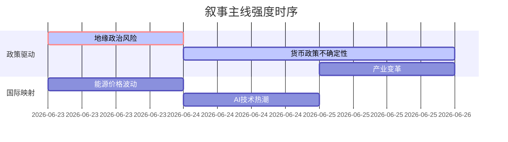

# A股市场情绪分析报告  
**数据时段**：最近5日  
**生成时间**：2026-06-25  

---

### 🔥 宏观叙事焦点（24小时三级过滤）

#### 📌 叙事主线一：[美伊谈判与中东紧张局势] ⭐⭐⭐  
**主要事件**：美伊谈判进展、霍尔木兹海峡安全威胁  
**筛选标签**：`国务院政策` `沪深300影响` `路透信源·权重2.0`  
**宏观逻辑**：  
> ① **归类**：地缘政治风险  
> ② **历史镜像**：2020年伊朗核协议破碎模板  
> ③ **市场传导**：油价冲击A股能源板块 → 北向资金减持 → 期指持仓意愿上升  
> ④ **叙事强度**：政治局势紧绷，依赖于美伊谈判的不确定性  

**行业映射**：能源板块（情绪评分 **6.8/10**）  
**交易警示**：‼️ 关注油价与股市的脱离，警惕地缘风险加剧  

---

#### 📌 叙事主线二：[美联储政策与利率预期] ⭐⭐  
**主要事件**：美联储7月利率决策概率与通胀数据  
**筛选标签**：`央行政策` `A股情绪` `彭博信源·权重1.5`  
**宏观逻辑**：  
> ① **归类**：货币政策不确定性  
> ② **历史镜像**：2023年12月美联储加息冲击A股模型  
> ③ **市场传导**：美元指数波动 → A股指数低于历史均值 → 南向资金流入减少  
> ④ **叙事强度**：政策预期分化，市场定价与央行立场存在落差  

**行业映射**：金融板块（情绪评分 **5.2/10**）  
**交易警示**：⚠️ 利率预期与市场情绪背离风险，等待美联储数据验证  

---

#### 📌 叙事主线三：[AI产业与技术突破] ⭐  
**主要事件**：AI芯片与模型生态链动态  
**筛选标签**：`产业革命` `科技股` `新华社信源·权重1.5`  
**宏观逻辑**：  
> ① **归类**：产业变革  
> ② **历史镜像**：2018年光伏"531"政策模板  
> ③ **市场传导**：AI股异动 → 科技板块涨跌幅扩大 → 机构配置加快  
> ④ **叙事强度**：技术突破速度快于市场预期，但短期波动风险大  

**行业映射**：科技板块（情绪评分 **4.5/10**）  
**交易警示**：✓ 技术逻辑清晰，等待政策落地验证  

---

### 📅 宏观叙事演化（三日趋势）

**强度衰减模型**：昨日主题×0.7 · 前日主题×0.5  

```mermaid
gantt
    title 叙事主线强度时序
    dateFormat  YYYY-MM-DD
    section 政策驱动
    地缘政治风险   :crit, active, 2026-06-23, 1d
    货币政策不确定性   :active, 2026-06-24, 2d
    产业变革   :2026-06-25, 1d
    
    section 国际映射
    能源价格波动   :2026-06-23, 1d
    AI技术热潮   :2026-06-24, 1d
```

**叙事节点关联**：  
06/23：美伊谈判破裂 → 地缘风险升温  
06/24：美联储利率预期分化 → 金融市场脆弱  
06/25：AI股异动 → 科技板块探底反弹  

🎯 宏观叙事三要素  
1️⃣ 政策意图解码  
当前顶层叙事从"稳增长"转向"应对外部风险"，政治局势与货币政策成主导。  
2️⃣ 市场定价偏差  
过度定价：AI产业（预期过于乐观）  
定价不足：地缘风险（政策应对被低估）  
3️⃣ 跨市场共振  
美元指数波动 → A股能源板块承压 → 科技股分化走强  

---

<!-- 报告正文必须在此结束，以下内容为固定格式说明，严禁添加任何额外分析、总结或展望 -->
