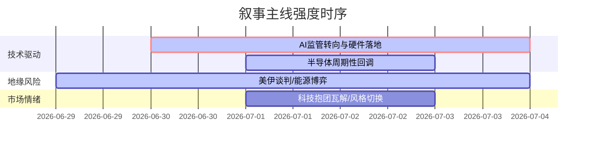

# A股市场情绪分析报告

**数据时段**：最近5日
**生成时间**：2026-07-03 07:35:20 (UTC+8)

## 🔥 宏观叙事焦点（24小时三级过滤）

#### 📌 叙事主线一：全球AI技术范式与监管博弈 ⭐⭐⭐
**主要事件**：美国解除Anthropic核心模型出口管制、Meta构建云业务、SpaceX开发AI硬件原型  
**筛选标签**：`产业生命周期` `路透信源·权重2.0` `技术突破`  
**宏观逻辑**：  
> ① **归类**：技术扩散与算力商业化  
> ② **历史镜像**：2023年生成式AI爆发初期  
> ③ **市场传导**：AI模型出口管制放松 → 全球产业链协同加速 → Meta/OpenAI算力需求变现 → 硬件端（SpaceX/机器人）应用落地  
> ④ **叙事强度**：技术边际改善与监管转向共振，AI从“纯算法竞赛”转向“软硬一体化商业落地”  

**行业映射**：AI算力与硬件（情绪评分 **8.5/10**）、人形机器人（情绪评分 **7.8/10**）  
**交易警示**：‼️ 关注美股科技巨头财报对A股产业链的映射，警惕AI概念股在高位出现获利回吐  

---

#### 📌 叙事主线二：地缘政治紧张与能源供应链重构 ⭐⭐  
**主要事件**：美伊多哈间接会谈、伊朗核监管争议、霍尔木兹海峡航运安全  
**筛选标签**：`地缘冲突` `能源安全` `新华社信源·权重1.5`  
**宏观逻辑**：  
> ① **归类**：风险事件缓释与反复  
> ② **历史镜像**：2019年美伊贸易战及油价波动  
> ③ **市场传导**：地缘紧张 → 霍尔木兹海峡风险预期 → 油价/黄金避险情绪上升 → 能源供应链安全性重估  
> ④ **叙事强度**：谈判进程具有高度不确定性，市场处于“观察期”而非“落地期”  

**行业映射**：贵金属/黄金（情绪评分 **7.0/10**）、能源开采（情绪评分 **6.2/10**）  
**交易警示**：⚠️ 黄金价格处于高位震荡，警惕地缘风险降温导致的避险资金流出  

---

#### 📌 叙事主线三：亚洲市场流动性收紧与半导体回调 ⭐  
**主要事件**：韩国KOSPI暴跌8%、日元汇率波动、A股科技板块深度调整  
**筛选标签**：`汇率波动` `流动性收紧` `财新信源·权重1.5`  
**宏观逻辑**：  
> ① **归类**：宏观流动性压力  
> ② **历史镜像**：2022年日元套利交易平仓引发的市场动荡  
> ③ **市场传导**：日元/韩元波动 → 亚洲科技股估值承压 → 半导体/电子元件板块回调 → 资金向高股息/红利资产切换  
> ④ **叙事强度**：短期情绪偏空，市场正经历从“成长抱团”向“多元定价”的切换  

**行业映射**：半导体设备/材料（情绪评分 **4.5/10**）、高股息红利资产（情绪评分 **5.8/10**）  
**交易警示**：✓ 关注科创50及半导体板块的止跌信号，短期以防守为主  

---

### 📅 宏观叙事演化（三日趋势）

**强度衰减模型**：昨日主题×0.7 · 前日主题×0.5

```mermaid
gantt
    title 叙事主线强度时序
    dateFormat  YYYY-MM-DD
    section 技术驱动
    AI监管转向与硬件落地   :crit, active, 2026-06-30, 4d
    半导体周期性回调       :active, 2026-07-01, 2d
    
    section 地缘风险
    美伊谈判/能源博弈     :active, 2026-06-29, 5d
    
    section 市场情绪
    科技抱团瓦解/风格切换   :2026-07-01, 2d
```

叙事节点关联：
06/30：美国解除AI模型出口管制 → 触发AI叙事从“限制”转向“扩张”
07/01：韩国股市及亚洲半导体板块大跌 → 触发流动性与风险偏好下修叙事
07/02：美联储利率预期波动 + 黄金突破新高 → 叙事进入“避险 vs 增长”的拉锯战

🎯 **宏观叙事三要素**
1️⃣ **政策意图解码**
全球监管重心正在从“全面封锁”转向“有条件的开放”（如Anthropic案例），AI产业正经历从纯软件向“AI+硬件”的物理层渗透。

2️⃣ **市场定价偏差**
过度定价：短期内对AI技术爆发带来的流动性冲击（过于乐观）
定价不足：亚洲市场因汇率与出口管制引发的半导体板块结构性调整（被低估）

3️⃣ **跨市场共振**
美股科技股走势分化 + 日元/韩元汇率波动 = A股科技成长板块短期承压，资金向“出海确定性”与“高壁垒细分龙头”转移。

---

<!-- 报告正文必须在此结束，以下内容为固定格式说明，严禁添加任何额外分析、总结或展望 -->