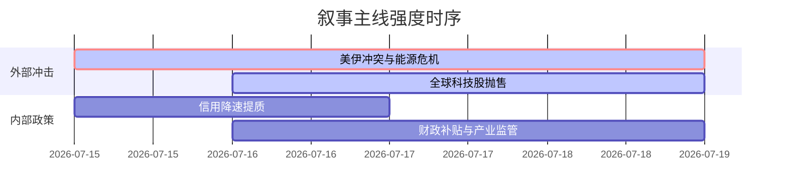

# A股市场情绪分析报告
**数据时段**：最近5日（2026-07-15至2026-07-18）
**生成时间**：2026-07-18 14:00

### 🔥 宏观叙事焦点（24小时三级过滤）

#### 📌 叙事主线一：美伊军事冲突升级致霍尔木兹海峡航运受阻 ⭐⭐⭐
**主要事件**：地缘冲突、能源供应链中断、国际油价暴涨  
**筛选标签**：`地缘风险` `全球定价` `路透/财新信源·权重2.5`  
**宏观逻辑**：  
> ① **归类**：外部供给冲击与风险溢价重估  
> ② **历史镜像**：2022年俄乌冲突初期能源危机模板  
> ③ **市场传导**：WTI原油周涨超12%突破82美元 → 欧洲天然气期货飙升19% → 全球避险情绪升温 → 风险资产估值系统性承压  
> ④ **叙事强度**：冲突从局部摩擦实质性升级为航道封锁威胁，地缘溢价全面兑现，打破弱复苏预期  

**行业映射**：能源化工/黄金避险链（情绪评分 **8.5/10**）  
**交易警示**：‼️ 关注油价高位震荡对全球通胀预期的二次冲击，警惕避险情绪退潮后的剧烈波动与航运保险成本跳升  

---

#### 📌 叙事主线二：A股科技板块深度回调与资金逻辑切换 ⭐⭐  
**主要事件**：AI算力估值消化、存储芯片踩踏、宽基ETF逆势吸金
**筛选标签**：`产业生命周期` `财报季博弈` `交易所/券商信源·权重1.5`  
**宏观逻辑**：  
> ① **归类**：估值修正与资本开支担忧  
> ② **历史镜像**：2021年中概股流动性收紧+业绩证伪模板  
> ③ **市场传导**：创业板指单日跌超7% → 光模块/存储龙头集体跌停 → 杠杆资金平仓共振 → 资金向低负债防御板块轮动  
> ④ **叙事强度**：前期涨幅透支与产业落地分歧共振，短期情绪触及冰点，但中长期国产替代与算力基建逻辑未改  

**行业映射**：半导体设备/消费电子（情绪评分 **5.8/10**）  
**交易警示**：⚠️ 警惕高估值科技股业绩分化风险，右侧信号需等待成交量企稳与机构持仓结构优化  

---

#### 📌 叙事主线三：国内宏观信用“降速提质”与财政精准发力 ⭐ 
**主要事件**：货币政策框架演进、地方楼市补贴、税收结构调整
**筛选标签**：`央行/财政部政策` `信用结构转型` `新华社/官方信源·权重1.5`  
**宏观逻辑**：  
> ① **归类**：信用扩张模式重构  
> ② **历史镜像**：2018年资管新规过渡期去杠杆与结构优化模板  
> ③ **市场传导**：信贷“降速提质”定调 → 票据转贴利率跌破0.5% → 直接融资占比提升 → 宽基ETF与红利资产受青睐  
> ④ **叙事强度**：政策重心从总量刺激转向结构优化，稳增长与防风险再平衡，财政补贴（20地楼市新政）加速落地  

**行业映射**：高股息红利/大金融（情绪评分 **6.2/10**）  
**交易警示**：✓ 叙事逻辑清晰，等待专项债发行节奏与房地产销售端实际转化数据验证  

---

### 📅 宏观叙事演化（三日趋势）

**强度衰减模型**：昨日主题×0.7 · 前日主题×0.5

```mermaid
gantt
    title 叙事主线强度时序
    dateFormat  YYYY-MM-DD
    section 外部冲击
    美伊冲突与能源危机   :crit, active, 2026-07-15, 4d
    全球科技股抛售       :active, 2026-07-16, 3d
    
    section 内部政策
    信用降速提质         :2026-07-15, 2d
    财政补贴与产业监管   :2026-07-16, 3d
```
叙事节点关联：
07/15：美伊战事全面升级锁定霍尔木兹海峡 → 触发能源危机叙事
07/16：央行定调信贷“降速提质” + 20地楼市新政 → 内部政策叙事强化
07/17：创业板指暴跌超7%宽基ETF吸金 → 科技估值消化叙事进入验证期
07/18：WTI原油周涨破12%叠加AI治理倡议发布 → 跨市场共振与叙事分化
🎯 宏观叙事三要素
1️⃣ 政策意图解码
当前顶层叙事从“规模扩张”转向“质量与结构”，允许短期阵痛换取长期韧性。产业出清与信用重构>总量刺激，政策定力超预期。
2️⃣ 市场定价偏差
过度定价：消费复苏弹性（预期过于乐观）
定价不足：产能出清速度与技术迭代成本（政策执行力与AI硬件落地节奏被低估）
3️⃣ 跨市场共振
美伊冲突推升能源溢价压制风险偏好 + 国内流动性精准投放托底 = A股结构性行情窗口期（红利防守 vs 科技博弈）

---

<!-- 报告正文必须在此结束，以下内容为固定格式说明，严禁添加任何额外分析、总结或展望 -->

---

*生成时间：2026-07-18 07:13:46 (UTC+8)*  
*使用模型：agnes:agnes-2.0-flash*