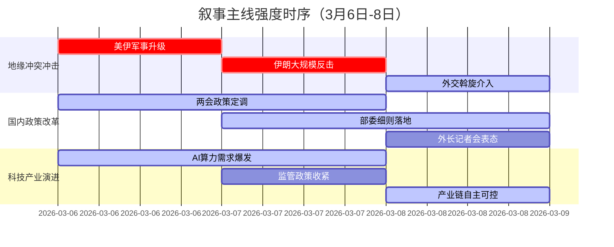

```markdown
## A股市场情绪分析报告

**数据时段**：最近5日（2026年3月4日 - 3月8日）  
**生成时间**：2026年3月9日

---

### 🔥 宏观叙事焦点（24小时三级过滤）

#### 📌 叙事主线一：地缘政治危机全面升级与全球供应链冲击 ⭐⭐⭐
**主要事件**：美以对伊朗发动军事打击，伊朗大规模反击，霍尔木兹海峡航运中断，全球能源与航运价格剧烈波动  
**筛选标签**：`地缘风险` `能源安全` `供应链重构`  
**宏观逻辑**：
> ① **归类**：地缘政治黑天鹅事件，直接冲击全球关键能源与物流通道  
> ② **历史镜像**：1990年海湾战争初期油价跳涨与供应链中断模板  
> ③ **市场传导**：油价单日涨超9% → 全球通胀预期重燃 → 央行降息预期推迟 → 风险资产（股、债）抛售，避险资产（黄金、美元）阶段性走强但后续波动加剧  
> ④ **叙事强度**：冲突长期化、多线化超预期，供应中断风险溢价持续计入，市场从“避险逻辑”转向“流动性为王”与“通胀对冲”并存状态

**行业映射**：油气开采、航运、油服（情绪评分 **8.5/10**）  
**交易警示**：‼️ 冲突缓和信号将导致油价、相关板块快速回调，需警惕追高风险

---

#### 📌 叙事主线二：中国两会政策定调与资本市场改革深化 ⭐⭐
**主要事件**：政府工作报告发布，多部委经济主题记者会，证监会强化监管，中长期资金入市机制部署  
**筛选标签**：`国务院政策` `沪深300影响` `改革预期`  
**宏观逻辑**：
> ① **归类**：政策从“稳增长”向“调结构”深化，强调新质生产力与防风险平衡  
> ② **历史镜像**：2013年十八届三中全会“市场决定性作用”与2020年资本市场长期资金入市政策组合  
> ③ **市场传导**：改革预期提振权益资产中长期配置价值 → 机构调高目标价（如宁德时代） → 但短期受地缘冲击扰动，资金在政策与风险间摇摆  
> ④ **叙事强度**：顶层设计超预期，但市场对政策见效节奏与地缘外溢存在分歧，信心修复需时间

**行业映射**：金融（券商、银行）、人工智能、高端制造、能源转型（情绪评分 **7.5/10**）  
**交易警示**：⚠️ 关注政策落地与市场反应的匹配度，警惕地缘风险对改革条件的制约

---

#### 📌 叙事主线三：全球AI算力竞赛与产业链自主可控加速 ⭐
**主要事件**：中国AI产业规模公布，具身智能融资火爆，半导体材料涨价，海外AI监管收紧  
**筛选标签**：`产业生命周期` `技术迭代` `国产替代`  
**宏观逻辑**：
> ① **归类**：科技自立自强进入“军备竞赛”阶段，算力需求指数增长与供应链安全并重  
> ② **历史镜像**：2018年后半导体国产化加速与2020年新能源车产业链崛起路径  
> ③ **市场传导**：AI模型迭代 → 算力硬件需求激增 → 半导体材料/设备涨价 → 产业链利润重分配 → 资金向具备核心技术环节集中  
> ④ **叙事强度**：技术突破与外部约束强化并行，国产替代逻辑从“主题”向“产业现实”过渡

**行业映射**：半导体设备/材料、算力基础设施、具身智能、AI应用（情绪评分 **7.0/10**）  
**交易警示**：✓ 核心环节技术突破是右侧确认信号，当前需甄别纯粹题材炒作

---

### 📅 宏观叙事演化（三日趋势）

**强度衰减模型**：昨日主题×0.7 · 前日主题×0.5


```mermaid
gantt
    title 叙事主线强度时序（3月6日-8日）
    dateFormat  YYYY-MM-DD
    section 地缘冲突冲击
    美伊军事升级   :crit, 2026-03-06, 1d
    伊朗大规模反击   :crit, 2026-03-07, 1d
    外交斡旋介入   :active, 2026-03-08, 1d
    
    section 国内政策改革
    两会政策定调   :active, 2026-03-06, 2d
    部委细则落地   :active, 2026-03-07, 2d
    外长记者会表态   :2026-03-08, 1d
    
    section 科技产业演进
    AI算力需求爆发   :active, 2026-03-06, 2d
    监管政策收紧   :2026-03-07, 1d
    产业链自主可控   :active, 2026-03-08, 1d
```

**叙事节点关联**：
- 03/06：美以空袭伊朗 → 伊朗启动“真实承诺-4”行动反击 → 霍尔木兹海峡航运中断 → 油价暴涨 → 全球股灾
- 03/07：发改委详解“十五五”规划与国家级并购基金 → 证监会发布短线交易监管规定 → 政策密度最高，但市场聚焦地缘
- 03/08：王毅外长记者会呼吁政治解决中东问题 → 外交部促航道安全 → 地缘叙事进入“外交干预”阶段，强度边际回落

🎯 **宏观叙事三要素**
1️⃣ **政策意图解码**
   - 顶层叙事从“总量稳增长”转向“结构调优与安全并重”。政府工作报告与部委释放信号：允许部分行业（如光伏）产能出清，全力推进科技自立自强（AI、商业航天），资本市场改革聚焦“ Long-term capital ”入市机制。政策定力超预期，短期阵痛换取中长期质量。
2️⃣ **市场定价偏差**
   - **过度定价**：地缘冲突下油气板块的情绪溢价（连续涨停），对缓和速度估计不足。
   - **定价不足**：科技自主可控的产业执行力（如半导体材料、商业航天进展）及政策对“耐心资本”的实际吸引力。
3️⃣ **跨市场共振**
   - **负面传导**：中东危机 → 油价飙升 → 美联储降息预期推迟 → 美元走强 → 外资流入放缓 → A股承压。
   - **正面对冲**：中国政策空间因外部风险延后而相对扩大，且国内能源自给率较高（煤炭、储能）部分缓冲油价冲击，A股内部结构（政策受益板块）韧性优于外围。

---

<!-- 报告正文必须在此结束，以下内容为固定格式说明，严禁添加任何额外分析、总结或展望 -->