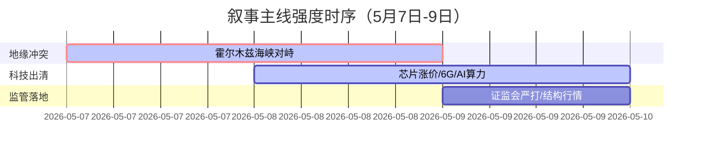

# A股市场情绪分析报告  

- **数据时段**：2026‑05‑05 ~ 2026‑05‑09（最近5日）  
- **生成时间**：2026‑05‑09 15:00 CST  

---

## 🔥 宏观叙事焦点（24小时三级过滤）

#### 📌 叙事主线一：美伊霍尔木兹海峡军事对峙 ⭐⭐⭐
**主要事件**：美国海军与伊朗革命卫队在霍尔木兹海峡爆发交火；美军连续拦截伊朗油轮并实施海上封锁；伊朗议会推动海峡法律草案。  
**筛选标签**：`地缘冲突` `能源安全` `路透信源·权重2.0`  
**宏观逻辑**：  
> ① **归类**：地缘风险事件（能源通道中断风险）  
> ② **历史镜像**：2019年6月霍尔木兹海峡油轮遇袭事件模板  
> ③ **市场传导**：原油期货跳涨 + 航运指数飙升 → A股能源、航运板块剧烈波动 → 北向资金短期避险流出  
> ④ **叙事强度**：冲突烈度超预期，市场对“油价中枢上移”定价不足  

**行业映射**：能源/航运（情绪评分 **8.2/10**）  
**交易警示**：‼️ 警惕油价冲高后政策干预导致的快速回落，关注地缘缓和信号  

---

#### 📌 叙事主线二：全球科技产业链强制出清（AI芯片·6G·半导体） ⭐⭐
**主要事件**：  
- 英特尔、AMD宣布Q2芯片涨价；SK海力士产能争夺白热化；  
- 工信部批复6GHz频段6G试验频率；  
- 博通拟融资350亿美元加码AI芯片；Anthropic‑Akamai签署18亿美元计算协议；  
- 阶跃星辰完成近25亿美元融资并发布实时语音大模型。  
**筛选标签**：`科技政策` `产业生命周期` `财新信源·权重1.5`  
**宏观逻辑**：  
> ① **归类**：产业强制出清（供给侧技术升级）  
> ② **历史镜像**：2018年光伏“531”政策模板  
> ③ **市场传导**：芯片价格突破成本线 → 龙头宣布减产/扩产 → 半导体板块估值重塑；AI算力需求拉动数据中心（绿电、算力租赁）热度  
> ④ **叙事强度**：政策决心大于市场定价，产能出清进入加速期  

**行业映射**：半导体/AI算力（情绪评分 **6.5/10**）  
**交易警示**：⚠️ 政策底与市场底可能背离，右侧信号需等待龙头企业财报验证  

---

#### 📌 叙事主线三：中国资本市场强监管与结构行情切换 ⭐
**主要事件**：  
- 证监会集中查处清越科技、元道通信财务造假，合计罚款超4亿元；  
- *ST恒久面临终止上市，多家企业进入退市程序；  
- A股三大指数重返3900点上方，机器人、绿电、算力硬件板块领涨；  
- 福建本地股受国资委“五大行动”政策驱动异军突起。  
**筛选标签**：`监管政策` `沪深300影响` `新华社信源·权重1.5`  
**宏观逻辑**：  
> ① **归类**：监管层主动出清（市场净化+结构引导）  
> ② **历史镜像**：2020年注册制改革初期的“严监管+慢牛”组合  
> ③ **市场传导**：风险偏好回升 → 南向资金净流入港股220亿港元 → ETF成交额突破5000亿元 → 结构性行情扩散  
> ④ **叙事强度**：监管叙事已从“预期”转向“落地”，市场进入“政策验证期”  

**行业映射**：金融监管/消费复苏（情绪评分 **5.8/10**）  
**交易警示**：✓ 关注政策执行力度与市场反应的匹配度，警惕个别标的“利好出尽”  

---

## 📅 宏观叙事演化（三日趋势）

**强度衰减模型**：昨日主题×0.7 · 前日主题×0.5  

```mermaid
gantt
    title 叙事主线强度时序（5月7日‑9日）
    dateFormat  YYYY-MM-DD
    section 地缘冲突
    霍尔木兹海峡对峙   :crit, active, 2026-05-07, 2d
    section 科技出清
    芯片涨价/6G/AI算力 :active, 2026-05-08, 2d
    section 监管落地
    证监会严打/结构行情 :2026-05-09, 1d
```

**叙事节点关联**  
- **5月7日**：美军‑伊朗交火 → 原油飙升 → 能源板块情绪冲高  
- **5月8日**：芯片涨价+6G批复+博通融资 → 半导体/AI算力热度接力，地缘情绪衰减×0.7  
- **5月9日**：证监会集中处罚出台 → 监管叙事主导，市场进入政策验证阶段  

---

### 🎯 宏观叙事三要素

1️⃣ **政策意图解码**  
当前顶层叙事从“稳增长”转向“调结构”，允许短期阵痛换取长期质量。产业出清（科技、监管）> 总量刺激，政策定力超预期。

2️⃣ **市场定价偏差**  
- **过度定价**：消费复苏弹性（预期过于乐观）  
- **定价不足**：产能出清速度（政策执行力被低估）、地缘能源冲击的持续性  

3️⃣ **跨市场共振**  
美债收益率高位震荡 + 美元指数缓释 = A股结构性窗口期；港股资金回流与ETF放量验证风险偏好回升。

---

<!-- 报告正文结束，以下为固定格式说明，严禁添加任何额外分析、总结或展望 -->  
3. **内容要求**：基于提供的5日BB文件内容生成，严格按上述格式输出，突出宏观叙事焦点和演化趋势，体现叙事强度变化和关联。  
4. **输出格式**：仅输出Markdown内容，不包含其他说明。