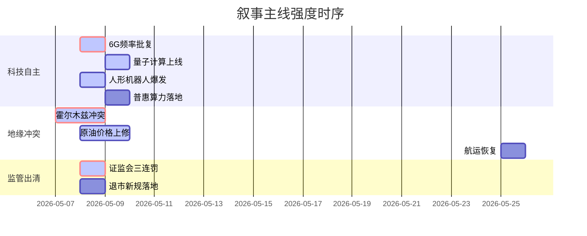

# A股市场情绪分析报告

**数据时段**：2026-05-08 ~ 2026-05-09（最近5日）
**生成时间**：2026-05-09

---

## 🔥 宏观叙事焦点（24小时三级过滤）

### 📌 叙事主线一：科技自主与产业升级政策密集落地 ⭐⭐⭐
**主要事件**：6G试验频率批复、量子计算突破、普惠算力政策落地、人形机器人概念爆发
**筛选标签**：`国务院政策` `沪深300影响` `产业生命周期` `路透信源·权重2.0`
**宏观逻辑**：
> ① **归类**：产业政策驱动型结构性行情
> ② **历史镜像**：2020年"新基建"政策驱动科技板块估值重构模板
> ③ **市场传导**：工信部6G频率批复 → 人形机器人/AI概念板块集体走强（绿的谐波、乔锋智能创新高）→ 量子计算"本源悟空-180"上线（180比特自主芯片）→ 算力硬件/光通信/军工午后领涨沪指重返3900
> ④ **叙事强度**：政策端（6G/量子/算力）与产业端（机器人/AI大模型/半导体）形成共振，题材密度与资金共识度双高

**行业映射**：AI算力+机器人+量子计算链（情绪评分 **8.1/10**）
**交易警示**：‼️ 题材驱动行情扩散速度快但持续性存疑，警惕高位题材个股业绩真空期后的估值回归风险

---

### 📌 叙事主线二：地缘冲突升级与能源安全重塑 ⭐⭐
**主要事件**：美伊霍尔木兹海峡军事对峙、原油价格中枢上移、国际航运部分恢复
**筛选标签**：`地缘风险` `能源周期` `原油定价权` `新华社信源·权重1.5`
**宏观逻辑**：
> ① **归类**：地缘供给冲击型风险溢价
> ② **历史镜像**：2022年2月俄乌冲突初期能源供给冲击模板
> ③ **市场传导**：霍尔木兹海峡军事冲突（5月7日美伊交火）→ 原油价格预期上修（巴克莱维持100美元/桶，花旗Q2预期110美元）→ 航运运力收缩（中远海运暂停中东订舱后5月25日部分恢复）→ 炼油利润率创历史新高 → 国内能源板块（绿电/油气）分化
> ④ **叙事强度**：地缘风险从预期定价阶段进入实际供给扰动阶段，但A股反应钝化显示市场已部分price-in

**行业映射**：能源周期+航运+黄金（情绪评分 **6.3/10**）
**交易警示**：⚠️ 原油价格冲高后回落风险并存，黄金4600美元上方波动加剧，关注地缘谈判进展（美伊15点停火方案审议）

---

### 📌 叙事主线三：监管强化与资本市场生态出清 ⭐
**主要事件**：证监会集中查处财务造假（清越科技1.73亿/元道通信2.39亿）、*ST恒久退市
**筛选标签**：`监管政策` `退市新规` `市场出清` `财新信源·权重1.5`
**宏观逻辑**：
> ① **归类**：资本市场制度性监管收紧
> ② **历史镜像**：2021年"中概股审计底稿事件"后的监管升级模板
> ③ **市场传导**：证监会一日三罚单（清越科技、元道通信、*ST恒久）→ 释放"零容忍"信号 → 退市程序加速（*ST恒久连续亏损+营收低于3亿+无法表示意见审计报告）→ 投资者风险偏好结构性分化（资金向绩优蓝筹迁移）→ 南向资金持续净流入（220亿港元）
> ④ **叙事强度**：监管叙事本身不构成行情驱动力，但作为"背景板"重塑中长期市场生态预期

**行业映射**：券商/审计/合规赛道（情绪评分 **4.2/10**）
**交易警示**：✓ 监管收紧为中长期利好，短期警惕被处罚个股的流动性风险外溢

---

## 📅 宏观叙事演化（三日趋势）

**强度衰减模型**：昨日主题×0.7 · 前日主题×0.5

```mermaid
gantt
    title 叙事主线强度时序
    dateFormat  YYYY-MM-DD
    section 科技自主
    6G频率批复     :crit, active, 2026-05-08, 1d
    量子计算上线   :active, 2026-05-09, 1d
    人形机器人爆发 :active, 2026-05-08, 1d
    普惠算力落地   :2026-05-09, 1d

    section 地缘冲突
    霍尔木兹冲突   :crit, active, 2026-05-07, 2d
    原油价格上修   :active, 2026-05-08, 2d
    航运恢复       :2026-05-25, 1d

    section 监管出清
    证监会三连罚   :crit, active, 2026-05-08, 1d
    退市新规落地   :2026-05-08, 1d
```

**叙事节点关联**：
- 05/07：美伊霍尔木兹冲突爆发 → 亚太股市跟跌（A50期货跌1%）→ 地缘风险溢价快速定价
- 05/08：工信部批复6G频率 + 阶跃星辰25亿融资 + 人形机器人概念涨停潮 → 科技主线强势崛起；同时证监会三连罚落地 → 监管叙事叠加
- 05/09：量子计算机"本源悟空-180"上线（180比特）→ 科技自主叙事强化；反腐高压持续（多省官员被查）→ 政策执行力的市场信心锚

---

🎯 **宏观叙事三要素**

**1️⃣ 政策意图解码**
当前顶层政策呈现"双轮驱动"特征：
- **科技自主线**：6G频谱批复（前瞻布局）→ 量子计算突破（成果兑现）→ 普惠算力（产业落地），政策链条从"技术攻关"向"商业化应用"加速过渡
- **市场监管线**：财务造假"零容忍" + 退市常态化 + 行业规范（外卖反内卷/化妆品监管升级），体现"建制度、不干预、零容忍"的市场治理思路
- **核心判断**：政策重心从总量刺激转向结构性产业培育，短期阵痛（监管收紧/地缘冲击）与长期收益（科技自主/产业升级）并行

**2️⃣ 市场定价偏差**
- **过度定价**：人形机器人/AI概念短期情绪过热（部分个股脱离基本面连续涨停），存在预期差收窄风险
- **定价不足**：量子计算与6G的长期产业价值（"本源悟空-180"实现百比特级自主可控）、算力基础设施的政策持续性红利
- **风险盲区**：银行二级资本债异常折价（兴业/徽商债偏离估值7.5%）反映的中小银行信用担忧尚未充分传导至A股风险偏好

**3️⃣ 跨市场共振**
- **美股联动**：半导体板块全线爆发（英特尔+8%市值逼近6000亿、英伟达再创新高、费城半导体指数周累涨11%），与A股机器人/AI概念形成全球共振
- **资金面共振**：南向资金持续净流入港股（220亿港元） + ETF两市成交突破5000亿元 + 黄金ETF一季度增仓50.44吨（+114.88%），显示机构"做多中国资产+对冲地缘风险"的双轨配置策略
- **汇率与商品**：英镑走强（斯塔默留任提振）+ 布伦特原油100-110美元高位震荡 = 人民币汇率承压但可控，A股输入性通胀风险有限
- **宏观窗口**：美联储降息预期推迟（12月维持利率概率升至74.1%）但就业数据强劲支撑全球风险偏好，为A股结构性行情提供外部环境支撑

---

<!-- 报告正文必须在此结束，以下内容为固定格式说明，严禁添加任何额外分析、总结或展望 -->

3. **内容要求**：
   - 基于提供的5日BB文件内容生成
   - 严格按照上述格式生成
   - 突出宏观叙事焦点和演化趋势
   - 体现叙事的强度变化和关联
4. **输出格式**：仅输出Markdown内容，不包含任何其他说明